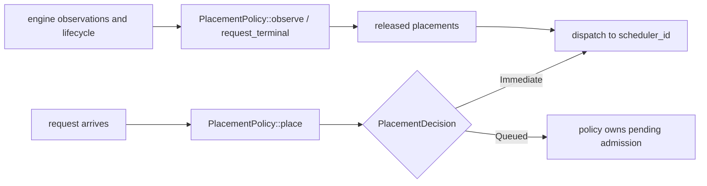

<!--
SPDX-FileCopyrightText: Copyright (c) 2026 NVIDIA CORPORATION & AFFILIATES. All rights reserved.
SPDX-License-Identifier: Apache-2.0
-->

# AISimulate Replay

This module owns the Dynamo-neutral, in-process replay runtime. It simulates a
trace without async runtimes, network planes, or real worker tasks: the
`Replayer` advances a logical clock, drives Generalized Mocker Engines from
`aisimulate_core::engine`, and records request and token timing in `TraceCollector`.

For operator-facing CLI documentation, see
[`dynosim-replay.mdx`](https://github.com/ai-dynamo/dynamo/blob/main/docs/fern/pages/cli/operations/simulation-with-dynosim/dynosim-replay.mdx).
This README covers the virtual clock, event queue, logical workers, and the
placement/scaling boundary used by Dynamo adapters.

## Where It Sits

The public entrypoint is `Replayer<C>`, where `C: ReplayComposition` supplies
placement and optional scaling policies. `RoundRobinComposition` is built in;
Dynamo constructs Router/Planner policies in its
[`lib/mocker`](https://github.com/ai-dynamo/dynamo/tree/main/lib/mocker) tree and injects them through
the same contract. The dependency points only toward this crate.

`Replayer::run` selects one of two topology runtimes:

- `agg.rs` for every aggregated replay, including one worker, multiple workers,
  and attention-DP
- `disagg.rs` for disaggregated prefill/decode replay

### AgentX input boundary

AISimulate owns raw Weka ingestion. `WekaImporter` deterministically preflights
a published Weka JSON object, JSONL corpus, or directory and lowers it to
Agentic Mooncake v2 rows. A JSONL file may contain multiple plays and published
AgentX plays may contain multiple request models;
`load_weka_agentic_graph` validates those rows as a `ValidatedAgenticGraph`.
Agentic Mooncake v2 is the optional materialized interchange format, not a
required preprocessing step. A downstream Dynamo integration should call this
public loader and must not maintain a second Weka parser or lowering pipeline.

Run `python3 scripts/qualify_weka_samples.py` from the repository root to check
the importer against two revision-pinned rows from the public SemiAnalysis
`cc-traces-weka-062126-256k` dataset. The rows are held in a temporary directory
and deleted when the check exits; the complete 570 MB corpus is not downloaded.

### Agentic driver/runtime contract

M1 execution consumes one completely preloaded, immutable
`ValidatedAgenticGraph`; neither the runtime nor an engine adapter polls a
client or extends the graph dynamically. The replay runtime is the sole owner
of logical time. At each timestamp it collects engine feedback and applies it
as one `AgenticRuntimeFeedback`, ordered by immutable graph ordinal: output
progress first, causal terminals second, and resource quiescence last.

A causal terminal resolves a request's client-visible outcome; successful
completion releases completion-triggered graph edges. Client lanes limit whole
plays, including background requests. A successful play releases its lane only
after all authored nodes complete, including delayed or blocked nodes. Under the
current failure policy, a failed play skips undispatched nodes and releases its
lane after every already-dispatched request becomes terminal. Merely finishing
the root or a blocking join does not finish still-running background requests.

Quiescence means the engine/router/handoff state owned by a request has settled.
It controls resource settlement and final drain, independently of client lane
reuse. The next play can therefore submit while an earlier play retains P/D
source holds or has pending cancellation actions; engine admission still queues
requests when those resources are unavailable. Late cleanup records the earlier
play's settlement without releasing the lane again. Request quiescence does not
require flushing reusable prefix-cache entries or ending an agent conversation.

In this in-process timing model, final decode or an observed request failure
stands in for the client response terminal. HTTP/SSE delivery and client task
teardown latency are not modeled. The strict failed-play policy above is an
explicit replay contract, not a claim of full AIPerf error-policy parity.

Equal-time event phases are engine pass completion, worker ready,
transfer completion, admission, telemetry, then scaling. Within a phase,
stable worker/pass/handoff identities replace insertion order as the primary
tie-breaker.

Both aggregated and disaggregated runtimes expose an internal `step()` seam.
It returns only after a semantic timestamp reaches a fixed point and preserves
all engine, placement, router, handoff, and KV state, so resuming does not
rebuild the simulation. Agentic requests carry a stable identity envelope
(request, play, conversation, and optional lane/tree/cache identities) across
the workload-to-runtime boundary. The driver can emit a canonical lifecycle
JSONL transcript and domain-separated digest for conformance tests.

AgentX timing preserves authored starts while completion-triggered dependency
delays use recorded end-to-start gaps: `max(0, target_start - source_end)`. A request without
`api_time` has a zero-width recorded interval; this does not synthesize source
duration or change engine-modeled completion. An overlapping child is released
from its parent's dispatch using the recorded start-to-start gap, a
post-completion child from the parent's causal
terminal, and a blocking parent resumes only after every join predecessor.
Background children add no implicit join. Zero-output requests remain valid
prefill-only/KV-warmup work.

Every play reports exactly one `completed`, `failed`, or `incomplete` outcome.
The outcome remains `incomplete` until server cleanup finishes, even if the
client lane has advanced to another play. `settled_at_ms` records that cleanup
time; outcomes remain in authored play order when plays settle out of order.
Rejected, canceled, and failed request terminals all fail the play, skip work
that has not dispatched, and let already-dispatched siblings settle. The
canonical failure is the minimum `(causal_terminal_ms, graph_node_ordinal)`;
status severity is deliberately not a tie-breaker. This rule keeps the failure
reason independent of engine callback order.
For a failed play, `causal_terminal_ms` records this primary failure, which may
precede client lane release while already-dispatched siblings finish.

## File Map

- `src/replay/replayer.rs`
  Owns the canonical replay entrypoint and composition boundary.
- `src/replay/agg.rs`
  Shared offline cluster simulator for every aggregated replay.
- `src/replay/disagg.rs`
  Offline two-stage replay harness with separate prefill and decode pools.
- `src/replay/state.rs`
  Per-request state used by the aggregated and disaggregated runtimes.
- `src/replay/event.rs`
  `SimulationEvent`, `SimulationEventKind`, and worker-completion payload types
  used by both topology runtimes.
- `src/replay/components/`
  Admission, logical-worker, and Generalized Engine orchestration shared by the
  aggregated and disaggregated runtimes.
- `src/replay/core/`
  Neutral placement contracts and built-in round-robin policies.
- `src/replay/runtime_utils.rs`
  Shared helpers used by `agg.rs` and `disagg.rs`: event scheduling,
  `ReadyWorkerCompletions`, and `next_timestamp`.
- `src/replay/telemetry.rs`
  Serializable, policy-neutral telemetry snapshots and the optional observer
  contract.
- `src/replay/progress.rs`
  `ReplayProgress`, the indicatif-based progress bar used by the harnesses.
- `src/replay/report.rs`
  `TraceCollector` and the serializable `ReplayReport`.
- `src/replay/spec.rs`
  Canonical, serializable `ReplaySpec` and topology/provider descriptors.

## Aggregated Runtime

The aggregated runtime lives in `src/replay/agg.rs`. It handles one or more logical
workers through the same deterministic event loop and models:

- a logical clock `now_ms`
- a pending request queue
- one `EngineComponent` logical worker per simulated worker
- a binary heap of future completion events
- an injected placement policy

For `dp_size > 1`, each logical worker owns one grouped Generalized Mocker
Engine containing one scheduler per DP rank. The placement policy retains the
live `(worker_id, dp_rank)` identity; scaling and
worker accounting continue to count mocker workers rather than rank schedulers.
At each iteration, every ready rank forms its scheduler-local pass and the logical
worker completes at the maximum rank latency. Completion-visible tokens, KV events,
and FPM timing share that boundary; empty ranks also wait at the barrier so arrivals
during an epoch cannot start early.

### Main Loop

The aggregated harness is event-driven. It does not sleep. Instead, `AggRuntime` repeatedly:

1. picks the next meaningful timestamp
2. advances `now_ms`
3. applies any worker completion events scheduled for that time
4. admits newly available requests, either from trace arrivals or concurrency backfill
5. starts passes on workers that are ready to run
6. pushes new `WorkerCompletion` events back into the binary heap

It only advances `now_ms` to the next meaningful timestamp:

- next request arrival
- next worker completion event
- next telemetry or scaling tick while work remains

### Worker Model

Each logical worker is represented by `EngineComponent` in
`src/replay/components/engine.rs`:

- wraps one `Engine`
- tracks whether a pass is currently in progress
- tracks in-flight request count separately from engine internals
- optionally publishes neutral engine KV observations to its composition

The pass execution itself still comes from the moved vLLM, SGLang, or
TensorRT-LLM scheduler core through the shared Generalized Engine contract.

So offline replay is not a toy simulator. It reuses the real per-pass mocker scheduling logic, but drives it deterministically.

## Completion Event Queue

The multi-worker and disagg harnesses use `SimulationEvent` from `src/replay/event.rs`
as a min-time priority queue implemented with `BinaryHeap`. The event carries a
scheduled timestamp, a sequence number for deterministic tie-breaking, and a
typed payload:

```rust
pub(crate) struct SimulationEvent<Events> {
    pub(crate) at_ms: f64,
    pub(crate) seq_no: u64,
    pub(crate) kind: SimulationEventKind<Events>,
}

pub(crate) enum SimulationEventKind<Events> {
    EnginePassCompletion(EnginePassCompletion<Events>),
    TransferComplete { handoff_id },
    WorkerReady { stage, worker_id },
    TelemetryTick,
    ScalingTick,
}
```

- `EnginePassCompletion` makes one grouped pass visible at the Generalized
  Engine's slowest-rank completion boundary.
- `TransferComplete` advances a disaggregated request after modeled handoff
  timing.
- `WorkerReady` marks the point at which a worker returns to the admission pool after a pass completes.
- `TelemetryTick` samples settled replay state without invoking or changing a
  scaling policy.
- `ScalingTick` gives the injected scaling policy a settled cluster snapshot.

At a shared timestamp, Replay settles workload events first, publishes the
telemetry sample second, and invokes scaling last. A scaling decision therefore
cannot rewrite the state represented by a coincident telemetry sample.

## Placement and Scaling Integration

Replay depends on the neutral `PlacementPolicy<Request>` and
`ReplayScalingPolicy` contracts. The built-in engine stack uses synchronous
round-robin placement and no scaling. Dynamo's composition implements the same
boundary with `KvRouterPlacement` and an optional Planner policy; Dynamo owns
the concrete Router configuration, indexer, and policy construction.

This router is synchronous and in-process:

- no async worker tasks
- no event plane
- no background indexer thread

Instead it maintains:

- a local radix tree indexer
- local `ActiveSequencesMultiWorker` state
- a pending queue for queued requests



### Optional telemetry sampling

`Replayer::with_telemetry_observer` attaches a separate observer at a positive,
finite virtual-time interval. This cadence is independent of Planner's scaling
ticks and does not need to be a multiple of any engine tick duration. Periodic
timestamps are derived from the original sampling time and ordinal, rather
than repeated floating-point addition.

The observer receives:

- a gauge-only baseline after the initial timestamp settles
- periodic samples with traffic and additive scheduler counters for each
  completed interval
- a final sample when a positive elapsed tail remains after the last periodic
  boundary, or when the final timestamp has pending zero-duration interval
  observations

Gauge rows describe only live worker ranks. Cache-hit token and preemption
counters from a rank that retires during an interval are folded into one
role-level aggregate before its live state is dropped, so telemetry storage is
O(live ranks) plus O(1) retired history. Arriving-request traffic has its own
accumulator, so neither the baseline nor telemetry sampling drains Planner's
traffic window. When no observer is attached, Replay allocates no telemetry
rank state and performs no telemetry callbacks.

Telemetry heartbeats are observational: they do not keep a deadlocked replay
alive or advance a replay past its configured time cap. A heartbeat is only
interleaved when canonical replay work exists at or before the cap.

### Why KV events are captured only where needed

When a composition requests engine observations, each Generalized Engine pass
returns neutral KV events. `ReplayEngineObservation` converts them at the
adapter boundary; the AISimulate crates never import Dynamo Router event types.

In round-robin mode, this capture is skipped because nothing consumes those events.
In offline disagg replay, only the prefill workers capture and publish KV events; the decode workers
run with capture disabled because the decode router is overlap-blind and does not consume router
events.

## Disaggregated Harness

The disaggregated runtime in `src/replay/disagg.rs` models two distinct stages:

- a prefill router and prefill worker pool
- a decode router and decode worker pool

vLLM and TensorRT-LLM use source-first handoff; SGLang uses destination-first handoff. The
TensorRT-LLM path applies `GUARANTEED_NO_EVICT` to reserve decode completion headroom while the
destination owns transferred prompt KV.

Attention-DP is supported independently in the prefill and decode pools. Each request is routed
from one concrete prefill `(worker, dp_rank)` to one concrete decode `(worker, dp_rank)`, while KV
transfer remains one aggregate request-level event. Rank-wise KV layout conversion and network
contention are not modeled. Native host offload remains unsupported for disaggregated replay.

Authored rank hints match Dynamo's request contract: `dp_rank` selects the aggregated or decode
rank, while `prefill_dp_rank` optionally overrides the prefill rank. In disaggregated replay an
omitted `prefill_dp_rank` falls back to `dp_rank`; each hint is validated against its role's
independent DP size.

SGLang attention-DP roles mirror its launch-time per-rank normalization: chunked-prefill size is
divided by DP size and schedule conservativeness is scaled by `0.3` before scheduler construction.

It keeps one logical clock and one completion-event heap, but request ownership moves through a
two-stage state machine instead of the aggregated single-pool lifecycle.

The prefill router is derived from the main router config with `router_track_active_blocks = false`.
The decode router is derived with:

- overlap disabled
- `assume_kv_reuse = false`
- `track_prefill_tokens = false`

The prefill stage runs a hidden synthetic one-token bootstrap request. When prefill completes, the
harness:

1. applies any prefill KV events
2. marks prefill complete in the prefill router
3. frees prefill router state
4. enqueues the original request into decode at the same logical timestamp

Decode then runs with normal collector visibility. The public replay report remains decode-only, so
TTFT includes prefill queueing and prefill compute.

## Trace vs Concurrency Modes

Both single and multi harnesses support two admission modes:

- Trace mode
  - for flat requests, respects input arrival timestamps
  - for workloads, respects first-turn timestamps and inter-turn delays
  - timestamps are normalized so the first request or first session starts at `0 ms`
  - `arrival_speedup_ratio` compresses or stretches inter-arrival gaps and inter-turn delays

- Concurrency mode
  - ignores original first-turn spacing
  - single-turn request lists: keeps up to `max_in_flight` requests in flight
  - multi-turn session traces: `max_in_flight` caps active **sessions**, and a session holds
    its slot across all its turns and inter-turn think-time (i.e. a new session starts only
    when an active one finishes).
  - stamps synthetic arrival times as requests are admitted

`ReplaySpec::max_in_flight` selects concurrency mode; omitting it selects trace
mode. Dynamo's compatibility entrypoints lower legacy inputs into the same
`Replayer` rather than maintaining a second event loop.

## Metrics Collection

All runtimes emit request timing into `TraceCollector` in `src/replay/report.rs`:

- arrival
- admission
- token emission
- completion

The harness does not compute final throughput/latency metrics incrementally. It
records events, then `TraceCollector::finish()` derives the final
`ReplayReport`.

## Mental Model

The easiest way to think about offline replay is:

1. Reuse the real mocker scheduling pass logic.
2. Replace wall-clock async execution with a deterministic logical clock.
3. Optionally replace networked router behavior with a synchronous in-process router model.
4. Record the same request lifecycle timings into `TraceCollector`.

That keeps the harness fast, reproducible, and close to the real scheduler behavior without needing to boot a live runtime.
