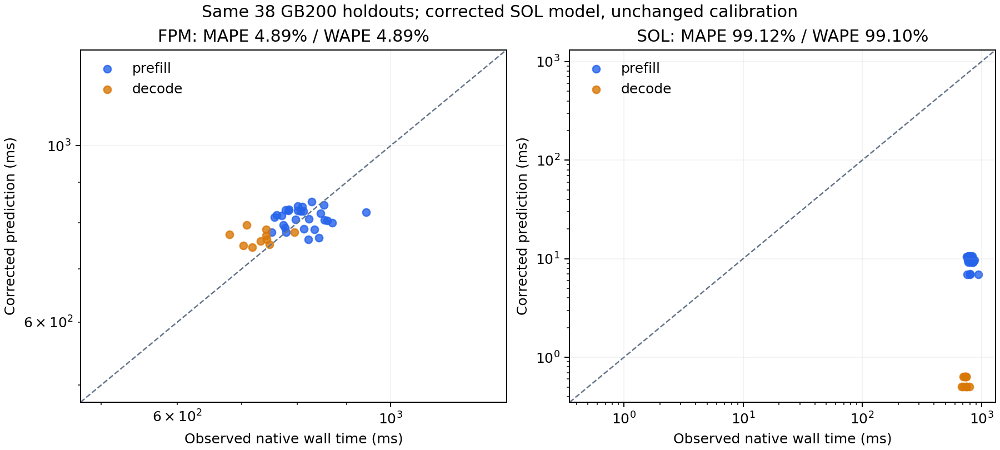

# GB200 prediction refresh after SOL review

This reruns the **same 38 independent holdouts** and unchanged 126-point calibration from [the original report](../holdout-v1/README.md). No new GPU observation, replacement sample, outlier removal or fitted correction is introduced. Each geometry still has one native timing; there is no repeated-run confidence interval.

The predictor includes SOL correction `563f1238`: replicated indexer heads, unique-row SWA HBM lower bounds, both compressor weight reads, restored shared MoE communication and MoE activation coefficients. The actual native build and merged FPM source are pinned in [refresh-provenance.json](refresh-provenance.json).

| Prediction | Coverage | Previous MAPE / WAPE | Corrected MAPE / WAPE | Changed predictions |
|---|---:|---:|---:|---:|
| FPM | 38/38 | 4.89423% / 4.88827% | 4.89423% / 4.88827% | 0/38 |
| SOL | 38/38 | 99.11601% / 99.09783% | 99.12040% / 99.10230% | 38/38 |

All 38 whole-forward FPM predictions are bit-identical to the previous report. All 38 analytical SOL predictions change. SOL remains a strong underestimate of this runtime wall-time boundary; these formula fixes do not establish serving-latency accuracy.

MAPE averages per-configuration absolute percentage errors; WAPE divides total absolute latency error by total observed latency. Both use the same 38 supported pairs. The additive [derived metrics](derived-error-metrics.json) preserve every original compressed result.



[Per-point before/after CSV](prediction-refresh.csv) · [Printable figure](prediction-refresh.pdf). The original report describes the exact native timing boundary, true KV preparation, runtime/kernel identity and limitations. These are native forward measurements, not ordinary HTTP TTFT or ITL verification.

The 121 scoped FPM/SOL/Qwen3.5/collection tests pass with this build, including FPM wrapper resident-weight and activation-interface preservation. The corrected vLLM TP4/8192-token activation estimate increases by 2.5 GiB/GPU; replicated indexer weights add 33,454,080 B/GPU. Those remain analytical memory estimates, not measured allocator accuracy.

Reproduce the CSV, table and figure from the frozen results with Python 3.13 and Matplotlib:

```sh
python render_report.py --directory .
```

Full prediction re-execution uses the existing `verification-plan/compare_fpm_holdout.py`, the original decompressed holdout, admission and `holdout-v1/export_holdout.py`, the unchanged calibration directory, and the two portable prediction configs in this directory. Build the exact predictor commit recorded in the provenance receipt.
