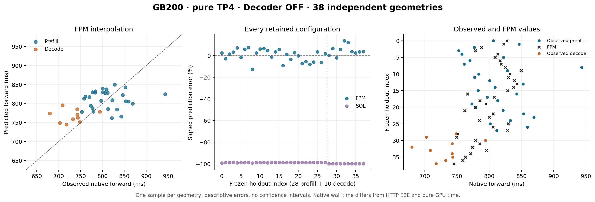

# Real silicon versus prediction: GB200 TP4 whole-forward holdouts

This is **38 fresh, geometrically disjoint holdout configurations** (28 prefill, 10 decode) against the unchanged [126-point calibration](../calibration-v1/README.md). Each geometry has **one native timing sample**. Original real-token and KV histories, native warmup records, phase/attempt IDs, admission checks and runtime/source hashes accompany the results. Calibration self-queries are separate consumer checks and do not contribute to these errors.

The measured configuration is one node, four GB200 GPUs, pure TP4/EP1/DP1/PP1/CP1, text AR, HBM Engram, eager execution, DSpark disabled and Decoder replay OFF. Installed vLLM is `0.1.dev20904+g179dd0fa9`; the composite Dynamo Python/native packages are 1.4.2 with four unchanged instrumentation modules from `54960177085413259859c88bd34ed0734d4c2ea9`. The frozen ARM64 image, actual prepared image, source manifest and selected `FLASHINFER_TRTLLM_MXFP4_MXFP8` kernel are recorded. A recipe commit is not the installed vLLM revision.

## Forward accuracy

The timing target is the native Dynamo FPM wall-time boundary: CPU schedule/output or adjacent output timing, depending on phase. Prefill uses a single step; decode uses a real-KV seeded steady-state second step. It is not a pure GPU device interval and is not interchangeable with the SGLang GPU-event study or HTTP TTFT/ITL. The consumer uses the native **past-KV** axis. The analytical op baseline adds the query once to obtain its inclusive attention length.

| Prediction | Phase | Predicted / planned | Mean signed error | MAPE | Median APE | p90 APE | WAPE |
|---|---|---:|---:|---:|---:|---:|---:|
| FPM | all | 38/38 | 1.46% | 4.89% | 3.84% | 8.30% | 4.89% |
| FPM | prefill | 28/28 | 0.16% | 4.69% | 4.17% | 7.70% | 4.75% |
| FPM | decode | 10/10 | 5.08% | 5.46% | 3.84% | 12.40% | 5.33% |
| SOL | all | 38/38 | -99.12% | 99.12% | 98.87% | 99.93% | 99.10% |
| SOL | prefill | 28/28 | -98.83% | 98.83% | 98.79% | 99.09% | 98.83% |
| SOL | decode | 10/10 | -99.92% | 99.92% | 99.92% | 99.93% | 99.92% |

Missing predictions stay in the coverage denominator; error statistics use supported pairs. Signed/APE statistics weight each configuration equally. WAPE divides total absolute latency error by total observed latency. MAPE is the mean per-configuration absolute percentage error; both metrics use the same supported pairs. p90 APE is a percentile of prediction errors, not p90 serving latency. No correction factor, outlier removal, replacement sample, or fitting to these holdouts is applied.

MAPE is an additive report statistic computed from the original observed/predicted pairs. [Derived metric provenance](derived-error-metrics.json) binds those unchanged compressed results and the reporting source; it does not replace the original prediction provenance.



[Per-configuration observations and predictions (CSV)](forward-comparison.csv) · [Standalone figure (PDF)](forward-comparison.pdf)

## Interpretation and precision

- FPM selects measured FP8 FMHA table cells with the isolated `fpm_fmha_dtype=fp8` selector under the actual FP8 KV/Collector identity contract. This is not a claim that all attention arithmetic uses FP8. Both its SOL interpolation anchors and the standalone SOL baseline keep checkpoint-native analytical precision and the full mixed-precision model, with no activation-dtype override. The original calibration files remain unchanged; the new selector does not relabel measured rows.
- SOL is an idealized logical-work baseline. The inspected installed FlashMLA wrapper pads the 16 local query heads at TP4 to 64 for its supported kernel shape, while this SOL graph uses the model's logical head count. Kernel padding, launch/runtime overhead and native efficiency are not fully represented by that baseline; the selector fix does not add them. Installed-source hashes for this inspection are retained in `artifact-provenance.json`.
- One sample per fixed geometry supports descriptive errors. It does not estimate repeated-run measurement variance or justify confidence intervals. TP ranks, tokens, warmups and calibration rows do not create independent holdout repetitions.
- The two native measurement phases have different producer/run IDs. Their attempts and point manifests differ from calibration. Matching an installed runtime does not require reusing a phase-specific compute hash or autotuning directory.
- These original-text holdouts test the frozen geometry domain. Dedicated corpus controls, ordinary serving prefix reuse, request-length mixtures, TTFT/ITL and throughput are separate verification reports. No production traffic distribution or Engram cache-locality conclusion is implied.
- Decoder replay ON remains an unverified vLLM runtime dependency. OFF data cannot satisfy an ON query.
- Internal allocation details, execution paths and original worker logs stay in the private evidence archive.

## Evidence and reproduction

`holdout.json.gz` preserves the exact normalized native artifact and complete token-stream sidecar bytes, including excluded warmup roles. `admission-receipt.json` binds the original Collector revalidation, frozen manifests, unchanged calibration, actual runtime verification and normalizer. The comparison adapter independently reruns the existing native Collector validator, then invokes the actual Rust whole-forward consumer. It records loaded model/source/binary hashes.

The observed runtime checks include a comparison of read-only verification probe windows with the native benchmark windows, recorded in `admission-receipt.json`. Those timing-boundary checks do not establish absence of every possible environmental effect.

`artifact-provenance.json` records original/decompressed hashes, exact comparison source revision, native binary identity, and portable prediction configs. The only configuration adaptation is the repository-relative calibration path. `artifact-hashes.json` hashes published files. `plot-input-hashes.json` binds renderer inputs. No model estimation happens during rendering.

From this directory, with Python 3.13 and Matplotlib:

```sh
python render_report.py --directory .
```

This reproduces the CSV, tables and PNG/PDF figure from the frozen comparison outputs. Full comparison re-execution uses the pinned `verification-plan/compare_fpm_holdout.py`, decompressed native holdout file, admission, normalizer source, exact calibration overlay and native build recorded in the provenance receipt. Private runtime evidence is required to repeat the independent raw-admission/export step.
