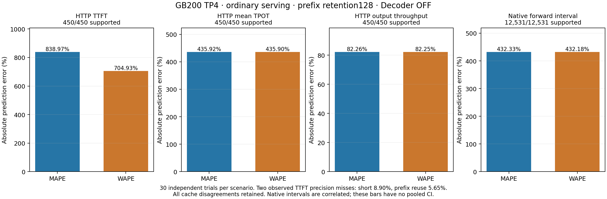

# GB200 TP4 ordinary-serving FPM verification

The frozen model predicts every measured primary cohort and native interval, but errors are large. This report retains every observed pair, including cache disagreements and unmet precision targets. It provides validation evidence; it does not establish accurate serving predictions.

Native prefix retention is **128**, with observed prefix reuse **512 tokens**. Decoder replay is OFF; execution is eager, TP4/EP1/DP1/PP1, Engram in HBM, with the pinned checkpoint's mixed precision and explicit FP8 FMHA table identity. The results are conditional on this policy, one physical lifecycle and the unchanged 126-point calibration.

| Metric | Supported / observed | Observed mean (supported) | Predicted mean | MAPE | WAPE |
|---|---:|---:|---:|---:|---:|
| ttft_ms | 450/450 | 338.2325 | 2722.5513 | 838.9658 | 704.9348 |
| average_tpot_ms | 450/450 | 143.8283 | 770.7779 | 435.9172 | 435.9016 |
| exact_itl_ms | 450/450 | 143.8283 | 770.7779 | 435.9172 | 435.9016 |
| output_tokens_per_second | 450/450 | 9.1974 | 1.6325 | 82.2571 | 82.2500 |
| request_latency_ms | 450/450 | 3801.1446 | 21316.0879 | 464.1971 | 460.7808 |
| last_token_latency_ms | 450/450 | 3800.5869 | 21316.0879 | 464.2936 | 460.8631 |
| native_forward_interval_ms | 12531/12531 | 144.4104 | 768.5187 | 432.3291 | 432.1768 |



## Coverage and uncertainty

The main stage has 30 independent trials per eligible scenario: 15 primary scenarios, 450 primary cohorts and 660 primary requests. Accuracy uses those 450 cohorts and their 12,531 native intervals. Full main coverage is 510 cohorts/720 requests, including 60 setup cohorts/requests. Ten pilot trials determine the fixed sample budget and are excluded. All phases together contain 705 cohorts/994 requests and 17,230 active dispatches plus 41 heartbeat records; those are lifecycle counts, not accuracy denominators.

MAPE, WAPE and supported means use identical successful observed/predicted pairs. Per-scenario values and original intervals remain in the compressed reports and CSV. Output tokens per second is finite-cohort throughput, not saturation throughput or serving capacity. All 30 trials are retained. Native intervals are correlated and are never independent replicates. The frozen sample budget remained 30; the existing 100-trial cap was not active.

Two observed TTFT cells miss the 5% relative half-width target:

| Scenario | Observed mean, ms | Pointwise 95% CI, ms | Relative half-width |
|---|---:|---|---:|
| prefix-reuse-B | 172.6192405 | 165.214589212 to 184.709324378 | 5.6467% |
| short | 170.5885279 | 160.210176155 to 190.560767030 | 8.8958% |

The other 43 preregistered observation cells and 15 supplementary exact-ITL cells meet 5%. Observation intervals use 5,000 whole-trial resamples with seed 92031519. Comparison intervals use 5,000 paired whole-trial resamples with seed 94051000. E2E stores an observed-mean CI and a **ratio-of-sums error CI**: `100*(sum(predicted)/sum(observed)-1)`. The latter is not a CI for mean per-trial percentage error, MAPE or WAPE. E2E MAPE/WAPE CIs are absent. Native intervals retain whole-trial CIs for mean trial total-forward bias, interval MAPE and interval WAPE. All CIs are pointwise; no pooled cross-scenario CI is claimed. Error p90 is across whole trials (or correlated native intervals where labeled), not token-tail latency. Mean ITL/TPOT is not tail ITL. Response-completion and last-token metrics are supplementary and did not enter the pilot N rule.

## Cache, calibration and runtime limits

All 13 cache-semantic disagreements among 450 primary cohorts are retained: 13/30 engram-repeated-text cohorts. Native and replay cache-token counts remain alongside every request. All 30 prefix-reuse-B main cohorts observed 512 cached tokens. The native pressure witness reports 24,958 allocation attempts, zero refusals/exceptions/preemptions, and minimum free physical blocks 198,246 above watermark 0 (198,374 total). Shared physical blocks are not converted to logical token capacity; allocator memory accuracy is not validated.

The calibration contains 126/126 measured points (100 prefill, 26 decode). Calibration consumer self-queries are excluded from accuracy. Native query-coordinate coverage is:

| Native coordinate region | Supported / observed intervals |
|---|---:|
| exact_aggregate_calibration_coordinate | 567/567 |
| mixed_no_single_measured_coordinate | 239/239 |
| unseen_inside_raw_phase_bounding_box | 11725/11725 |

These are aggregate coordinates actually submitted to the whole-forward predictor after the declared axis bridge. Exact coordinate equality does not mean identical request content, homogeneous lengths or schedule. Inside a raw bounding box is not proof of interpolation coverage; outside it is not automatically a failed prediction. Existing SOL anchors, clamps and floors are unchanged. Prediction success and measured-coordinate coverage are separate. Native region labels do not classify the HTTP replay's potentially different queries. The heterogeneous HTTP cohort contains three queued requests, while max-num-seqs is two; HTTP concurrency is not native batch size. The normalized corpus role is primary; frozen coverage/stress roles are preserved.

The ordinary free-autoregressive canary has 8/10 equal output sequences and 2/10 different sequences, with 2/16 aligned token positions different. All outputs and timings are retained, and reference tokens do not control sampling. This comparison is not a main accuracy denominator and does not establish model-quality equivalence.

Native observations are vLLM CPU schedule/output or adjacent-output intervals, not SGLang GPU-event intervals. HTTP adds frontend, transport and completion costs. The current vLLM Aggregated replay still charges a separate first-output decode after prefill. Current SGLang emits its first token at final prefill. [CURRENT_REPLAY_SEMANTICS.md](../CURRENT_REPLAY_SEMANTICS.md) corrects stale shared prose in the untouched E2E report. No decode time is subtracted from predictions. The large native interval error exists independently of that HTTP first-token limitation; no causal kernel explanation is established. These are retention128 results, not default-retention0 results.

## Provenance and reproduction

Prediction model/native identity: commit `3627568d809774eb693abf3551a2ed36ad1dc032`, native extension `f54a6015f6a97212e018615d909f1814f729d9b25df8b64e86802b7c5630e163`. The forward analysis helper has a separately recorded source hash. Its fixes preserve observed/native values and predictor formulas/configuration; the original failed attempt remains private and unchanged. They are not a model refit.

Base ARM64 image digest: `sha256:d84a123255b822fc22508635218000187221794f59c0694c33b0650d1e377d58`. Actual prepared squashfs bytes SHA-256: `c42ea19c53004855c25731f2cf5e6b5e3955ed677f8d3a7b854b864b11e32d52` (21,501,927,424 bytes). These identify different objects.

`provenance.json` binds the exact original private reports, source files and calibration inventory. The public data is an allowlisted presentation projection with ordinal trial/scenario/request/interval IDs. Retained measurement/prediction numbers and CI arrays are preserved; private counters, paths, allocation/node details and UUIDs are omitted. Original raw evidence stays private. No runtime/data-loader contract is changed and no recovered third-party runtime source is included.

From the repository root, regenerate tables and figures into a new directory:

```sh
python data/experimental/deepseek-v41/gb200-fpm/ordinary-serving-retention128-v1/render_report.py \
  --output /path/to/new-report
```

The renderer validates `render-inputs.json`, rechecks paired metric arithmetic, and uses only the public compressed data. It never invokes FPM or inference. Python and Matplotlib are required. `export_public.py --help` documents private-evidence projection inputs; the exact private invocation and file hashes are retained in the private export receipt. Export requires the unchanged explicit FP8 config and existing calibration-v1 overlay. Gzip headers and PDF metadata are deterministic; regenerated image bytes require the recorded Matplotlib version. `report/plot-input-hashes.json` records renderer/input hashes and plotting versions.
