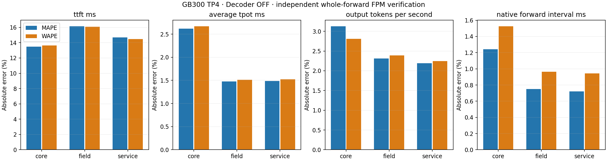

# GB300 TP4 independent whole-forward FPM verification

Decoder replay: **OFF**. Core, field and service remain separate.

| Scope | Metric | Supported / observed | Real mean | Prediction mean | MAPE | WAPE |
| --- | --- | --- | ---: | ---: | ---: | ---: |
| core | ttft_ms | 600/600 | 373.0687 | 404.5978 | 13.4865 | 13.6283 |
| core | average_tpot_ms | 600/600 | 158.8418 | 154.6191 | 2.6206 | 2.6674 |
| core | exact_itl_ms | 600/600 | 158.8418 | 154.6191 | 2.6206 | 2.6674 |
| core | output_tokens_per_second | 600/600 | 8.6773 | 8.7195 | 3.1243 | 2.8097 |
| core | request_latency_ms | 600/600 | 4210.8404 | 4145.3728 | 2.8292 | 2.6941 |
| core | last_token_latency_ms | 600/600 | 4210.3188 | 4145.3728 | 2.8238 | 2.6913 |
| core | native_forward_interval_ms | 15756/15756 | 157.0012 | 155.3409 | 1.2409 | 1.5244 |
| field | ttft_ms | 120/120 | 372.8503 | 417.5014 | 16.1361 | 16.0925 |
| field | average_tpot_ms | 120/120 | 158.0262 | 155.6521 | 1.4787 | 1.5117 |
| field | exact_itl_ms | 120/120 | 158.0262 | 155.6521 | 1.4787 | 1.5117 |
| field | output_tokens_per_second | 120/120 | 8.9944 | 8.9261 | 2.3120 | 2.3869 |
| field | request_latency_ms | 120/120 | 4649.6881 | 4629.4073 | 2.0272 | 2.0865 |
| field | last_token_latency_ms | 120/120 | 4649.1611 | 4629.4073 | 2.0242 | 2.0847 |
| field | native_forward_interval_ms | 3503/3503 | 155.9893 | 155.5281 | 0.7507 | 0.9648 |
| service | ttft_ms | 120/120 | 375.8119 | 417.5004 | 14.6925 | 14.4668 |
| service | average_tpot_ms | 120/120 | 158.0412 | 155.6521 | 1.4870 | 1.5236 |
| service | exact_itl_ms | 120/120 | 158.0412 | 155.6521 | 1.4870 | 1.5236 |
| service | output_tokens_per_second | 120/120 | 8.9855 | 8.9261 | 2.1926 | 2.2429 |
| service | request_latency_ms | 120/120 | 4653.5620 | 4629.4064 | 1.9447 | 1.9956 |
| service | last_token_latency_ms | 120/120 | 4653.0424 | 4629.4064 | 1.9401 | 1.9922 |
| service | native_forward_interval_ms | 3509/3509 | 155.8776 | 155.5706 | 0.7217 | 0.9423 |

Both errors use identical supported pairs. Missing predictions remain in coverage and keep their original failure reasons.
Observed coverage, prediction coverage and measured calibration-coordinate coverage are separate in each source summary.
Native intervals are correlated. Original scenario CIs remain in the compressed comparison outputs; core ON stays segmented, with no pooled lifecycle CI.
Core scenario rows spanning lifecycle segments are descriptive error aggregates, without a pooled CI.
HTTP timing includes service costs outside the native DeviceTimer interval; mean TPOT is not tail ITL.
The calibration-only consumer self-query checks appear separately under ../calibration and are excluded from every accuracy table and plot.
