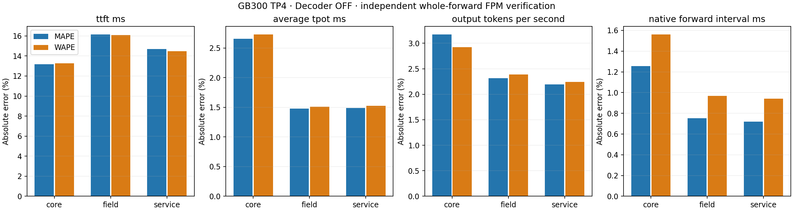

# GB300 TP4 independent whole-forward FPM verification

Decoder replay: **OFF**. Core, field and service remain separate.

| Scope | Metric | Supported / observed | Real mean | Prediction mean | MAPE | WAPE |
| --- | --- | --- | ---: | ---: | ---: | ---: |
| core | ttft_ms | 440/600 | 365.2756 | 393.7219 | 13.1621 | 13.2815 |
| core | average_tpot_ms | 440/600 | 158.7465 | 154.4223 | 2.6574 | 2.7261 |
| core | exact_itl_ms | 440/600 | 158.7465 | 154.4223 | 2.6574 | 2.7261 |
| core | output_tokens_per_second | 440/600 | 8.0751 | 8.1348 | 3.1702 | 2.9208 |
| core | request_latency_ms | 440/600 | 4031.4656 | 3963.9154 | 2.9020 | 2.8092 |
| core | last_token_latency_ms | 440/600 | 4030.9883 | 3963.9154 | 2.8952 | 2.8051 |
| core | native_forward_interval_ms | 14220/15756 | 156.4082 | 154.4908 | 1.2556 | 1.5594 |
| field | ttft_ms | 120/120 | 372.8503 | 417.5014 | 16.1361 | 16.0925 |
| field | average_tpot_ms | 120/120 | 158.0262 | 155.6521 | 1.4787 | 1.5117 |
| field | exact_itl_ms | 120/120 | 158.0262 | 155.6521 | 1.4787 | 1.5117 |
| field | output_tokens_per_second | 120/120 | 8.9944 | 8.9261 | 2.3120 | 2.3869 |
| field | request_latency_ms | 120/120 | 4649.6881 | 4629.4073 | 2.0272 | 2.0865 |
| field | last_token_latency_ms | 120/120 | 4649.1611 | 4629.4073 | 2.0242 | 2.0847 |
| field | native_forward_interval_ms | 3466/3503 | 155.6610 | 155.2014 | 0.7513 | 0.9682 |
| service | ttft_ms | 120/120 | 375.8119 | 417.5004 | 14.6925 | 14.4668 |
| service | average_tpot_ms | 120/120 | 158.0412 | 155.6521 | 1.4870 | 1.5236 |
| service | exact_itl_ms | 120/120 | 158.0412 | 155.6521 | 1.4870 | 1.5236 |
| service | output_tokens_per_second | 120/120 | 8.9855 | 8.9261 | 2.1926 | 2.2429 |
| service | request_latency_ms | 120/120 | 4653.5620 | 4629.4064 | 1.9447 | 1.9956 |
| service | last_token_latency_ms | 120/120 | 4653.0424 | 4629.4064 | 1.9401 | 1.9922 |
| service | native_forward_interval_ms | 3478/3509 | 155.5965 | 155.2982 | 0.7200 | 0.9424 |

Both errors use identical supported pairs. Missing predictions remain in coverage and keep their original failure reasons.
Observed coverage, prediction coverage and measured calibration-coordinate coverage are separate in each source summary.
Native intervals are correlated. Original scenario CIs remain in the compressed comparison outputs; core ON stays segmented, with no pooled lifecycle CI.
Core scenario rows spanning lifecycle segments are descriptive error aggregates, without a pooled CI.
HTTP timing includes service costs outside the native DeviceTimer interval; mean TPOT is not tail ITL.
The calibration-only consumer self-query checks appear separately under ../calibration and are excluded from every accuracy table and plot.
