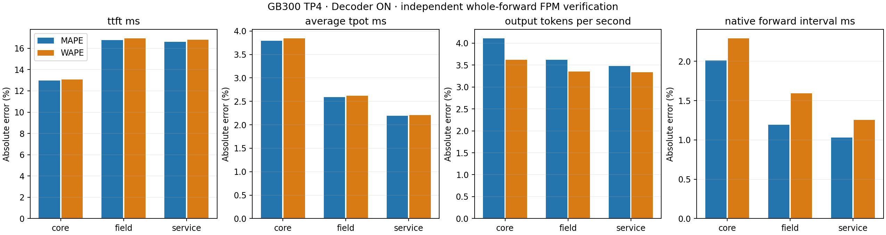

# GB300 TP4 independent whole-forward FPM verification

Decoder replay: **ON**. Core, field and service remain separate.

| Scope | Metric | Supported / observed | Real mean | Prediction mean | MAPE | WAPE |
| --- | --- | --- | ---: | ---: | ---: | ---: |
| core | ttft_ms | 1400/1500 | 367.9819 | 390.4054 | 12.9572 | 13.0736 |
| core | average_tpot_ms | 1400/1500 | 160.2495 | 154.1667 | 3.7935 | 3.8406 |
| core | exact_itl_ms | 1400/1500 | 160.2495 | 154.1667 | 3.7935 | 3.8406 |
| core | output_tokens_per_second | 1400/1500 | 7.9721 | 8.1116 | 4.1050 | 3.6237 |
| core | request_latency_ms | 1400/1500 | 4161.1852 | 4049.9143 | 3.7750 | 3.5140 |
| core | last_token_latency_ms | 1400/1500 | 4160.7074 | 4049.9143 | 3.7685 | 3.5098 |
| core | native_forward_interval_ms | 39293/39393 | 158.5977 | 155.2858 | 2.0114 | 2.2897 |
| field | ttft_ms | 120/120 | 372.2376 | 415.1192 | 16.7871 | 16.9198 |
| field | average_tpot_ms | 120/120 | 159.4551 | 155.3943 | 2.5895 | 2.6213 |
| field | exact_itl_ms | 120/120 | 159.4551 | 155.3943 | 2.5895 | 2.6213 |
| field | output_tokens_per_second | 120/120 | 8.9204 | 8.9163 | 3.6209 | 3.3529 |
| field | request_latency_ms | 120/120 | 4689.3444 | 4631.8558 | 3.1296 | 2.9778 |
| field | last_token_latency_ms | 120/120 | 4688.8154 | 4631.8558 | 3.1268 | 2.9762 |
| field | native_forward_interval_ms | 3503/3503 | 157.3066 | 155.6014 | 1.1930 | 1.5929 |
| service | ttft_ms | 120/120 | 371.3825 | 415.1200 | 16.5980 | 16.8026 |
| service | average_tpot_ms | 120/120 | 158.4320 | 155.3943 | 2.1891 | 2.2047 |
| service | exact_itl_ms | 120/120 | 158.4320 | 155.3943 | 2.1891 | 2.2047 |
| service | output_tokens_per_second | 120/120 | 8.9781 | 8.9163 | 3.4813 | 3.3344 |
| service | request_latency_ms | 120/120 | 4658.6337 | 4631.8566 | 2.8795 | 2.7001 |
| service | last_token_latency_ms | 120/120 | 4658.1053 | 4631.8566 | 2.8768 | 2.6986 |
| service | native_forward_interval_ms | 3504/3504 | 156.2507 | 155.6079 | 1.0321 | 1.2546 |

Both errors use identical supported pairs. Missing predictions remain in coverage and keep their original failure reasons.
Observed coverage, prediction coverage and measured calibration-coordinate coverage are separate in each source summary.
Native intervals are correlated. Original scenario CIs remain in the compressed comparison outputs; core ON stays segmented, with no pooled lifecycle CI.
Core scenario rows spanning lifecycle segments are descriptive error aggregates, without a pooled CI.
HTTP timing includes service costs outside the native DeviceTimer interval; mean TPOT is not tail ITL.
The calibration-only consumer self-query checks appear separately under ../calibration and are excluded from every accuracy table and plot.
