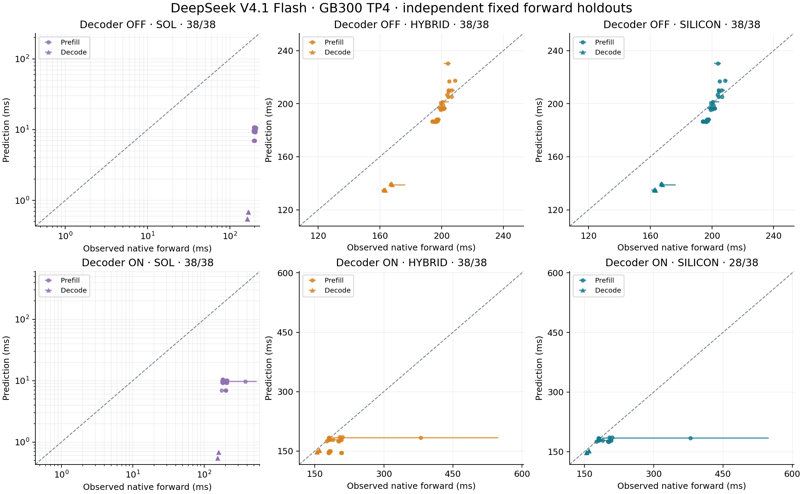

# GB300 independent native forward comparison

The complete fixed holdout contains 38 configurations per Decoder profile. SILICON predicts all 38 with Decoder OFF and 28 with Decoder ON. The ten missing ON cases remain missing; HYBRID uses analytical fallback for those cases. These measurements do not establish HTTP E2E or whole-forward FPM accuracy.

## Observed versus predicted

Each observation is the median of three independently invoked forwards, after taking the maximum of all four TP ranks for each invocation. One warmup per configuration is retained and excluded. Error is `(prediction / observation - 1) * 100`. Configurations have equal weight for signed bias and APE percentiles; WAPE is `sum(abs(prediction - observation)) / sum(observation)`. The p90 column describes errors across configurations, not request tail latency.

| Profile | Mode | Predicted / measured | Mean signed error | Median APE | p90 APE | WAPE |
|---|---|---:|---:|---:|---:|---:|
| Decoder OFF | SOL | 38/38 | -96.42% | 95.32% | 99.67% | 96.26% |
| Decoder OFF | HYBRID | 38/38 | -5.15% | 4.13% | 17.05% | 6.38% |
| Decoder OFF | SILICON | 38/38 | -5.15% | 4.13% | 17.05% | 6.38% |
| Decoder ON | SOL | 38/38 | -96.32% | 95.30% | 99.65% | 96.22% |
| Decoder ON | HYBRID | 38/38 | -10.65% | 5.61% | 19.05% | 12.41% |
| Decoder ON | SILICON | 28/38 | -7.00% | 4.73% | 13.60% | 9.29% |

SILICON enforces measured V4.1 table coverage with shared-layer reuse disabled. Generic embedding, normalization, activation and memory operations still use the existing empirical models; a stage total is not entirely measured. SOL is the analytical lower-bound model and its large negative bias is reported explicitly. No correction factor was fitted to these holdouts.

Horizontal whiskers show the minimum and maximum of the three measured repetitions, not confidence intervals. The dashed line denotes exact agreement. Missing predictions have no point on the scatter and remain in the coverage denominator.

## Phase breakdown

| Profile | Mode | Phase | Coverage | Mean signed error | Median APE | WAPE |
|---|---|---|---:|---:|---:|---:|
| Decoder OFF | SOL | Prefill | 28/28 | -95.27% | 95.20% | 95.27% |
| Decoder OFF | SOL | Decode | 10/10 | -99.63% | 99.63% | 99.63% |
| Decoder OFF | HYBRID | Prefill | 28/28 | -0.91% | 2.75% | 3.24% |
| Decoder OFF | HYBRID | Decode | 10/10 | -17.04% | 16.99% | 17.04% |
| Decoder OFF | SILICON | Prefill | 28/28 | -0.91% | 2.75% | 3.24% |
| Decoder OFF | SILICON | Decode | 10/10 | -17.04% | 16.99% | 17.04% |
| Decoder ON | SOL | Prefill | 28/28 | -95.15% | 94.89% | 95.25% |
| Decoder ON | SOL | Decode | 10/10 | -99.61% | 99.61% | 99.61% |
| Decoder ON | HYBRID | Prefill | 28/28 | -12.73% | 13.18% | 14.58% |
| Decoder ON | HYBRID | Decode | 10/10 | -4.81% | 4.73% | 4.81% |
| Decoder ON | SILICON | Prefill | 18/28 | -8.22% | 3.90% | 11.22% |
| Decoder ON | SILICON | Decode | 10/10 | -4.81% | 4.73% | 4.81% |

Compare modes on the same supported subset as well: a smaller coverage set can otherwise conceal hard cases.

| Profile | Mode | Common strict subset | Mean signed error | Median APE | p90 APE | WAPE |
|---|---|---:|---:|---:|---:|---:|
| Decoder OFF | SOL | 38/38 | -96.42% | 95.32% | 99.67% | 96.26% |
| Decoder OFF | HYBRID | 38/38 | -5.15% | 4.13% | 17.05% | 6.38% |
| Decoder OFF | SILICON | 38/38 | -5.15% | 4.13% | 17.05% | 6.38% |
| Decoder ON | SOL | 28/38 | -96.93% | 96.28% | 99.65% | 96.78% |
| Decoder ON | HYBRID | 28/38 | -7.00% | 4.73% | 13.60% | 9.29% |
| Decoder ON | SILICON | 28/38 | -7.00% | 4.73% | 13.60% | 9.29% |

## Repeat stability

| Profile | Median within-point CV | Largest within-point CV | Case with largest CV | Repetitions (ms) |
|---|---:|---:|---|---|
| Decoder OFF | 0.49% | 2.92% | decode-0005 | 168.006, 167.749, 176.511 |
| Decoder ON | 0.29% | 48.55% | prefill-0017 | 548.985, 379.867, 187.826 |

The ON B2 / 96-new-token / zero-prefix point is unstable in this three-repeat attempt. All three values, including the two slow forwards, remain in the reported median and error calculation. A separate precision attempt with ten repetitions for every one of the 38 holdouts in both profiles is prepared; it will not replace or silently pool this attempt. Its results are pending. The current WAPE and scatter must be read together with this repeat instability.

## Coverage and limitations

The frozen calibration contains 126 configurations per profile (100 prefill, 26 decode); the separate holdout contains 38 (28 prefill, 10 decode). Each configuration has one warmup and three measured repetitions. Per profile this is 378 calibration and 114 holdout measured invocations, each requiring four rank records. TP ranks and component keys are not independent workloads. Both final calibration/holdout attempts passed their raw evidence admission checks. See the [study evidence and attempt notes](../study/README.md) for collection details.

Decoder OFF has 836 calibrated V4.1 physical module keys; Decoder ON has 830. Each has 80 GEMM/MoE/NCCL baseline keys. These calibration rows are never counted as independent accuracy results. The forward-only holdout ran without the component recorder and contributed no component rows to calibration.

The ON holdout exposes exact-prefix coverage gaps after the bounded layers shift a long extension to its last 128 tokens. The current lookup requires the shifted prefix bucket to exist. Missing cases are listed below, with their full native failure retained in the result JSON. Filling these from holdout module timings would contaminate the test; this report performs no such refill.

| Missing strict ON case | Batch | New tokens / request | Initial prefix |
|---|---:|---:|---:|
| prefill-0002 | 1 | 192 | 0 |
| prefill-0006 | 1 | 192 | 128 |
| prefill-0010 | 1 | 192 | 512 |
| prefill-0011 | 1 | 384 | 512 |
| prefill-0014 | 1 | 192 | 1536 |
| prefill-0015 | 1 | 384 | 1536 |
| prefill-0018 | 2 | 192 | 0 |
| prefill-0021 | 2 | 192 | 128 |
| prefill-0024 | 2 | 192 | 512 |
| prefill-0027 | 2 | 192 | 1536 |

The observation boundary is the native SGLang synchronized wall time around preparation, forward and sampling. It includes shared Engram hash/history work omitted from the module graph. Native mHC retains its statistics stream; component measurement serializes that stream. Baseline expert routing is seeded uniform synthetic routing, while held-out forward uses real text. These are explicit possible sources of error, not measured causal attributions. Profiles were collected in separate runs, so their timing ratio is not a controlled paired estimate of Decoder optimization speedup.

This is a fixed geometry grid with three repetitions per point. It does not provide a production-workload confidence interval. Independent E2E trials will supply separate trial-level uncertainty estimates. Other corpora, larger batches, long contexts, candidate saturation, CUDA graphs, other parallel layouts, vision and DSpark remain outside this result.

## Reproduction and identity

Use the [pinned runtime, kernel and input evidence](../study/README.md). The measurement uses four GB300 GPUs, pure TP4/EP1/DP1/PP1, SGLang `0.0.0.dev0`, ARM64 image `sha256:800cc9adea5be1e18f48185451220c4bc487c545b7095c720d2ccc9ba9bb3b5d`, checkpoint `fb2764a5cf321eaa5070ca8f9e892818f477c16d`, eager execution, DSpark off, Engram in HBM, and explicit NCCL with custom and FlashInfer AR fusion disabled. Resident unused vision weights are a runtime loading limitation; no vision work is executed. Do not reinterpret this as a graph-enabled or fused-AR result.

1. In the SILICON checkout, rebuild the native extension and run `verify_study.py` with `PYTHONPATH=python/aisimulate/src:python/aisimulate`.
2. Use the analysis utility from the sibling FPM PR at [`f9dc0f21`](https://github.com/ai-dynamo/aisimulate/tree/f9dc0f21/data/experimental/deepseek-v41/verification-plan). That utility calls the shared native forward API; it does not require FPM calibration to produce these op-level predictions. Keep the SILICON checkout as the working directory and Python source path.
3. For each profile/mode, run `compare_forward.py --observations data/experimental/deepseek-v41/gb300-silicon/study/<profile>/heldout/forward-results.json --heldout-plan <FPM-checkout>/data/experimental/deepseek-v41/verification-plan/heldout.json --prediction-config data/experimental/deepseek-v41/gb300-silicon/report/<profile>-<mode>-config.json --output <new-results-file.json>`. The utility refuses to overwrite results.
4. Run `render_report.py` to regenerate this document and PNG/PDF figures from the six stored comparison files. [SHA-256 receipt](artifact-hashes.json) pins the input/configuration/results and rendering source. Each result also pins the actually imported model, engine and native binary, independent of installed package metadata. Internal cluster logs and identifiers are kept separately.
