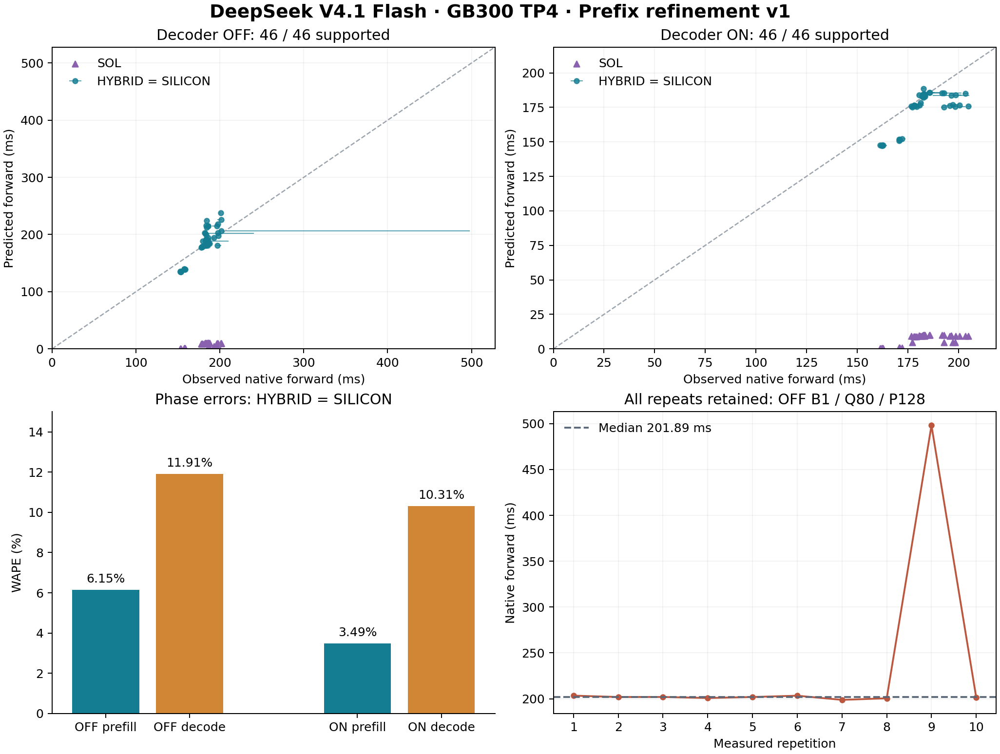

# GB300 prefix refinement: independent forward validation

Strict SILICON and HYBRID predict **46/46 fresh holdouts in both Decoder profiles**. Their predictions are identical on this set. WAPE is **7.23% with Decoder OFF** and **4.85% with Decoder ON**. This is native benchmark-forward validation; it does not establish HTTP or serving FPM accuracy. One OFF repetition was much slower and is retained below.



Points compare the median native forward with prediction. Horizontal whiskers span all ten measured repetitions, not confidence intervals. The line denotes exact agreement. The lower panels separate prefill/decode error and expose the largest repeat variation.

## Accuracy and common support

| Profile | Mode | Coverage | Mean signed error | Median APE | p90 APE | WAPE |
|---|---|---:|---:|---:|---:|---:|
| Decoder OFF | SOL | 46/46 | -96.14% | 95.02% | 99.61% | 96.02% |
| Decoder OFF | HYBRID | 46/46 | +1.37% | 6.67% | 15.38% | 7.23% |
| Decoder OFF | SILICON | 46/46 | +1.37% | 6.67% | 15.38% | 7.23% |
| Decoder ON | SOL | 46/46 | -96.14% | 95.02% | 99.64% | 96.07% |
| Decoder ON | HYBRID | 46/46 | -4.38% | 2.29% | 11.48% | 4.85% |
| Decoder ON | SILICON | 46/46 | -4.38% | 2.29% | 11.48% | 4.85% |

All three modes share the same 46 supported configurations per profile; the common-support statistics therefore equal the table above. No missing point was dropped from a denominator. Strict SILICON disables shared-source fallback. Existing empirical embedding, normalization, activation and memory operations remain empirical, so a successful strict query is not a claim that every forward cost was measured. SOL's roughly 96% underprediction against this native wall interval is shown explicitly; it is not a validated wall-latency forecast.

| Profile | Phase | Mode | Coverage | Mean signed error | Median APE | WAPE |
|---|---|---|---:|---:|---:|---:|
| Decoder OFF | Prefill | SOL | 36/36 | -95.17% | 94.86% | 95.19% |
| Decoder OFF | Prefill | HYBRID / SILICON | 36/36 | +5.06% | 3.56% | 6.15% |
| Decoder OFF | Decode | SOL | 10/10 | -99.61% | 99.61% | 99.61% |
| Decoder OFF | Decode | HYBRID / SILICON | 10/10 | -11.91% | 11.98% | 11.91% |
| Decoder ON | Prefill | SOL | 36/36 | -95.17% | 94.82% | 95.19% |
| Decoder ON | Prefill | HYBRID / SILICON | 36/36 | -2.74% | 1.15% | 3.49% |
| Decoder ON | Decode | SOL | 10/10 | -99.64% | 99.64% | 99.63% |
| Decoder ON | Decode | HYBRID / SILICON | 10/10 | -10.28% | 10.32% | 10.31% |

The 36 prefill and 10 decode points are also reported separately: decode is underpredicted by about 10-12% despite the smaller combined WAPE. Signed error is `100*(prediction/observation-1)`. APE percentiles weight each logical configuration equally; WAPE is `100*sum(abs(prediction-observation))/sum(observation)`. The p90 column is a percentile across configurations, not request tail latency. Each observation is the median of ten invocation times, each invocation first taking the maximum across four TP ranks. There is no fitted correction.

## Repeat stability

| Profile | Median within-point CV | Maximum CV | Worst configuration |
|---|---:|---:|---|
| Decoder OFF | 0.31% | 40.56% | prefill-0004: B1, Q80, P128 |
| Decoder ON | 0.36% | 2.80% | prefill-0034: B2, Q130, P512 |

OFF B1/Q80/P128 measured (ms): 203.363, 201.895, 201.937, 200.802, 201.891, 203.311, 198.793, 200.479, 498.046, 201.465. The 498.046 ms invocation remains in the raw evidence and the plot; the median is 201.893 ms. No repetition was removed or replaced. CV uses the sample standard deviation divided by the mean of the ten rank maxima. Low median CV does not establish stability across runtime lifecycles, and the cause of this slow invocation has not been established.

## Why these samples

This separate study was frozen before measurement: **18 new bounded calibration configurations** (one warmup plus three measured invocations each), and **46 new holdouts per profile** (one warmup plus ten measured invocations each). Thus there are 92 fresh profile/configuration pairs, 974 measured invocations per rank (`18*3+92*10`), and 110 warmups. TP ranks, repetitions, and physical module keys are not independent workload configurations.

The count 18 is a conditional minimum under the existing exact-prefix consumer and fixed target: ten absent `(batch, effective late-layer prefix)` curves exposed by the old bounded holdouts, plus eight different curves required by the new Q130 target. One homogeneous calibration configuration can supply only one of these curves for its batch. This is not a universal minimum for V4.1 or a statistical sample-size guarantee. Ten holdout repetitions improve within-case precision; this bounded grid does not support a population-level accuracy confidence interval.

The 46 whole-forward geometries per profile are disjoint from old and new calibration and old holdouts. Their forward-only runs contain no component recorder and contribute no fitted rows. Explicitly audited pilot reuse adds only attention at B1/P256/Q3 or Q128; formal same-key rows always win. The final module tables contain 848 OFF and 948 ON keys, plus the unchanged 80 baseline keys per profile. See the [frozen design and admission receipts](../../prefix-refinement-v1/README.md).

These are different holdouts from the original 38-point study. Comparing their percentages does not isolate the benefit of calibration refinement. The [original three-repeat report](../README.md) and [38-point precision repeat](../precision-v2/README.md) remain unchanged, including their missing ON predictions and variable observations.

## Identity, scope, and reproduction

The target is the original SGLang synchronized one-batch wall interval, including preparation, all layers, shared Engram hashing, forward and sampling. It differs from GPU-timed serving FPM and HTTP latency. Runtime is SGLang 0.0.0.dev0, pinned ARM image `800cc9ad…`, text-only TP4/EP1, DP1/PP1, eager prefill/decode, sharded shared experts and explicit unfused NCCL. Decoder ON uses the verified current-extend tail semantics. The checkpoint and effective quantization are unchanged. For decode, canonical past KV K is seeded and native inclusive K+1 is predicted, without a second increment.

The domain remains homogeneous B1/B2, at most 512 total new prefill tokens and native context at most 2048. This does not qualify heterogeneous/B3 requests, arbitrary exact-prefix buckets, longer contexts, new corpora, different kernels, scheduling or repeated-text cache semantics. No model formula or correction was changed for these results.

Every result JSON binds the observed attempt, frozen point manifest, configuration, checkpoint, resolved model, actual source files and complete system-overlay hashes. The renderer independently checks all 276 predictions against admitted observations and plan geometry, recomputes statistics, checks source and data hashes, and verifies original artifact preservation. `artifact-hashes.json` binds this review and its outputs. To regenerate with the source-verified FPM comparison tools from the companion PR available at `$ANALYSIS_DIR`:

```bash
export PYTHONPATH=python/aisimulate/src:python/aisimulate
python data/experimental/deepseek-v41/gb300-silicon/report/prefix-refinement-v1/render_report.py --analysis-dir "$ANALYSIS_DIR"
```
