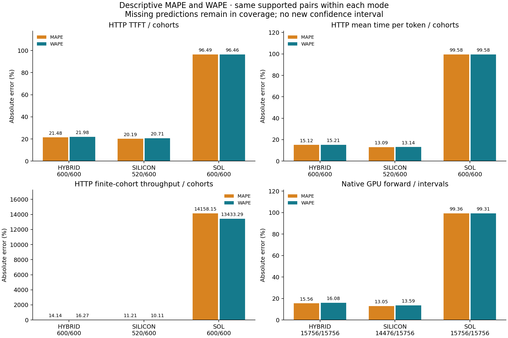
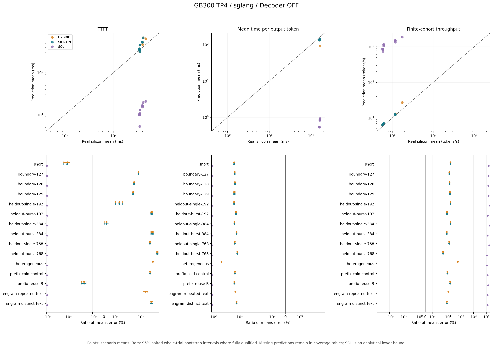
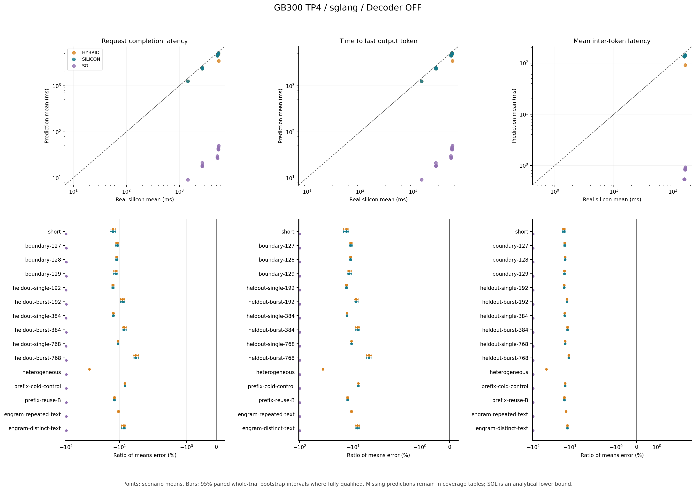
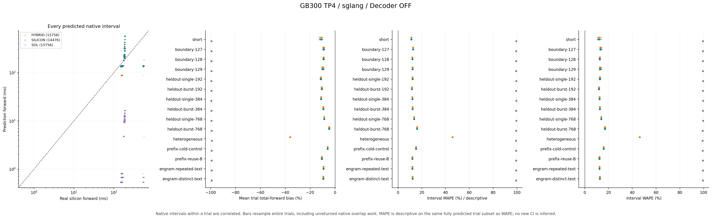

# Real silicon versus prediction: GB300 TP4 / Decoder OFF / primary

The observed runtime is `sglang 0.0.0.dev0` in eager text AR, with DSpark disabled. These comparisons use one physical runtime lifecycle. Each mode uses the same real HTTP requests and native intervals. Model, calibration, binary, source and raw-evidence identities are recorded in the result files. No correction factor is fitted to these observations.

The frozen main plan requests **40 independent trials per scenario**. The closed audit covers **680/680** planned main cohorts including setup, and **600** metric-bearing cohorts. Warmup, canary, pilot and prefix preparation are separate roles. Repeated decode intervals and TP ranks do not increase the independent trial count.

The adjacent `main-budget.json` and original pilot/main statistics retain the sample-size decision. The rule takes the largest required N across TTFT, mean time per token, and throughput: at least 20, rounded up to a multiple of 10 from `(1.96 * pilot_CV / 0.05)^2`, capped at 100. Each corpus/profile uses independent pilot and main seeds. Achieved uncertainty is reported below; the budget is an estimate, not a precision guarantee.



[Descriptive metric receipt](descriptive-metrics.json) pins the unchanged comparisons and the added analysis. Original prediction/source identities and conditional confidence intervals remain unchanged.

## HTTP serving errors

Rows below are descriptive across scenario/trial observations, equally weighted per cohort. They do not represent a production traffic mixture. Mean signed error is `(prediction / observation - 1) * 100`; WAPE is total absolute error divided by total observed value. MAPE is `100 * mean(abs(prediction / observation - 1))` on the identical supported cohort or native-interval pairs, with equal weight per pair. p90 APE is a percentile of prediction errors, not p90 request latency. Time per output token is the HTTP request-level mean; coalesced frames do not establish exact individual token gaps or tail ITL.

| Mode | Metric | Predicted / observed cohorts | Mean signed error | Median APE | p90 APE | MAPE | WAPE |
|---|---|---:|---:|---:|---:|---:|---:|
| HYBRID | TTFT | 600/600 | +20.07% | 13.55% | 48.79% | 21.48% | 21.98% |
| HYBRID | Mean time per output token | 600/600 | -15.12% | 13.18% | 17.62% | 15.12% | 15.21% |
| HYBRID | Finite-cohort throughput | 600/600 | +14.14% | 11.96% | 15.42% | 14.14% | 16.27% |
| HYBRID | Request completion latency | 600/600 | -12.10% | 10.70% | 13.77% | 12.10% | 12.40% |
| HYBRID | Time to last output token | 600/600 | -12.09% | 10.70% | 13.76% | 12.09% | 12.38% |
| HYBRID | Mean inter-token latency | 600/600 | -15.12% | 13.18% | 17.62% | 15.12% | 15.21% |
| SILICON | TTFT | 520/600 | +18.57% | 8.14% | 48.82% | 20.19% | 20.71% |
| SILICON | Mean time per output token | 520/600 | -13.09% | 13.11% | 14.05% | 13.09% | 13.14% |
| SILICON | Finite-cohort throughput | 520/600 | +11.21% | 11.86% | 14.66% | 11.21% | 10.11% |
| SILICON | Request completion latency | 520/600 | -10.32% | 10.62% | 12.80% | 10.32% | 10.01% |
| SILICON | Time to last output token | 520/600 | -10.31% | 10.61% | 12.79% | 10.31% | 10.00% |
| SILICON | Mean inter-token latency | 520/600 | -13.09% | 13.11% | 14.05% | 13.09% | 13.14% |
| SOL | TTFT | 600/600 | -96.49% | 96.55% | 97.13% | 96.49% | 96.46% |
| SOL | Mean time per output token | 600/600 | -99.58% | 99.65% | 99.66% | 99.58% | 99.58% |
| SOL | Finite-cohort throughput | 600/600 | +14158.15% | 13993.44% | 18335.68% | 14158.15% | 13433.29% |
| SOL | Request completion latency | 600/600 | -99.29% | 99.30% | 99.46% | 99.29% | 99.28% |
| SOL | Time to last output token | 600/600 | -99.29% | 99.30% | 99.46% | 99.29% | 99.28% |
| SOL | Mean inter-token latency | 600/600 | -99.58% | 99.65% | 99.66% | 99.58% | 99.58% |

### Same supported subset: 520 cohorts

| Mode | Metric | Mean signed error | Median APE | p90 APE | MAPE | WAPE |
|---|---|---:|---:|---:|---:|---:|
| HYBRID | TTFT | +18.57% | 8.14% | 48.82% | 20.19% | 20.71% |
| HYBRID | Mean time per output token | -13.09% | 13.11% | 14.05% | 13.09% | 13.14% |
| HYBRID | Finite-cohort throughput | +11.21% | 11.86% | 14.66% | 11.21% | 10.11% |
| HYBRID | Request completion latency | -10.32% | 10.62% | 12.80% | 10.32% | 10.01% |
| HYBRID | Time to last output token | -10.31% | 10.61% | 12.79% | 10.31% | 10.00% |
| HYBRID | Mean inter-token latency | -13.09% | 13.11% | 14.05% | 13.09% | 13.14% |
| SILICON | TTFT | +18.57% | 8.14% | 48.82% | 20.19% | 20.71% |
| SILICON | Mean time per output token | -13.09% | 13.11% | 14.05% | 13.09% | 13.14% |
| SILICON | Finite-cohort throughput | +11.21% | 11.86% | 14.66% | 11.21% | 10.11% |
| SILICON | Request completion latency | -10.32% | 10.62% | 12.80% | 10.32% | 10.01% |
| SILICON | Time to last output token | -10.31% | 10.61% | 12.79% | 10.31% | 10.00% |
| SILICON | Mean inter-token latency | -13.09% | 13.11% | 14.05% | 13.09% | 13.14% |
| SOL | TTFT | -96.61% | 96.85% | 97.14% | 96.61% | 96.59% |
| SOL | Mean time per output token | -99.60% | 99.65% | 99.66% | 99.60% | 99.60% |
| SOL | Finite-cohort throughput | +14541.31% | 14472.70% | 18369.25% | 14541.31% | 13997.63% |
| SOL | Request completion latency | -99.31% | 99.32% | 99.46% | 99.31% | 99.31% |
| SOL | Time to last output token | -99.31% | 99.32% | 99.46% | 99.31% | 99.31% |
| SOL | Mean inter-token latency | -99.60% | 99.65% | 99.66% | 99.60% | 99.60% |





Response completion and last-token latency are supplementary metrics added after the sampling plan; they do not change its pilot-derived N. Exact ITL is a request mean, not a token-tail statistic.

[Scenario means and coverage (CSV)](scenario-means.csv) includes real values, predictions, paired error intervals and unmatched observations. The original real-token request plans are included as `main-plan.json.gz` and `pilot-plan.json.gz`.

## Scenario confidence and coverage

Intervals resample whole independent trials within each scenario. They are conditional on this runtime lifecycle and frozen calibration. Missing predictions suppress that scenario's final interval. The interval targets the ratio of predicted and observed means. Legacy scenario names containing `heldout` are identifiers; E2E semantic cases are not all geometrically disjoint from calibration.

| Mode | Scenario | Predicted / observed trials | TTFT error CI95 | Mean time per output token error CI95 | Finite-cohort throughput error CI95 | Request completion latency error CI95 | Time to last output token error CI95 | Mean inter-token latency error CI95 |
|---|---|---:|---:|---:|---:|---:|---:|---:|
| HYBRID | short | 40/40 | [-14.84%, -7.15%] | [-16.06%, -13.49%] | [+13.71%, +17.01%] | [-15.12%, -12.08%] | [-15.10%, -12.06%] | [-16.06%, -13.49%] |
| HYBRID | boundary-127 | 40/40 | [+7.30%, +8.03%] | [-14.68%, -13.05%] | [+11.56%, +13.25%] | [-11.86%, -10.38%] | [-11.84%, -10.37%] | [-14.68%, -13.05%] |
| HYBRID | boundary-128 | 40/40 | [+4.50%, +4.87%] | [-14.22%, -12.94%] | [+11.93%, +13.24%] | [-11.83%, -10.67%] | [-11.82%, -10.66%] | [-14.22%, -12.94%] |
| HYBRID | boundary-129 | 40/40 | [+4.06%, +4.35%] | [-15.36%, -12.99%] | [+12.07%, +14.51%] | [-12.92%, -10.79%] | [-12.91%, -10.77%] | [-15.36%, -12.99%] |
| HYBRID | heldout-single-192 | 40/40 | [+1.02%, +1.65%] | [-14.99%, -13.69%] | [+14.50%, +16.06%] | [-13.92%, -12.69%] | [-13.92%, -12.68%] | [-14.99%, -13.69%] |
| HYBRID | heldout-burst-192 | 40/40 | [+28.00%, +37.82%] | [-12.75%, -11.48%] | [+7.27%, +8.99%] | [-9.58%, -8.06%] | [-9.57%, -8.05%] | [-12.75%, -11.48%] |
| HYBRID | heldout-single-384 | 40/40 | [+0.02%, +0.43%] | [-14.51%, -13.58%] | [+14.47%, +15.57%] | [-13.53%, -12.65%] | [-13.52%, -12.65%] | [-14.51%, -13.58%] |
| HYBRID | heldout-burst-384 | 40/40 | [+30.57%, +41.21%] | [-12.29%, -11.11%] | [+6.65%, +8.29%] | [-8.99%, -7.52%] | [-8.98%, -7.51%] | [-12.29%, -11.11%] |
| HYBRID | heldout-single-768 | 40/40 | [+28.04%, +28.68%] | [-13.63%, -13.38%] | [+11.78%, +12.09%] | [-10.80%, -10.55%] | [-10.79%, -10.54%] | [-13.63%, -13.38%] |
| HYBRID | heldout-burst-768 | 40/40 | [+59.50%, +71.92%] | [-11.27%, -10.41%] | [+3.28%, +4.53%] | [-5.61%, -4.47%] | [-5.60%, -4.45%] | [-11.27%, -10.41%] |
| HYBRID | heterogeneous | 40/40 | [+35.65%, +43.74%] | [-44.05%, -43.54%] | [+55.27%, +56.83%] | [-37.11%, -36.47%] | [-37.10%, -36.46%] | [-44.05%, -43.54%] |
| HYBRID | prefix-cold-control | 40/40 | [+28.29%, +28.79%] | [-13.61%, -13.31%] | [+8.49%, +8.83%] | [-8.13%, -7.84%] | [-8.11%, -7.83%] | [-13.61%, -13.31%] |
| HYBRID | prefix-reuse-B | 40/40 | [-1.98%, -1.57%] | [-14.85%, -13.57%] | [+13.70%, +15.02%] | [-13.20%, -12.06%] | [-13.18%, -12.05%] | [-14.85%, -13.57%] |
| HYBRID | engram-repeated-text | 40/40 | [+12.45%, +21.75%] | [-13.26%, -12.47%] | [+9.65%, +10.99%] | [-11.17%, -10.09%] | [-11.16%, -10.08%] | [-13.26%, -12.47%] |
| HYBRID | engram-distinct-text | 40/40 | [+28.91%, +39.84%] | [-12.30%, -11.15%] | [+6.76%, +8.43%] | [-9.11%, -7.63%] | [-9.10%, -7.61%] | [-12.30%, -11.15%] |
| SILICON | short | 40/40 | [-14.84%, -7.15%] | [-16.06%, -13.49%] | [+13.71%, +17.01%] | [-15.12%, -12.08%] | [-15.10%, -12.06%] | [-16.06%, -13.49%] |
| SILICON | boundary-127 | 40/40 | [+7.30%, +8.03%] | [-14.68%, -13.05%] | [+11.56%, +13.25%] | [-11.86%, -10.38%] | [-11.84%, -10.37%] | [-14.68%, -13.05%] |
| SILICON | boundary-128 | 40/40 | [+4.50%, +4.87%] | [-14.22%, -12.94%] | [+11.93%, +13.24%] | [-11.83%, -10.67%] | [-11.82%, -10.66%] | [-14.22%, -12.94%] |
| SILICON | boundary-129 | 40/40 | [+4.06%, +4.35%] | [-15.36%, -12.99%] | [+12.07%, +14.51%] | [-12.92%, -10.79%] | [-12.91%, -10.77%] | [-15.36%, -12.99%] |
| SILICON | heldout-single-192 | 40/40 | [+1.02%, +1.65%] | [-14.99%, -13.69%] | [+14.50%, +16.06%] | [-13.92%, -12.69%] | [-13.92%, -12.68%] | [-14.99%, -13.69%] |
| SILICON | heldout-burst-192 | 40/40 | [+28.00%, +37.82%] | [-12.75%, -11.48%] | [+7.27%, +8.99%] | [-9.58%, -8.06%] | [-9.57%, -8.05%] | [-12.75%, -11.48%] |
| SILICON | heldout-single-384 | 40/40 | [+0.02%, +0.43%] | [-14.51%, -13.58%] | [+14.47%, +15.57%] | [-13.53%, -12.65%] | [-13.52%, -12.65%] | [-14.51%, -13.58%] |
| SILICON | heldout-burst-384 | 40/40 | [+30.57%, +41.21%] | [-12.29%, -11.11%] | [+6.65%, +8.29%] | [-8.99%, -7.52%] | [-8.98%, -7.51%] | [-12.29%, -11.11%] |
| SILICON | heldout-single-768 | 40/40 | [+28.04%, +28.68%] | [-13.63%, -13.38%] | [+11.78%, +12.09%] | [-10.80%, -10.55%] | [-10.79%, -10.54%] | [-13.63%, -13.38%] |
| SILICON | heldout-burst-768 | 40/40 | [+59.50%, +71.92%] | [-11.27%, -10.41%] | [+3.28%, +4.53%] | [-5.61%, -4.47%] | [-5.60%, -4.45%] | [-11.27%, -10.41%] |
| SILICON | prefix-cold-control | 40/40 | [+28.29%, +28.79%] | [-13.61%, -13.31%] | [+8.49%, +8.83%] | [-8.13%, -7.84%] | [-8.11%, -7.83%] | [-13.61%, -13.31%] |
| SILICON | prefix-reuse-B | 40/40 | [-1.98%, -1.57%] | [-14.85%, -13.57%] | [+13.70%, +15.02%] | [-13.20%, -12.06%] | [-13.18%, -12.05%] | [-14.85%, -13.57%] |
| SILICON | engram-distinct-text | 40/40 | [+28.91%, +39.84%] | [-12.30%, -11.15%] | [+6.76%, +8.43%] | [-9.11%, -7.63%] | [-9.10%, -7.61%] | [-12.30%, -11.15%] |
| SILICON | heterogeneous | 0/40 | — | — | — | — | — | — |
| SILICON | engram-repeated-text | 0/40 | — | — | — | — | — | — |
| SOL | short | 40/40 | [-98.57%, -98.44%] | [-99.66%, -99.65%] | [+15192.52%, +15639.53%] | [-99.39%, -99.36%] | [-99.39%, -99.36%] | [-99.66%, -99.65%] |
| SOL | boundary-127 | 40/40 | [-97.14%, -97.12%] | [-99.66%, -99.65%] | [+14537.35%, +14758.99%] | [-99.34%, -99.33%] | [-99.34%, -99.33%] | [-99.66%, -99.65%] |
| SOL | boundary-128 | 40/40 | [-97.13%, -97.12%] | [-99.66%, -99.65%] | [+14512.58%, +14683.05%] | [-99.34%, -99.33%] | [-99.34%, -99.33%] | [-99.66%, -99.65%] |
| SOL | boundary-129 | 40/40 | [-97.12%, -97.11%] | [-99.66%, -99.65%] | [+14518.46%, +14833.99%] | [-99.34%, -99.33%] | [-99.34%, -99.33%] | [-99.66%, -99.65%] |
| SOL | heldout-single-192 | 40/40 | [-97.07%, -97.05%] | [-99.66%, -99.65%] | [+18959.43%, +19218.84%] | [-99.49%, -99.48%] | [-99.49%, -99.48%] | [-99.66%, -99.65%] |
| SOL | heldout-burst-192 | 40/40 | [-96.30%, -96.01%] | [-99.49%, -99.49%] | [+12739.59%, +12946.04%] | [-99.25%, -99.24%] | [-99.25%, -99.24%] | [-99.49%, -99.49%] |
| SOL | heldout-single-384 | 40/40 | [-96.85%, -96.84%] | [-99.66%, -99.65%] | [+18312.26%, +18487.20%] | [-99.47%, -99.46%] | [-99.47%, -99.46%] | [-99.66%, -99.65%] |
| SOL | heldout-burst-384 | 40/40 | [-95.91%, -95.57%] | [-99.48%, -99.47%] | [+12162.21%, +12349.03%] | [-99.21%, -99.20%] | [-99.21%, -99.20%] | [-99.48%, -99.47%] |
| SOL | heldout-single-768 | 40/40 | [-96.32%, -96.30%] | [-99.65%, -99.65%] | [+17094.27%, +17142.54%] | [-99.43%, -99.43%] | [-99.43%, -99.43%] | [-99.65%, -99.65%] |
| SOL | heldout-burst-768 | 40/40 | [-95.42%, -95.07%] | [-99.46%, -99.46%] | [+11220.80%, +11358.55%] | [-99.15%, -99.14%] | [-99.15%, -99.14%] | [-99.46%, -99.46%] |
| SOL | heterogeneous | 40/40 | [-95.64%, -95.38%] | [-99.43%, -99.43%] | [+10684.95%, +10793.03%] | [-99.10%, -99.10%] | [-99.10%, -99.10%] | [-99.43%, -99.43%] |
| SOL | prefix-cold-control | 40/40 | [-96.31%, -96.30%] | [-99.65%, -99.65%] | [+12403.81%, +12444.60%] | [-99.22%, -99.21%] | [-99.22%, -99.21%] | [-99.65%, -99.65%] |
| SOL | prefix-reuse-B | 40/40 | [-96.93%, -96.92%] | [-99.66%, -99.65%] | [+13966.18%, +14131.41%] | [-99.31%, -99.30%] | [-99.31%, -99.30%] | [-99.66%, -99.65%] |
| SOL | engram-repeated-text | 40/40 | [-96.15%, -95.83%] | [-99.49%, -99.49%] | [+12513.04%, +12666.92%] | [-99.23%, -99.22%] | [-99.23%, -99.22%] | [-99.49%, -99.49%] |
| SOL | engram-distinct-text | 40/40 | [-95.96%, -95.62%] | [-99.48%, -99.47%] | [+12176.76%, +12367.22%] | [-99.22%, -99.20%] | [-99.22%, -99.20%] | [-99.48%, -99.47%] |

Observed-mean precision target: 45/45 required scenario/metric pairs achieve a 95% interval relative half-width of at most 5%. Main sample size stays frozen after the pilot.

## Native forward intervals

Observed timing target: `sglang_existing_gpu_event_interval`. This differs from HTTP E2E and from the synchronized prepare/forward/sample component-study holdouts. All attributed native work, including unreturned overlap output, is retained. Interval statistics below are descriptive because consecutive intervals are correlated.

| Mode | Phase | Predicted / observed intervals | Mean signed error | Median APE | p90 APE | MAPE | WAPE |
|---|---|---:|---:|---:|---:|---:|---:|
| HYBRID | all | 15756/15756 | -11.80% | 11.64% | 42.43% | 15.56% | 16.08% |
| HYBRID | prefill | 716/716 | +41.24% | 23.20% | 73.24% | 41.43% | 41.79% |
| HYBRID | decode | 15040/15040 | -14.32% | 11.60% | 13.10% | 14.32% | 14.62% |
| SILICON | all | 14476/15756 | -8.96% | 11.56% | 12.57% | 13.05% | 13.59% |
| SILICON | prefill | 716/716 | +41.24% | 23.20% | 73.24% | 41.43% | 41.79% |
| SILICON | decode | 13760/15040 | -11.57% | 11.52% | 12.38% | 11.57% | 11.84% |
| SOL | all | 15756/15756 | -99.36% | 99.57% | 99.65% | 99.36% | 99.31% |
| SOL | prefill | 716/716 | -94.21% | 94.35% | 94.90% | 94.21% | 94.21% |
| SOL | decode | 15040/15040 | -99.60% | 99.58% | 99.65% | 99.60% | 99.60% |



## Cache behavior, missing predictions and limitations

| Mode | Predicted requests with cache witnesses | Initial cache-reuse mismatches | Missing E2E cohorts | Missing native intervals |
|---|---:|---:|---:|---:|
| HYBRID | 880 | 40 | 0 | 0 |
| SILICON | 680 | 0 | 80 | 1280 |
| SOL | 880 | 40 | 0 | 0 |

| Mode | Missing E2E scenario | Failure category | Cohorts |
|---|---|---|---:|
| SILICON | engram-repeated-text | missing measured attention geometry | 40 |
| SILICON | heterogeneous | missing measured attention geometry | 40 |

### Same native supported subset: 14476 intervals

| Mode | Mean signed error | Median APE | p90 APE | MAPE | WAPE |
|---|---:|---:|---:|---:|---:|
| HYBRID | -8.96% | 11.56% | 12.57% | 13.05% | 13.59% |
| SILICON | -8.96% | 11.56% | 12.57% | 13.05% | 13.59% |
| SOL | -99.34% | 99.64% | 99.65% | 99.34% | 99.30% |

Frozen planned coverage roles: `{'coverage_candidate': 280, 'stress_or_extrapolation': 320}`. A coverage candidate is not proof of interpolation for every actual geometry. Lookup coverage and cache-semantics agreement are separate findings. Cache disagreements remain in timing error statistics; missing predictions remain in the coverage denominator. Error statistics use supported pairs.

- HTTP includes frontend, transport and response completion; native replay excludes them.
- The inspected SGLang and vLLM replay paths charge a separate first-output decode after prefill.
- Runtime overlap and dynamic admission policies are approximated by the existing scheduler.
- Runtime context limit is recorded but not a SGLang replay control; this study stays below it.
- SGLang uses observed logical capacity. vLLM's heterogeneous pools are not flattened: logical capacity is an unconstrained frozen-workload envelope, allowed only with native zero-pressure evidence. Allocator memory accuracy is not validated.
- ITL comparison is the mean per request, equally weighted per trial; no modeled token-tail distribution.
- SOL is an analytical lower bound; its underprediction is reported without an empirical correction.
- The original short corpus uses repeated offsets: distinct token sequences do not imply distinct Engram ngram working sets. Dedicated content strata are reported separately; no physical cache-locality claim is made.
- Complete data collection does not imply accurate predictions or qualify every operation as measured.
- Internal allocation details, original runtime logs and request-mapping evidence are retained separately from the public report.

## Reproduction

The adjacent compressed comparison results retain per-cohort observations/predictions, per-interval geometry, missing results and source/identity hashes. Decompression preserves the original JSON bytes. The comparison adapters replay actual request/token inputs and call the independent native timing model; the render scripts consume frozen outputs and perform no model fit. `plot-input-hashes.json` binds plotted inputs. PNG and standalone PDF figures are included.

`closure-receipt.json` records the checkpoint, immutable image, installed packages, actual scheduler configuration, runtime strategy, counts and source revisions. `artifact-provenance.json` records original/decompressed bytes and the portable configs, whose only change is making `systems_path` relative to the repository root. `measurement.json` binds the privately retained full native audit.

The source adapters used for this report are pinned in `closure-receipt.json` under `source.fpm_tools_commit`: `data/experimental/deepseek-v41/verification-plan/compare_e2e.py` and `compare_trace.py` in that revision. Full prediction replay also requires the bound native audit and client/scheduler receipts; those private runtime artifacts are not replaced by this public summary. Plot/table reproduction needs only Python 3.13, Matplotlib, and the adjacent compressed results:

```sh
python write_readme.py --directory .
python render_report.py --directory .
```

Run those commands from this report directory. The machine-readable scenario means retain all observed trials even when a mode has no supported prediction. The original model inputs and timing observations remain unchanged by the rendering steps.
