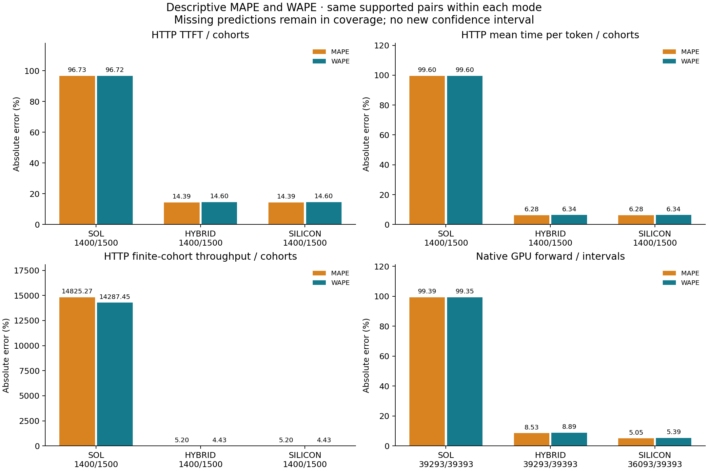

# Real silicon versus prediction: GB300 TP4 / Decoder ON / physical segments

Frozen logical-plan coverage is **complete**: 1500/1500 metric-bearing cohorts across 2 independently closed physical runtimes. This report preserves each lifecycle; it does not treat their combined observations as one run.

The pinned SGLang eager text runtime, real requests and native FPM intervals are compared with unchanged SOL, HYBRID and strict SILICON models. The prefix-refined calibration overlay is fixed before these comparisons. No correction factor is fitted. [The OFF report](../off-prefix-refined/README.md) and [independent forward holdouts](../../prefix-refinement-v1/README.md) retain their distinct timing boundaries.
Here FPM means the observed per-iteration telemetry. All three prediction modes use the op-level engine; this report does not qualify a GB300 whole-forward FPM lookup table.

The independent 10-trial pilot requested N=150; the prespecified cap froze N=100 trials per scenario. The cap does not establish the requested 5% precision. The pilot rule takes the largest scenario/metric requirement from (1.96 * CV / 0.05)^2, with at least 20 trials and rounding up to a multiple of 10 before the cap. The deadline selects the next complete cohort boundary; a trial may span runtimes. All boundary-trial cohorts remain in descriptive errors and coverage. Only trials with every scenario in one physical runtime enter that runtime's approximate whole-trial bootstrap, and only with at least 20 complete trials and full prediction coverage for the metric. These pointwise 95% intervals are conditional on the observed lifecycle and fixed-deadline stopping boundary, not a separately powered sample or simultaneous coverage of all metrics. **No cross-lifecycle confidence interval is published.**

## Physical lifecycle coverage

| Segment | Original cohorts | Complete trial indices for conditional CI | Boundary trial indices | Native intervals in complete physical audit |
|---|---:|---|---|---:|
| 1 | 1244 | 0-72 (73) | [73] | 33620 |
| 2 | 456 | 74-99 (26) | [73] | 11107 |

Physical audit totals also include setup, warmup, pilot and unreturned overlap work. Only the frozen primary main cohorts contribute to comparison errors below. TP ranks and consecutive native intervals do not increase the independent trial count.

## Verified runtime continuity

| Segment | Actual runtime identity SHA256 (prefix) | Comparison reference SHA256 (prefix) | Admission |
|---|---|---|---|
| 1 | `8550094e86a1cdb1` | `8550094e86a1cdb1` | exact origin identity |
| 2 | `4eff465dc8537e54` | `8550094e86a1cdb1` | reviewed inactive PD bootstrap port and continuation-control change |

Both actual server configurations use the literal `null` disaggregation mode. The successor's automatically allocated integer PD bootstrap port differs; the other 494 server arguments are exactly equal. Actual installed parser and mode-consumer sources establish that this port is unused by the aggregated inference path. A separately reviewed change to `continuation.py` admits only this difference; the regenerated bundle manifest records that change. Every other measurement, observer and client source remains identical. The original failed attempt produced no HTTP observations and remains in the private evidence.

The continuation's actual configuration, control-source hashes, original audit/progress and exact remaining frozen plan are checked before assigning the origin comparison reference. Both raw runtime identities and the original configuration hashes remain in the per-segment receipts, together with the immutable review addendum. This exception neither changes the frozen sample budget nor permits pooling confidence intervals across physical lifecycles.

[Descriptive metric receipt](descriptive-metrics.json) binds the unchanged comparison files. These additions do not change conditional lifecycle confidence intervals or create a pooled interval.

## HTTP serving errors

Descriptive MAPE is `100 * mean(abs(prediction / observation - 1))`, weighting supported scenario/trial cohorts equally. WAPE uses the same supported pairs and is total absolute error divided by total observed value. p90 APE is a percentile of prediction errors, not p90 request latency. Error values use available predictions; missing predictions remain in the coverage denominator. The common-support table compares identical predicted cohorts across modes. HTTP mean inter-token latency does not establish exact per-token or tail gaps.

| Mode | Metric | Predicted / observed | Mean signed error | Median APE | p90 APE | MAPE | WAPE |
|---|---|---:|---:|---:|---:|---:|---:|
| SOL | TTFT | 1400/1500 | -96.73% | 96.91% | 97.17% | 96.73% | 96.72% |
| SOL | Mean time per output token | 1400/1500 | -99.60% | 99.65% | 99.66% | 99.60% | 99.60% |
| SOL | Finite-cohort throughput | 1400/1500 | +14825.27% | 14451.68% | 18948.37% | 14825.27% | 14287.45% |
| SOL | Request completion latency | 1400/1500 | -99.33% | 99.33% | 99.48% | 99.33% | 99.33% |
| SOL | Time to last output token | 1400/1500 | -99.33% | 99.32% | 99.48% | 99.33% | 99.33% |
| SOL | Mean inter-token latency | 1400/1500 | -99.60% | 99.65% | 99.66% | 99.60% | 99.60% |
| HYBRID | TTFT | 1400/1500 | +9.50% | 6.53% | 40.29% | 14.39% | 14.60% |
| HYBRID | Mean time per output token | 1400/1500 | -6.28% | 6.43% | 7.40% | 6.28% | 6.34% |
| HYBRID | Finite-cohort throughput | 1400/1500 | +4.97% | 5.30% | 7.63% | 5.20% | 4.43% |
| HYBRID | Request completion latency | 1400/1500 | -5.10% | 5.47% | 7.10% | 5.15% | 4.89% |
| HYBRID | Time to last output token | 1400/1500 | -5.09% | 5.46% | 7.09% | 5.14% | 4.88% |
| HYBRID | Mean inter-token latency | 1400/1500 | -6.28% | 6.43% | 7.40% | 6.28% | 6.34% |
| SILICON | TTFT | 1400/1500 | +9.50% | 6.53% | 40.29% | 14.39% | 14.60% |
| SILICON | Mean time per output token | 1400/1500 | -6.28% | 6.43% | 7.40% | 6.28% | 6.34% |
| SILICON | Finite-cohort throughput | 1400/1500 | +4.97% | 5.30% | 7.63% | 5.20% | 4.43% |
| SILICON | Request completion latency | 1400/1500 | -5.10% | 5.47% | 7.10% | 5.15% | 4.89% |
| SILICON | Time to last output token | 1400/1500 | -5.09% | 5.46% | 7.09% | 5.14% | 4.88% |
| SILICON | Mean inter-token latency | 1400/1500 | -6.28% | 6.43% | 7.40% | 6.28% | 6.34% |

### Same supported subset: 1400 cohorts

| Mode | Metric | Predicted / observed | Mean signed error | Median APE | p90 APE | MAPE | WAPE |
|---|---|---:|---:|---:|---:|---:|---:|
| SOL | TTFT | 1400/1400 | -96.73% | 96.91% | 97.17% | 96.73% | 96.72% |
| SOL | Mean time per output token | 1400/1400 | -99.60% | 99.65% | 99.66% | 99.60% | 99.60% |
| SOL | Finite-cohort throughput | 1400/1400 | +14825.27% | 14451.68% | 18948.37% | 14825.27% | 14287.45% |
| SOL | Request completion latency | 1400/1400 | -99.33% | 99.33% | 99.48% | 99.33% | 99.33% |
| SOL | Time to last output token | 1400/1400 | -99.33% | 99.32% | 99.48% | 99.33% | 99.33% |
| SOL | Mean inter-token latency | 1400/1400 | -99.60% | 99.65% | 99.66% | 99.60% | 99.60% |
| HYBRID | TTFT | 1400/1400 | +9.50% | 6.53% | 40.29% | 14.39% | 14.60% |
| HYBRID | Mean time per output token | 1400/1400 | -6.28% | 6.43% | 7.40% | 6.28% | 6.34% |
| HYBRID | Finite-cohort throughput | 1400/1400 | +4.97% | 5.30% | 7.63% | 5.20% | 4.43% |
| HYBRID | Request completion latency | 1400/1400 | -5.10% | 5.47% | 7.10% | 5.15% | 4.89% |
| HYBRID | Time to last output token | 1400/1400 | -5.09% | 5.46% | 7.09% | 5.14% | 4.88% |
| HYBRID | Mean inter-token latency | 1400/1400 | -6.28% | 6.43% | 7.40% | 6.28% | 6.34% |
| SILICON | TTFT | 1400/1400 | +9.50% | 6.53% | 40.29% | 14.39% | 14.60% |
| SILICON | Mean time per output token | 1400/1400 | -6.28% | 6.43% | 7.40% | 6.28% | 6.34% |
| SILICON | Finite-cohort throughput | 1400/1400 | +4.97% | 5.30% | 7.63% | 5.20% | 4.43% |
| SILICON | Request completion latency | 1400/1400 | -5.10% | 5.47% | 7.10% | 5.15% | 4.89% |
| SILICON | Time to last output token | 1400/1400 | -5.09% | 5.46% | 7.09% | 5.14% | 4.88% |
| SILICON | Mean inter-token latency | 1400/1400 | -6.28% | 6.43% | 7.40% | 6.28% | 6.34% |

## Native forward intervals

The target is the native SGLang GPU-event interval. It differs from HTTP E2E and synchronized prepare/forward/sample benchmark holdouts. Every attributed interval, including unreturned overlap output, is retained. The table is descriptive over correlated intervals; per-scenario conditional whole-trial intervals are retained separately in each segment result.

| Mode | Phase | Predicted / observed | Mean signed error | Median APE | p90 APE | MAPE | WAPE |
|---|---|---:|---:|---:|---:|---:|---:|
| SOL | all | 39293/39393 | -99.39% | 99.58% | 99.65% | 99.39% | 99.35% |
| SOL | prefill | 1693/1793 | -94.54% | 94.53% | 94.86% | 94.54% | 94.54% |
| SOL | decode | 37600/37600 | -99.60% | 99.58% | 99.65% | 99.60% | 99.61% |
| SOL | mixed | 0/0 | unavailable | unavailable | unavailable | unavailable | unavailable |
| HYBRID | all | 39293/39393 | -7.50% | 4.94% | 8.15% | 8.53% | 8.89% |
| HYBRID | prefill | 1693/1793 | +11.81% | 2.51% | 27.14% | 12.08% | 12.29% |
| HYBRID | decode | 37600/37600 | -8.37% | 4.96% | 6.83% | 8.37% | 8.71% |
| HYBRID | mixed | 0/0 | unavailable | unavailable | unavailable | unavailable | unavailable |
| SILICON | all | 36093/39393 | -3.93% | 4.81% | 5.94% | 5.05% | 5.39% |
| SILICON | prefill | 1693/1793 | +11.81% | 2.51% | 27.14% | 12.08% | 12.29% |
| SILICON | decode | 34400/37600 | -4.71% | 4.83% | 5.89% | 4.71% | 5.00% |
| SILICON | mixed | 0/0 | unavailable | unavailable | unavailable | unavailable | unavailable |

### Same supported native subset: 36093 intervals

Different coverage can make an error summary look better. This table compares the same physical-run / cohort / dispatch intervals in all modes, without dropping missing rows from the full-coverage table above.

| Mode | Phase | Predicted / observed | Mean signed error | Median APE | p90 APE | MAPE | WAPE |
|---|---|---:|---:|---:|---:|---:|---:|
| SOL | all | 36093/36093 | -99.38% | 99.64% | 99.65% | 99.38% | 99.34% |
| SOL | prefill | 1693/1693 | -94.54% | 94.53% | 94.86% | 94.54% | 94.54% |
| SOL | decode | 34400/34400 | -99.62% | 99.64% | 99.65% | 99.62% | 99.62% |
| SOL | mixed | 0/0 | unavailable | unavailable | unavailable | unavailable | unavailable |
| HYBRID | all | 36093/36093 | -3.93% | 4.81% | 5.94% | 5.05% | 5.39% |
| HYBRID | prefill | 1693/1693 | +11.81% | 2.51% | 27.14% | 12.08% | 12.29% |
| HYBRID | decode | 34400/34400 | -4.71% | 4.83% | 5.89% | 4.71% | 5.00% |
| HYBRID | mixed | 0/0 | unavailable | unavailable | unavailable | unavailable | unavailable |
| SILICON | all | 36093/36093 | -3.93% | 4.81% | 5.94% | 5.05% | 5.39% |
| SILICON | prefill | 1693/1693 | +11.81% | 2.51% | 27.14% | 12.08% | 12.29% |
| SILICON | decode | 34400/34400 | -4.71% | 4.83% | 5.89% | 4.71% | 5.00% |
| SILICON | mixed | 0/0 | unavailable | unavailable | unavailable | unavailable | unavailable |

## Missing predictions and observed execution limits

- SOL: 100 HTTP cohorts lack predictions; 100 native intervals lack predictions; 102 predicted cohorts disagree with observed initial prefix reuse.
- HYBRID: 100 HTTP cohorts lack predictions; 100 native intervals lack predictions; 102 predicted cohorts disagree with observed initial prefix reuse.
- SILICON: 100 HTTP cohorts lack predictions; 3300 native intervals lack predictions; 102 predicted cohorts disagree with observed initial prefix reuse.

The retained failures identify heterogeneous Decoder-ON prefill query/prefix batches that the aggregate input cannot represent, plus strict SILICON decode at batch 3 outside the batch-1/2 calibration grid. The prefix-refined buckets resolve the earlier shifted-prefix gaps for the supported cases; they do not establish arbitrary batch support. Observed-versus-predicted cache reuse remains a separate limit. Missing predictions retain their reasons and denominator in `missing-predictions.json`; they are not assigned zero error. The existing replay emits its first output after a decode iteration, which can increase modeled TTFT relative to serving. Native serving overlap is also distinct from the analytical eager graph. SOL is an idealized lower bound, not calibrated hardware latency.

## Disclosed host activity

A separate CPU-only analysis ran from 2026-09-10T14:37:35Z through 2026-09-10T14:37:47Z on the serving host. At one-second timestamp resolution, the conservative end-inclusive-second window intersects 5 HTTP cohorts and 69 dispatch-to-report host envelopes. These are not exact GPU-event overlap intervals or an estimate of causal slowdown. All affected observations and eligible trials remain included; none were filtered or replaced.

Known exposure annotations and source hashes are retained in each segment receipt. Their presence does not establish that other interference was absent.

## Prespecified paired output check

The first 40 OFF/ON trials have exactly paired inputs and requested output lengths (680 cohorts / 960 requests). Actual returned token IDs are checked independently against the original HTTP frames: 755 request pairs have equal output sequences, 205 differ, and 0 lack comparable output IDs. This describes returned sequences; it does not establish hidden-state numerical equivalence or task quality. No timing observations are removed or corrected based on these outcomes. `paired-output-ids.json` retains per-request sequence hashes, status and source bindings.

## Content-control limits

Both two-request content controls retain 100 trials. Native observations place both requests in the same first-prefill dispatch in 52 repeated-sequence trials and 58 different-offset trials. Both requests begin with zero cached tokens in every trial. Different-offset sequences are unequal, but their raw trigram sets are identical in every trial; this is not a disjoint-ngram locality test. Raw n-grams do not establish compressed Engram addresses or hardware-cache hits, and a native KV reset does not flush the Engram table or GPU caches. All timings remain included. `content-controls.json` binds the descriptive records to original inputs and both closed physical audits.

## Reproduction

`python render_report.py --directory .` validates all three result sets, recomputes descriptive tables and redraws the figures. A partial package requires `--allow-partial`. `provenance.json` records the separate SILICON model/binary checkout and FPM comparison-tool checkout; original raw evidence stays private. `artifact-hashes.json` binds every published artifact. Rendering never changes predictions, observations, calibration or frozen sample budgets.
