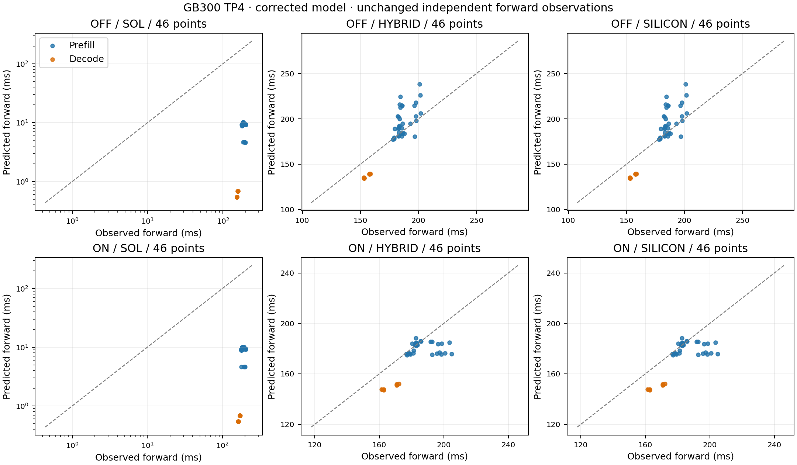
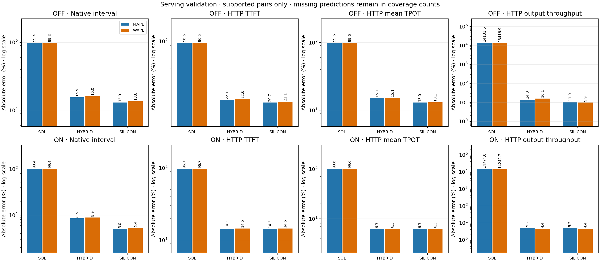

# GB300 TP4 verification after SOL review fixes

This report recomputes SOL, Hybrid, and SILICON predictions using the corrected V4.1 model and the versioned replicated-indexer tables. It preserves every original observed value and workload identity. No new measurements or fitted correction factors enter these results.

Model: `29b45ac55df501b061be7d3aac4b059922059125`. Analysis: `be0c44dfd1e319139d16659f2d96bf9a88337c53`. Native binary SHA-256: `eb72fd7443f4e286bd9fc9d73cd9fc213b3acd29eb2420c0485a780714640704`. The native code was built from `09954c44`, whose prediction implementation is unchanged at the model commit. [Table derivation](../../indexer-identity-v2/README.md) corrects labels without changing latency bits.

## Independent forward holdouts

The original frozen refinement holds out 46 configurations per profile (36 prefill, 10 decode), each with ten measured repetitions and four TP ranks. A point is the median of rank-max repetitions, not ten or forty independent workloads. The same 92 configuration/profile pairs are evaluated in each prediction mode.

| Replay | Mode | Covered | Real mean (ms) | Predicted mean (ms) | MAPE | WAPE |
| --- | --- | --- | ---: | ---: | ---: | ---: |
| OFF | SOL | 46/46 | 180.257 | 7.151 | 96.15% | 96.03% |
| OFF | HYBRID | 46/46 | 180.257 | 183.675 | 7.37% | 7.23% |
| OFF | SILICON | 46/46 | 180.257 | 183.675 | 7.37% | 7.23% |
| ON | SOL | 46/46 | 182.196 | 7.138 | 96.15% | 96.08% |
| ON | HYBRID | 46/46 | 182.196 | 174.218 | 4.84% | 4.85% |
| ON | SILICON | 46/46 | 182.196 | 174.218 | 4.84% | 4.85% |



## Native serving and HTTP validation

OFF retains 40 independent trials in one closed lifecycle: 600 primary HTTP cohorts and 15,756 native intervals. ON retains 100 logical trials across two independently closed physical lifecycles: 1,500 primary HTTP cohorts. Per-lifecycle complete-trial subsets retain their conditional confidence intervals in the compressed outputs; boundary trials remain in descriptive statistics. There is no pooled cross-lifecycle confidence interval or claim that the original precision target was met.

Means below use the same supported pairs as each error statistic. MAPE weights those pairs equally; WAPE weights by their observed value in the metric's own units. Aggregate HTTP pairs are cohort/trial summaries; native intervals are correlated and do not count as independent trials. Missing results are excluded from error arithmetic and retained in the coverage denominator. These descriptive aggregates are not a production traffic mixture.

| Replay | Metric | Mode | Covered | Real mean | Predicted mean | MAPE | WAPE |
| --- | --- | --- | --- | ---: | ---: | ---: | ---: |
| OFF | HTTP TTFT (ms) | SOL | 600/600 | 373.069 | 13.088 | 96.52% | 96.49% |
| OFF | HTTP mean TPOT (ms) | SOL | 600/600 | 158.842 | 0.673 | 99.58% | 99.58% |
| OFF | HTTP output tokens/s | SOL | 600/600 | 8.677 | 1172.897 | 14131.62% | 13416.91% |
| OFF | Native interval (ms) | SOL | 15756/15756 | 157.001 | 1.082 | 99.35% | 99.31% |
| ON | HTTP TTFT (ms) | SOL | 1400/1500 | 367.982 | 12.022 | 96.75% | 96.73% |
| ON | HTTP mean TPOT (ms) | SOL | 1400/1500 | 160.250 | 0.652 | 99.59% | 99.59% |
| ON | HTTP output tokens/s | SOL | 1400/1500 | 7.972 | 1143.406 | 14774.04% | 14242.67% |
| ON | Native interval (ms) | SOL | 39293/39393 | 158.598 | 1.028 | 99.38% | 99.35% |
| OFF | HTTP TTFT (ms) | HYBRID | 600/600 | 373.069 | 451.811 | 22.06% | 22.60% |
| OFF | HTTP mean TPOT (ms) | HYBRID | 600/600 | 158.842 | 134.778 | 15.06% | 15.15% |
| OFF | HTTP output tokens/s | HYBRID | 600/600 | 8.677 | 10.076 | 14.03% | 16.12% |
| OFF | Native interval (ms) | HYBRID | 15756/15756 | 157.001 | 138.702 | 15.53% | 16.04% |
| ON | HTTP TTFT (ms) | HYBRID | 1400/1500 | 367.982 | 403.001 | 14.29% | 14.50% |
| ON | HTTP mean TPOT (ms) | HYBRID | 1400/1500 | 160.250 | 150.091 | 6.28% | 6.34% |
| ON | HTTP output tokens/s | HYBRID | 1400/1500 | 7.972 | 8.298 | 5.21% | 4.44% |
| ON | Native interval (ms) | HYBRID | 39293/39393 | 158.598 | 146.368 | 8.52% | 8.86% |
| OFF | HTTP TTFT (ms) | SILICON | 560/600 | 366.597 | 438.090 | 20.75% | 21.13% |
| OFF | HTTP mean TPOT (ms) | SILICON | 560/600 | 158.563 | 137.866 | 13.01% | 13.05% |
| OFF | HTTP output tokens/s | SILICON | 560/600 | 8.052 | 8.853 | 11.02% | 9.94% |
| OFF | Native interval (ms) | SILICON | 14476/15756 | 156.947 | 143.163 | 13.01% | 13.56% |
| ON | HTTP TTFT (ms) | SILICON | 1400/1500 | 367.982 | 403.001 | 14.29% | 14.50% |
| ON | HTTP mean TPOT (ms) | SILICON | 1400/1500 | 160.250 | 150.091 | 6.28% | 6.34% |
| ON | HTTP output tokens/s | SILICON | 1400/1500 | 7.972 | 8.298 | 5.21% | 4.44% |
| ON | Native interval (ms) | SILICON | 36093/39393 | 158.490 | 151.971 | 5.04% | 5.37% |



## Coverage and interpretation

- serving-off-sol: 0 missing HTTP predictions; 0 missing native intervals out of 15756; 40 predicted cohorts disagree with observed initial cache reuse.
- serving-on-sol: 100 missing HTTP predictions; 100 missing native intervals out of 39393; 102 predicted cohorts disagree with observed initial cache reuse.
- serving-off-hybrid: 0 missing HTTP predictions; 0 missing native intervals out of 15756; 40 predicted cohorts disagree with observed initial cache reuse.
- serving-on-hybrid: 100 missing HTTP predictions; 100 missing native intervals out of 39393; 102 predicted cohorts disagree with observed initial cache reuse.
- serving-off-silicon: 40 missing HTTP predictions; 1280 missing native intervals out of 15756; 40 predicted cohorts disagree with observed initial cache reuse.
- serving-on-silicon: 100 missing HTTP predictions; 3300 missing native intervals out of 39393; 102 predicted cohorts disagree with observed initial cache reuse.

The corrected SOL roofline remains an idealized lower bound and strongly underpredicts runtime latency. The measured module composition performs much better on the controlled forward holdouts, but the serving comparison includes scheduling, overlap, preparation, sampling, and HTTP costs outside that target. Coverage and cache agreement remain separate from accuracy. Exact token-gap ITL, request-completion latency, last-token latency, per-scenario paired intervals, and failure reasons are retained in JSON/CSV; HTTP mean TPOT is not a tail-ITL measurement.

## Reproduction and preservation

[summary.json](summary.json) verifies original observations against frozen historical reports at the model commit. [comparison.csv](comparison.csv) includes both errors, measured/predicted means, and all supported-pair counts. Each scope's `replay-provenance.json` binds unchanged qualified inputs, portable prediction configs, the full table inventory, helper source hashes, and output hashes. Original reports and observations remain at their original paths. Private cluster paths and raw journals are not published.

Run from the repository root with the recorded corrected native extension and its source import paths:

```bash
export PYTHONPATH=python/aisimulate/src:python/aisimulate
python data/experimental/deepseek-v41/gb300-silicon/report/sol-review-v2/replay.py forward --output-dir /path/to/fresh-report
python data/experimental/deepseek-v41/gb300-silicon/report/sol-review-v2/replay.py off --output-dir /path/to/fresh-report --off-qualified /path/to/qualified-off --off-raw /path/to/original-off
python data/experimental/deepseek-v41/gb300-silicon/report/sol-review-v2/replay.py on --output-dir /path/to/fresh-report --on-qualified /path/to/qualified-segments
python data/experimental/deepseek-v41/gb300-silicon/report/sol-review-v2/render.py --directory /path/to/fresh-report
```

Replay refuses to overwrite an existing report scope. Rendering validates prediction bytes and unchanged observation values before producing tables and standalone PNG/PDF figures. Rendering performs no prediction fit and does not alter compressed comparisons. The final render command writes the explicitly selected fresh report directory.
