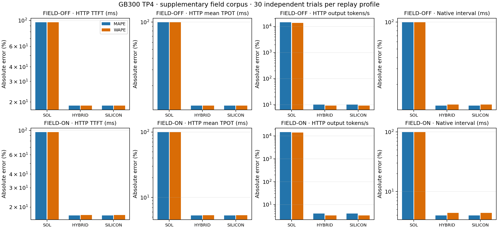

# GB300 TP4 field corpus: separate supplementary OFF and ON strata

Each profile retains 30 independent trials in its own closed runtime lifecycle and frozen resource window: four primary scenarios, 120 HTTP cohorts. They cover boundary-129, heldout-single-192, repeated text, and distinct text. The 10 pilot trials per profile are excluded from these accuracy aggregates. No heldout fitting or modification of the original observations occurred.

The corrected model, native extension, and versioned replicated-indexer tables match the [core report](README.md). The frozen analysis helper version is identical. Neither corpus nor replay mode is pooled. Per-scenario paired bootstrap intervals remain in the exact compressed comparison outputs, conditional on each runtime lifecycle and frozen calibration. These descriptive aggregates do not claim the original 5% precision target.

MAPE weights supported cohort/trial pairs equally; WAPE weights by observed value within the metric. Native intervals remain correlated and are not independent trials. Means and both errors use identical supported pairs; missing predictions remain in coverage denominators.

| Replay | Metric | Mode | Covered | Real mean | Predicted mean | MAPE | WAPE |
| --- | --- | --- | --- | ---: | ---: | ---: | ---: |
| OFF | HTTP TTFT (ms) | SOL | 120/120 | 372.850 | 13.148 | 96.47% | 96.47% |
| OFF | HTTP mean TPOT (ms) | SOL | 120/120 | 158.026 | 0.694 | 99.56% | 99.56% |
| OFF | HTTP output tokens/s | SOL | 120/120 | 8.994 | 1249.189 | 14461.78% | 13788.45% |
| OFF | Native interval (ms) | SOL | 3503/3503 | 155.989 | 1.027 | 99.38% | 99.34% |
| OFF | HTTP TTFT (ms) | HYBRID | 120/120 | 372.850 | 438.926 | 18.60% | 18.65% |
| OFF | HTTP mean TPOT (ms) | HYBRID | 120/120 | 158.026 | 138.927 | 12.07% | 12.09% |
| OFF | HTTP output tokens/s | HYBRID | 120/120 | 8.994 | 9.821 | 10.11% | 9.18% |
| OFF | Native interval (ms) | HYBRID | 3503/3503 | 155.989 | 141.614 | 11.59% | 11.91% |
| OFF | HTTP TTFT (ms) | SILICON | 120/120 | 372.850 | 438.926 | 18.60% | 18.65% |
| OFF | HTTP mean TPOT (ms) | SILICON | 120/120 | 158.026 | 138.927 | 12.07% | 12.09% |
| OFF | HTTP output tokens/s | SILICON | 120/120 | 8.994 | 9.821 | 10.11% | 9.18% |
| OFF | Native interval (ms) | SILICON | 3503/3503 | 155.989 | 141.614 | 11.59% | 11.91% |
| ON | HTTP TTFT (ms) | SOL | 120/120 | 372.238 | 12.822 | 96.54% | 96.56% |
| ON | HTTP mean TPOT (ms) | SOL | 120/120 | 159.455 | 0.692 | 99.57% | 99.57% |
| ON | HTTP output tokens/s | SOL | 120/120 | 8.920 | 1262.726 | 14713.06% | 14055.56% |
| ON | Native interval (ms) | SOL | 3503/3503 | 157.307 | 1.009 | 99.39% | 99.36% |
| ON | HTTP TTFT (ms) | HYBRID | 120/120 | 372.238 | 416.258 | 16.79% | 16.94% |
| ON | HTTP mean TPOT (ms) | HYBRID | 120/120 | 159.455 | 150.915 | 5.31% | 5.36% |
| ON | HTTP output tokens/s | HYBRID | 120/120 | 8.920 | 9.173 | 4.11% | 3.34% |
| ON | Native interval (ms) | HYBRID | 3503/3503 | 157.307 | 151.654 | 3.95% | 4.38% |
| ON | HTTP TTFT (ms) | SILICON | 120/120 | 372.238 | 416.258 | 16.79% | 16.94% |
| ON | HTTP mean TPOT (ms) | SILICON | 120/120 | 159.455 | 150.915 | 5.31% | 5.36% |
| ON | HTTP output tokens/s | SILICON | 120/120 | 8.920 | 9.173 | 4.11% | 3.34% |
| ON | Native interval (ms) | SILICON | 3503/3503 | 157.307 | 151.654 | 3.95% | 4.38% |



## Coverage and content controls

- field-off-sol: 0 missing HTTP cohorts; 0 missing native intervals out of 3503; 30 predicted cohorts disagree with observed initial cache reuse.
- field-off-hybrid: 0 missing HTTP cohorts; 0 missing native intervals out of 3503; 30 predicted cohorts disagree with observed initial cache reuse.
- field-off-silicon: 0 missing HTTP cohorts; 0 missing native intervals out of 3503; 30 predicted cohorts disagree with observed initial cache reuse.
- field-on-sol: 0 missing HTTP cohorts; 0 missing native intervals out of 3503; 30 predicted cohorts disagree with observed initial cache reuse.
- field-on-hybrid: 0 missing HTTP cohorts; 0 missing native intervals out of 3503; 30 predicted cohorts disagree with observed initial cache reuse.
- field-on-silicon: 0 missing HTTP cohorts; 0 missing native intervals out of 3503; 30 predicted cohorts disagree with observed initial cache reuse.

Both repeated-text and distinct-text pairs were cold with respect to observed initial KV reuse in all 30 trials per profile. Repeated-text sequences and raw 3-gram sets match; distinct-text pairs differ. Cold pairs arrived in the same first-prefill dispatch in only 21/30 repeated and 16/30 distinct OFF trials, and 20/30 repeated and 17/30 distinct ON trials. Their decode schedules can also differ. These controls establish input content and native batching facts; raw n-grams do not establish compressed Engram addresses, cache hits, or a causal Engram latency effect. KV reset does not flush Engram/HBM/L2 state.

[field-summary.json](field-summary.json) includes all metrics, four-scenario breakdowns, observation-preservation proofs, coverage, source hashes, and content summaries. [field-comparison.csv](field-comparison.csv) provides the same aggregate/scenario comparisons. [consolidated-summary.json](consolidated-summary.json) inventories the unchanged 48 core metric rows and 42 separate supplementary rows for PR reporting.

## Reproduction

Use the same native extension, source import paths, and model checkout described in the core report. Retain each original raw root beside its closed-lifetime admission and normalized audit. `replay_field.py` uses OFF data; `replay_field_on.py` uses ON data. Both refuse to overwrite existing output scopes. For OFF, run from a fresh copy of this report tree after omitting its `field-off` directory; ON also accepts `--output-dir`.

```bash
python replay_field.py --qualified /path/to/qualified/field-off --raw /path/to/original-field-off
python replay_field_on.py --qualified /path/to/qualified/field-on --raw /path/to/original-field-on
python render_field.py --qualified /path/to/qualified --off-raw /path/to/original-field-off --on-raw /path/to/original-field-on --off-content /path/to/field-off-content.json --on-content /path/to/field-on-content.json
```

The renderer checks all original core artifact hashes, then independently reconstructs observation fields from the admitted client/audit inputs and compares every metric and native interval geometry. It does not fit or regenerate model predictions. Public outputs retain only source hashes, portable identities, and sanitized observations; internal cluster files remain separate.
