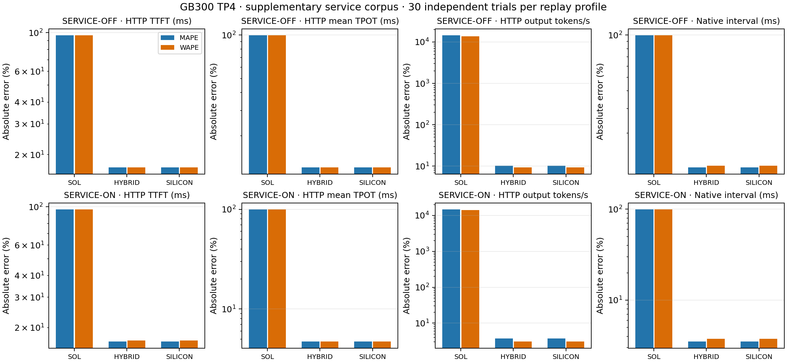

# GB300 TP4 service corpus: separate supplementary OFF and ON strata

Each profile contains 30 independent main trials in its own closed runtime lifecycle: four primary scenarios and 120 HTTP cohorts. The ten pilot trials are excluded. Observations, seeds, requested lengths, calibration, and the first comparison policy remain frozen. No fitting or timing filtering occurred.

The corrected model/native/table identities match the [core report](README.md) and [field report](field-README.md), whose files remain byte-identical. The analysis helpers are pinned to the same commit. No corpus or replay profile is pooled. Per-scenario paired confidence intervals stay in the compressed results and remain conditional on their runtime lifecycle and frozen calibration.

MAPE and WAPE use the same supported pairs. MAPE weights pairs equally; WAPE weights by observed value in each metric. Missing predictions stay in coverage. Native intervals are correlated and do not count as independent trials; HTTP mean TPOT is not a tail-ITL metric.

| Replay | Metric | Mode | Covered | Real mean | Predicted mean | MAPE | WAPE |
| --- | --- | --- | --- | ---: | ---: | ---: | ---: |
| OFF | HTTP TTFT (ms) | SOL | 120/120 | 375.812 | 13.147 | 96.51% | 96.50% |
| OFF | HTTP mean TPOT (ms) | SOL | 120/120 | 158.041 | 0.694 | 99.56% | 99.56% |
| OFF | HTTP output tokens/s | SOL | 120/120 | 8.986 | 1249.225 | 14470.36% | 13802.66% |
| OFF | Native interval (ms) | SOL | 3509/3509 | 155.878 | 1.040 | 99.37% | 99.33% |
| OFF | HTTP TTFT (ms) | HYBRID | 120/120 | 375.812 | 438.925 | 16.94% | 16.89% |
| OFF | HTTP mean TPOT (ms) | HYBRID | 120/120 | 158.041 | 138.927 | 12.07% | 12.09% |
| OFF | HTTP output tokens/s | HYBRID | 120/120 | 8.986 | 9.821 | 10.18% | 9.29% |
| OFF | Native interval (ms) | HYBRID | 3509/3509 | 155.878 | 141.633 | 11.41% | 11.73% |
| OFF | HTTP TTFT (ms) | SILICON | 120/120 | 375.812 | 438.925 | 16.94% | 16.89% |
| OFF | HTTP mean TPOT (ms) | SILICON | 120/120 | 158.041 | 138.927 | 12.07% | 12.09% |
| OFF | HTTP output tokens/s | SILICON | 120/120 | 8.986 | 9.821 | 10.18% | 9.29% |
| OFF | Native interval (ms) | SILICON | 3509/3509 | 155.878 | 141.633 | 11.41% | 11.73% |
| ON | HTTP TTFT (ms) | SOL | 120/120 | 371.383 | 12.823 | 96.54% | 96.55% |
| ON | HTTP mean TPOT (ms) | SOL | 120/120 | 158.432 | 0.692 | 99.56% | 99.56% |
| ON | HTTP output tokens/s | SOL | 120/120 | 8.978 | 1262.791 | 14627.03% | 13965.17% |
| ON | Native interval (ms) | SOL | 3504/3504 | 156.251 | 1.011 | 99.39% | 99.35% |
| ON | HTTP TTFT (ms) | HYBRID | 120/120 | 371.383 | 416.258 | 16.60% | 16.82% |
| ON | HTTP mean TPOT (ms) | HYBRID | 120/120 | 158.432 | 150.915 | 4.72% | 4.74% |
| ON | HTTP output tokens/s | HYBRID | 120/120 | 8.978 | 9.173 | 3.77% | 3.06% |
| ON | Native interval (ms) | HYBRID | 3504/3504 | 156.251 | 151.652 | 3.50% | 3.76% |
| ON | HTTP TTFT (ms) | SILICON | 120/120 | 371.383 | 416.258 | 16.60% | 16.82% |
| ON | HTTP mean TPOT (ms) | SILICON | 120/120 | 158.432 | 150.915 | 4.72% | 4.74% |
| ON | HTTP output tokens/s | SILICON | 120/120 | 8.978 | 9.173 | 3.77% | 3.06% |
| ON | Native interval (ms) | SILICON | 3504/3504 | 156.251 | 151.652 | 3.50% | 3.76% |

## Coverage and content

- service-off-sol: 0 missing HTTP predictions; 0 missing native intervals out of 3509; 30 predicted cohorts disagree with observed initial cache reuse.
- service-off-hybrid: 0 missing HTTP predictions; 0 missing native intervals out of 3509; 30 predicted cohorts disagree with observed initial cache reuse.
- service-off-silicon: 0 missing HTTP predictions; 0 missing native intervals out of 3509; 30 predicted cohorts disagree with observed initial cache reuse.
- service-on-sol: 0 missing HTTP predictions; 0 missing native intervals out of 3504; 30 predicted cohorts disagree with observed initial cache reuse.
- service-on-hybrid: 0 missing HTTP predictions; 0 missing native intervals out of 3504; 30 predicted cohorts disagree with observed initial cache reuse.
- service-on-silicon: 0 missing HTTP predictions; 0 missing native intervals out of 3504; 30 predicted cohorts disagree with observed initial cache reuse.

Input content and actual batching controls are descriptive:

- service-off, engram-distinct-text: 30/30 trials; 0 equal input-sequence pairs; 15 cold pairs in the same first-prefill dispatch.
- service-off, engram-repeated-text: 30/30 trials; 30 equal input-sequence pairs; 16 cold pairs in the same first-prefill dispatch.
- service-on, engram-distinct-text: 30/30 trials; 0 equal input-sequence pairs; 20 cold pairs in the same first-prefill dispatch.
- service-on, engram-repeated-text: 30/30 trials; 30 equal input-sequence pairs; 16 cold pairs in the same first-prefill dispatch.

Different first-prefill/decode schedules can confound content comparisons. Raw n-gram sets do not establish compressed Engram addresses or cache hits. KV resets do not flush Engram/HBM/L2 state. No causal Engram effect is claimed.

## Observed precision and returned-output addendum

These are checks on observed statistics and outputs, separate from prediction accuracy. The original N=30 remains fixed. The predeclared mean-CI precision target is a 95% bootstrap relative half-width at most 5%, tested for TTFT, mean TPOT, and throughput in each of four scenarios.

| Stratum | Targets met | Largest observed CI relative half-width | Failed targets |
| --- | ---: | ---: | --- |
| field-off | 11/12 | 6.5470% | engram-distinct-text / ttft_ms: 6.5470% |
| field-on | 11/12 | 5.9069% | boundary-129 / ttft_ms: 5.9069% |
| service-off | 12/12 | 4.4796% | none |
| service-on | 11/12 | 5.9499% | boundary-129 / ttft_ms: 5.9499% |

The paired output check matches all planned input token IDs, seeds and output lengths; it is descriptive exact returned-token equality, not numerical-equivalence or task-quality validation:

- field: 30 trials, 120 cohorts, 180 paired requests; 33 equal outputs, 147 different, 0 missing.
- service: 30 trials, 120 cohorts, 180 paired requests; 35 equal outputs, 145 different, 0 missing.

Output differences do not filter timing observations or establish a causal mechanism. The addendum records original response/source hashes while leaving core and field reports unchanged.

[service-summary.json](service-summary.json) includes all seven metrics and four-scenario breakdowns. [service-comparison.csv](service-comparison.csv) contains both error metrics and supported means. [consolidated-with-service.json](consolidated-with-service.json) inventories 132 metric rows: 48 core, 42 field, and 42 service, without pooling them.

## Reproduction

Use the recorded corrected native extension and source imports. `replay_service.py off` and `replay_service.py on` accept their respective `--qualified`, `--raw`, and optional `--output-dir`; each refuses to overwrite a scope. `render_service.py` accepts `--qualified`, `--off-raw`, `--on-raw`, `--off-content`, `--on-content`, `--field-off-raw`, `--field-on-raw`, `--field-output-check`, and `--service-output-check`. Original lifecycle inputs stay private; published provenance pins their hashes. The renderer checks original core/field file hashes, re-extracts unchanged observations from admitted inputs, and checks observed CI summaries against frozen client statistics. It never refits or reruns predictions.
