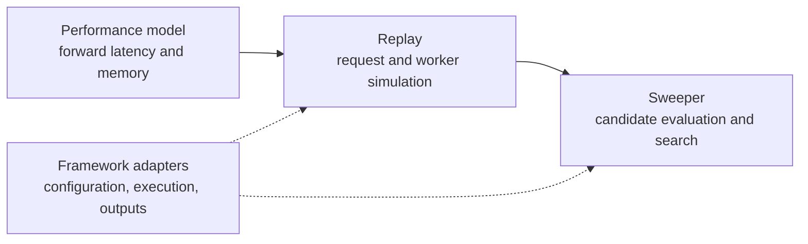

<!--
SPDX-FileCopyrightText: Copyright (c) 2026 NVIDIA CORPORATION & AFFILIATES. All rights reserved.
SPDX-License-Identifier: Apache-2.0
-->

# AISimulate documentation

AISimulate predicts LLM serving behavior and searches deployment configurations
offline. Start with the [quickstart](getting-started/quickstart.md) to predict a
deployment, search under a GPU budget, and evaluate the selected configuration.

## Three layers

The arrows show how capabilities compose. In a typical prediction-driven
search, Sweeper invokes a runner, Replay schedules work in virtual time, and
the engine queries the performance model for forward timing. Some analytical
evaluation paths do not execute the native Replay loop; their scope is stated
in the component documentation.

| Layer | Input | Output and responsibility |
| --- | --- | --- |
| [Performance model](perf-model/README.md) | Model, hardware, backend identity, parallelism, batch features, performance data | Forward-pass latency and memory estimates, with explicit estimator mode and coverage |
| [Replay](replay/README.md) | Workload, deployment topology, scheduling and cache policies, performance model | Request timelines, throughput, latency, cache behavior and completion evidence |
| [Sweeper](sweeper/README.md) | Search domains, workload, optimization goal and constraints | Evaluated candidates, ranking/Pareto results and concrete recommended configurations |

Adapters are integration boundaries, not a fourth simulation layer. A serving
framework can supply configuration, execution and output contracts; native
composition can customize placement and scaling without owning the event loop.
The Rust crate's `engine`, `replay`, and `perfmodel` namespaces describe its
implementation, while the product layers above describe user capabilities.

## Choose a task

| Task | Read |
| --- | --- |
| Install and run a first prediction/search | [Installation](getting-started/installation.md), [quickstart](getting-started/quickstart.md), [understand results](getting-started/understand-results.md) |
| Choose or query an estimator | [Model configuration](perf-model/configuration.md), [memory](perf-model/memory.md), [Python API](perf-model/api/python.md), [Rust API](perf-model/api/rust.md) |
| Collect FPM data for a model and target | [FPM self-service](perf-model/fpm-self-service/README.md), [implementation/reference](perf-model/fpm-self-service/implementation.md), [examples](perf-model/fpm-self-service/examples.md) |
| Replay traffic or AgentX sessions | [Workloads](replay/workloads.md), [AgentX quickstart](replay/agentic/quickstart.md), [cache](replay/cache.md), [Dynamo integration](replay/dynamo.md) |
| Search and materialize a deployment | [Search space](sweeper/search-space.md), [goals](sweeper/optimization-goals.md), [results](sweeper/results.md), [deployment generation](sweeper/deployment-generation.md) |
| Implement an integration boundary | [Adapter ABI reference](adapters/README.md) |
| Extend a component | [Performance modeling](perf-model/extending.md), [Collector](perf-model/collector/README.md), [Replay](replay/extending.md), [Sweeper SDK](sweeper/sdk.md) |
| Look up shared syntax | [CLI](reference/cli.md), [top-level configuration](reference/configuration.md), [local resources](reference/local-resources.md) |
| Maintain checks and releases | [CI](ci/README.md), [release](ci/release.md), [accuracy publication](ci/accuracy.md), [upstream sync](ci/aic-sync.md) |
| Use or migrate AIC workflows | [AIC backward compatibility](aic-backward-compatibility/README.md) |

## Support and accuracy

[Performance-model coverage](perf-model/support-matrix.md) and
[Replay features](replay/features.md) answer different questions. The public
[FPE matrix](https://ai-dynamo.org/aisimulate/fpe-support-matrix/) probes a
specific strict-native op-level query surface. It does not certify all FPM
methods, orchestration paths, or end-to-end accuracy.

Use the [FPM accuracy](https://ai-dynamo.org/aisimulate/fpm-accuracy/) and
[E2E accuracy](https://ai-dynamo.org/aisimulate/e2e-accuracy/) dashboards for
measurement-backed results within their recorded scope. A configuration that
runs successfully is not necessarily an accurate prediction. Replay and
Sweeper remain experimental; validate shortlisted configurations on the target
serving system before capacity or SLA decisions.

Examples on `main` can require capabilities newer than published wheels.
Follow the installation guide's version and optional Dynamo pairing rules.
