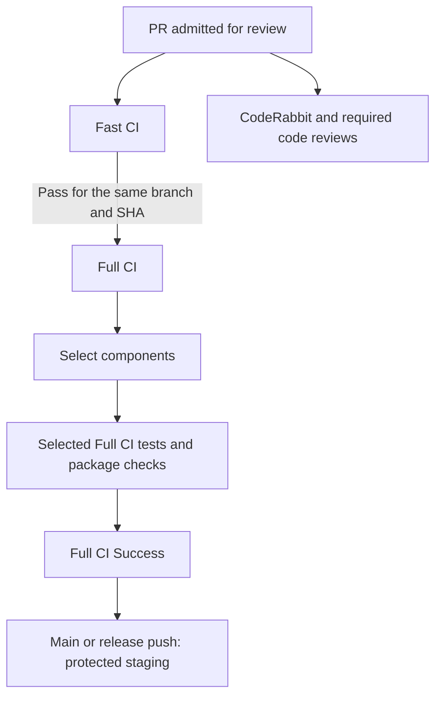
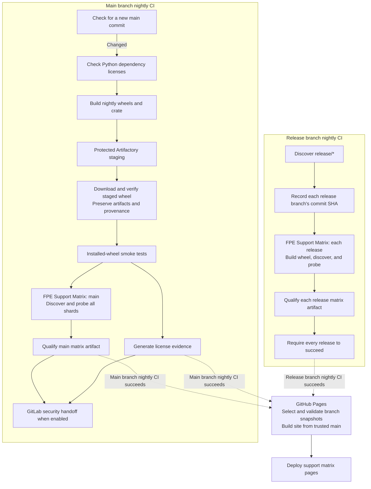

<!--
SPDX-FileCopyrightText: Copyright (c) 2026 NVIDIA CORPORATION & AFFILIATES. All rights reserved.
SPDX-License-Identifier: Apache-2.0
-->

# AISimulate CI guide

AISimulate uses **Fast CI** for quick code and policy checks, **Full CI** for
compiled tests and package validation, and **Main branch nightly CI** for release artifacts
and broader Forward Pass Engine (FPE) qualification. Fast and Full CI are
separate workflows: Full CI verifies a successful standalone Fast CI run for
the same branch and commit before starting compiled validation.
Nightly has its own build and qualification pipeline; it does not rerun the
entire Full CI suite.
**Release branch nightly CI** separately discovers release branches and qualifies
their support matrices each day.

**Code review runs alongside CI.** Fast CI checks code mechanically; reviewers
assess behavior, design, compatibility, and evidence. Passing validation,
receiving review approval, and publishing artifacts are separate outcomes.

## Contents

- [Workflow map and triggers](#workflow-map-and-triggers)
- [Code review and PR admission](#code-review-and-pr-admission)
- [Fast CI](#fast-ci)
- [Full CI](#full-ci)
- [Application test inventory and exceptions](#application-test-inventory-and-exceptions)
- [Nightly CI and FPE qualification](#nightly-ci-and-fpe-qualification)
- [Reading results and troubleshooting](#reading-results-and-troubleshooting)
- [Running and inspecting CI](#running-and-inspecting-ci)
- [Required checks and release approval](#required-checks-and-release-approval)
- [Runner environment and performance](#runner-environment-and-performance)

## Workflow map and triggers

The executable definitions live in the root
[`.github/workflows/`](../.github/workflows/). Imported workflow copies under
`python/aisimulate/.github/` are migration history and do not run for this repo.

### Validation and review



The diagram shows the high-level validation flow. Full CI verifies the
standalone Fast CI result at its entry check. In the actual workflow, this
check and component selection run in parallel; selected tests wait for both
to succeed. The arrows describe prerequisites, not automatic dispatch.
Review policy controls admission; the YAML does not automatically dispatch
Full CI when a review finishes.

### Nightly CIs



The two nightly schedules are independent. **FPE Support Matrix** and
**FPE Support Matrix (release)** are reusable workflows called by those schedules;
they have no separate nightly timers. Within main's nightly run, FPE qualification
starts after the staged-wheel smoke tests succeed. Release qualification processes
branches sequentially, with up to 20 shard jobs within each release.
Each release uses the commit SHA recorded at the start of the run, even if its
branch receives new commits while the checks are running.
Pages requires a successful completed nightly; the optional GitLab security
job is skipped when disabled and must succeed when enabled.

The release path runs **only FPE support-matrix qualification**. Its scheduler
discovers branches and calls the per-release helper, whose jobs prepare the
wheel, generate probe reports, and qualify the matrix artifact. Main's nightly
pipeline additionally builds distributable packages, runs wheel smoke suites,
and stages packages. Full CI's broader test suites run in their own workflow.

The main path above shows a scheduled run with a changed commit. An unchanged
`main` skips rebuilding and qualification; release nightly refreshes every
discovered release even when its commit is unchanged. An empty release
inventory skips qualification. A failed release does not cancel the remaining
branches, but Pages requires the overall producer run to succeed.

Dotted arrows show successful workflow-completion events that trigger Pages.
Pages selects retained qualified artifacts for each branch and publishes them
in a separate deployment. Main's scheduled package staging requires protected
environment approval; release FPE qualification produces coverage artifacts.
Manual dispatches and site-change triggers are listed below.

| Workflow | When it runs | Role |
| --- | --- | --- |
| [Fast CI](../.github/workflows/fast-ci.yml) | PR open/update/reopen and ready-for-review; pushes to `main`, `release/*`, and trusted `pull-request/*`; manual dispatch with `expected_sha` | Quick checks and `Fast CI Success` |
| [Full CI](../.github/workflows/ci.yml) | Pushes to `main`, `release/*`, and trusted `pull-request/*`; manual dispatch with `expected_sha` | Selects and aggregates compiled validation |
| [Main branch nightly CI](../.github/workflows/nightly-ci.yml) | Daily at 08:00 UTC; manual dispatch from `main` | Builds, stages, qualifies, and hands off artifacts for publication; skips unchanged scheduled `main` and requires approval for manual sources |
| [Validate platform wheels](../.github/workflows/validate-platform-wheels.yml) | Called by Full CI; manual dispatch | Linux x86-64/ARM64 and macOS ARM64 package validation |
| [Collector Data Check](../.github/workflows/collector-check.yml) | Called by Full CI; manual dispatch | Collector-data integrity and informational sanity reports |
| [Prediction Regression Gate](../.github/workflows/prediction-regression-gate.yml) | Called by Full CI; manual dispatch | Before/after prediction comparison |
| [FPE Support Matrix](../.github/workflows/fpe-support-matrix.yml) | Called by Main branch nightly CI; manual dispatch with `expected_sha` | Broad native operation-level support qualification |
| [Release branch nightly CI](../.github/workflows/release-nightly-ci.yml) | Daily at 09:23 UTC; manual dispatch on `main` | Schedules FPE support-matrix refreshes for discovered `release/*` branches |
| [FPE Support Matrix (release)](../.github/workflows/fpe-release-qualify.yml) | Called once per release by Release branch nightly CI | Builds the release wheel, probes all shards, and uploads its qualified matrix artifact |
| [codeowners](../.github/workflows/codeowners.yml) | PRs and pushes to `main` | Independent ownership coverage and generated-file checks; overlaps with Fast CI |
| [Forward Prediction Performance (advisory)](../.github/workflows/performance.yml) | Every trusted `pull-request/*` push; selects relevant PR files before benchmarking; manual dispatch for a PR | Paired base/head prediction-runtime benchmark, outside Full CI |
| [E2E Accuracy Matrix](../.github/workflows/e2e-accuracy.yml) | Daily at 10:17 UTC for `main` and all `release/*` heads; manual dispatch for one explicit SHA | Advisory accuracy campaigns using one wheel for both CLIs; publishes qualified artifacts |
| [GitHub Pages](../.github/workflows/pages.yml) | FPE Support Matrix, Main branch nightly CI, Release branch nightly CI, or E2E Accuracy Matrix completion; relevant site changes on PRs/`main`; daily at 09:17 UTC; manual dispatch | Validates qualified FPE and accuracy snapshots, tests FPE branch selection in Chromium, and builds public pages; deployment is restricted to trusted `main` |

Forward performance uses the same selection pattern as Full CI: a small
GitHub-hosted job checks the complete PR file list before allocating the benchmark
runner. This includes the first copied-branch push, whose event can contain no
commits. The selector checks current and previous filenames, validates the PR
head and base, and reports an explicit skip for unrelated changes. API failures
or changed revisions fail selection; empty, incomplete, or oversized file lists
run the benchmark conservatively. Manual dispatch forces a comparison after the
same revision checks: the trusted copy must match the current PR head.

If the PR changes the performance gate's Python files or the shared prediction
grid, the benchmark job also runs the PR's controller against the same base and
head installations. This validates new matrix cases before merge and reports
them separately, alongside the normal comparison made with the base controller. It reuses the built
packages and requires no additional runner or manual dispatch.
Gate documentation-only changes do not select a benchmark or an additional
controller run.

Ownership checks, prediction performance, E2E accuracy, and Pages run independently
of the Fast/Full validation gates. E2E accuracy does not gate nightly staging.
Pages consumes qualification evidence after producer completion.
The DCO sign-off check and review services are additional PR signals, not jobs
inside Fast CI. See [CONTRIBUTING.md](../CONTRIBUTING.md) for DCO requirements.

## Code review and PR admission

The [review contract](../REVIEW.md#risk-tiered-review-and-ci) defines review
depth and merge policy. The root [CodeRabbit configuration](../.coderabbit.yaml)
configures automated review separately from GitHub Actions.

1. Open or update the PR to run Fast CI automatically, including while it is a
   draft. Mark the PR non-draft for automatic CodeRabbit review, subject to its
   configured title and label exclusions. No `review-ready` label is needed.
2. Complete the reviews required for the risk level on the current commit:
   CodeRabbit for all tiers, plus Codex for medium/high risk.
3. A maintainer admits Full CI after the required initial reviews complete with
   no unresolved P0/P1 finding. Lower-priority findings and CODEOWNER review may
   proceed while Full CI runs.
4. Before merge, confirm the current head, applicable CODEOWNER approval,
   required conversation resolution, CI results, and effective branch rules.
   High-risk changes also need the relevant domain, architecture, security,
   or release owner.

Trusted copy-pr-bot branches also launch Full CI automatically as a coverage
backstop. Check that the copy's SHA matches the PR head before using its result.
If that run already validates the current head, a second manual launch is
unnecessary. The maintainer admission boundary remains in place. Conditional
Codex review and a review-completion dispatcher are not implemented by these
workflow files.

## Fast CI

Fast CI has three substantive jobs, followed by an aggregate result:

| Job | Checks |
| --- | --- |
| Repository Policy | Copyright and packaged legal files; CODEOWNERS policy tests, ownership coverage, and generated artifacts; workflow/selection and qualification contract tests |
| Python Static Checks | Ruff lint and formatting on the configured AISimulate/test paths, Python syntax compilation, and changed-line whitespace |
| Rust Format | `cargo fmt --all -- --check` |
| Fast CI Success | Requires the three jobs to succeed for every PR, branch push, or manual run |

Draft and non-draft PRs run the same Fast CI checks without a label requirement.
The aggregate fails if any required job fails, is canceled, or is skipped.
The exact Ruff paths are listed in [the workflow](../.github/workflows/fast-ci.yml);
this is not a claim that every migrated source file is linted.

Every standalone run publishes `Fast CI Success`. Full CI contains only a
lightweight **Require Fast CI** job, which reads the standalone run and verifies
all three substantive jobs plus its aggregate. The Fast checks are not rerun
inside Full CI. A direct PR event and a trusted-copy push can each produce a
separate Fast run; this preserves validation in both admission contexts.

## Full CI

Full CI first verifies the target commit, checks the standalone Fast CI
prerequisite, and calculates validation scope. Expensive jobs wait for the
prerequisite and scope selection.

[The prerequisite checker](../scripts/require_fast_ci.py) waits up to ten minutes
for the latest Fast run on the exact branch and SHA. A push requires a Fast push
run on that branch; manual Full CI accepts a same-branch Fast push or manual run.
It verifies the current attempt and every job, rejects missing/failed/skipped or
wrong-commit evidence, and rechecks for a newer run or attempt before succeeding.
API errors fail closed. Draft PR aggregate success cannot satisfy this gate.
The summary links the standalone run used as evidence.

Fast CI runs alongside Full CI on lifecycle and trusted-copy pushes. For a
manual branch validation, launch standalone Fast CI first, as shown below.
The gate reads Actions metadata with a read-only token; it does not dispatch
another workflow or grant new release permissions.

### Component selection

[The selector](../scripts/select_full_ci.py) uses the complete changed-file set
of a trusted PR copy, classifying both paths of a rename. The independent
[selection cases](../.github/full-ci-selection-cases.yml) document expected
components and their consumer rationale; Fast CI checks this contract.

- **Main, release, and manual runs:** every Full CI component.
- **Trusted PR copies:** components affected by the change. Documentation and
  review-policy-only changes can mark every expensive component N/A.
- **Unknown paths, shared dependency/test configuration, or CI execution
  changes:** conservative full coverage. Failed or incomplete change discovery
  must not produce a reduced green result.

`Full CI Success` runs even when dependencies fail. It rejects missing/invalid
selection outputs, missing dependencies, failures, cancellations, and unexpected
skips. A skipped component is acceptable only when the selector explicitly
marked it N/A.

### Validation components

| Component | Coverage |
| --- | --- |
| Rust workspace and public API | Workspace tests and external Rust consumer tests on amd64 and arm64 |
| Rust feature modes | Supported feature builds/tests, including embedded Python and replay benchmarks |
| Cargo Deny | Workspace dependency license and banned-package policy on both architectures |
| Application wheels and tests | One prebuilt test wheel per architecture, installed into the application shards below; wheel verification reuses it |
| Python compatibility | Cross-package contracts and dependency checks on Python 3.11 and 3.13; application shards use Python 3.12 |
| Engine Golden Regression | Engine-step and compiled-engine parity suites, plus frozen native numerical checks |
| Platform Wheels | Build, repair, install, and exercise Linux x86-64/ARM64 and macOS ARM64 wheels |
| Collector Data | Collector V3 invariants, backend-facts registry, and changed-operation manifest; cross-backend sanity scan is informational |
| Prediction Regression | Collect old/new static, scheduling, and silicon-reference snapshots; fail when a previously working case stops working |
| Release Artifact Contract | Build the wheel and crate; verify installed versions, allowed distributions, compatibility imports, dependencies, and CLI entry points on both architectures |

### Numerical and installed-package evidence

[Native numerical checks](../scripts/check_prediction_numerics.py) exercise
16 frozen queries on B200: eight vLLM 0.24.0 queries for dense Qwen3-32B and
MoE MiniMax-M2.5, plus four Qwen3-32B queries each for TRT-LLM 1.3.0rc20 and
SGLang 0.5.14. Every backend covers prefill/decode and short/long sequences.
The [manifest](../.github/prediction-numerical-sentinels.json)
records a full baseline commit that must resolve in the checkout. Fast CI and
the numerical-check job explicitly fetch that SHA from `origin` if missing;
full branch history alone can omit a baseline from a squashed PR. Fetch or
commit-validation failures remain errors. Fetch-only mode does not load the
AISimulate runtime; the subsequent checks validate the complete manifest.
To prepare a checkout locally, run:

```sh
python scripts/check_prediction_numerics.py --fetch-baseline-only
```

Tolerances are 2% relative and 0.0001 ms absolute. Missing, duplicate, failed, nonfinite,
nonpositive, or out-of-tolerance results fail. Intentional modeling changes
need explained before/after evidence; do not refresh goldens merely to pass CI.

Composition/correction tests use the measured FP8 GEMM lane in the vLLM 0.24.0
fixture after removal of its invalid FP8-block rows. Installed-wheel checks
resolve the canonical `ForwardPassPerfModelConfig` and `ForwardPassPerfOptions`
exports and verify their object identity. The AFD qualification golden retains
all numerical values; its replay hash includes the empty
`forward_pass_estimators` field added by the unified estimator schema.
The heterogeneous prefill/decode CLI round trip verifies each role's system
inside `timing_model.config`, along with the external AIC provider, and retains
the recommendation-versus-replay metric checks.

The FP8-block data correction in PR #244 changes only the MiniMax cases to
enable declared reuse: their vLLM 0.24.0 primary data no longer contains
invalid eager FP8-block measurements, so corrected GEMMs come from 0.25.0.
With the original data, enabling reuse reproduces all four old baselines
exactly. With corrected data, the prefill baselines change from
42.676331 / 116.409355 ms to 21.898890 / 98.968257 ms, and decode from
39.364559 / 7396.437641 ms to 6.956580 / 2192.966039 ms (short/long cases).
The four Qwen baselines and all tolerances remain unchanged. These are
prediction-stability values, not measured whole-model accuracy.

The 16-case manifest was reproduced from runtime and packaged data at
`d066e918705b98e2d55eed55743ce8d225f129ea`. The original eight vLLM values
were reproduced exactly and retained unchanged. The eight added backend values
use the same four dense-model query shapes and SILICON mode, without shared
layer reuse. These operator-level queries complement the engine integration
tests for context limits; they do not measure E2E gym MAPE or incorporate the
separate TRT-LLM data collection in PR #264.

The broader [prediction comparison](../python/aisimulate/tools/prediction_regression_gate/report.py)
reports numerical drift, gains, and added/removed rows for review. It blocks
previously working cases becoming broken. If the comparison base predates the
harness, the report explicitly contains new-side statistics only. Frozen
goldens establish numerical stability; hardware accuracy is supported by the
specific measured configurations in the
[accuracy evidence](../README.md#accuracy-evidence).

Each platform-wheel job verifies installed package/native-extension identity,
then runs `recommend` and feeds the generated YAML to `predict` from an unrelated
temporary directory with isolated Python. The fixed-timing fixture requires all
six requests to finish. This establishes packaging and public configuration
round trips, with wheel hashes and request counts in `installed-cli-*` artifacts.

## Application test inventory and exceptions

Full CI uses **12 application jobs per architecture, 24 total**. Paths in this
table are relative to `python/aisimulate/` unless marked repository-root.

| Shard | Test selection | Parallelism per architecture |
| --- | --- | --- |
| `contracts` | Repository-root `tests/`, `tests/cross_package/`, CLI compatibility, and collection inventory | One job; four workers for repository-root tests |
| `unit` | Entire `tests/unit/` and `tests/golden/`, including unmarked tests | Four disjoint groups, four workers each |
| `integration` | Entire `tests/integration/` against the installed native wheel and packaged data | One job, two workers |
| `cli-build` | Build-marked `tests/e2e/cli/`; recommendation E2E runs separately within group 1 | Four disjoint groups, four workers each; recommendation runs serially |
| `support-matrix` | Build-marked `tests/e2e/support_matrix/` | One job, pytest automatic worker count |
| `tools-build` | Build-marked `tests/e2e/tools/`; installed FPM verification reuses the wheel | One job, pytest automatic worker count |

Unit and CLI groups use pytest-split's `least_duration` partitioning. Every
group is scheduled when application tests are selected. Integration coverage
includes configuration-adapter estimates, memory estimation, configuration
picking, and TRT-LLM KV capacity; selecting the whole directory includes newly
added modules without requiring a marker.

The [inventory checker](../scripts/check_application_test_inventory.py) uses
actual pytest collection and uploads `application-test-inventory-<arch>`.
Every collected case needs a shard or documented manual destination. Unknown
categories, unexplained collection skips, and collection errors fail the check.
Use each run's artifact for current counts; assignment alone does not prove
that a test executed or passed.

[Explicit exceptions](../.github/application-test-inventory.json) are:

- **Manual extended CLI coverage:** API equivalence, broad model/system/backend
  compatibility, static estimates, estimate-versus-default comparisons, and
  non-build experiment cases. Their build-marked subsets still run in CI.
- **Optional real-PyTorch collection:** DeepSeek V4 MegaMoE workload, helper MoE
  distribution, and SGLang MoE EP routing tensor suites. Run these in a Collector
  environment with real PyTorch; a collection skip is recorded, not a pass.
- **Runtime fixture/dependency skips:** inspect the shard's reasons, including
  any integration fixture or optional downstream dependency that is absent.

Nightly does not automatically execute the manual suites or fill optional
dependency gaps. Downstream Dynamo runtime qualification also needs separate
evidence; the AISimulate wheel remains standalone.

After installing and activating the [development environment](../DEVELOPMENT.md),
run this from the repository root for extended CLI coverage:

```bash
cd python/aisimulate
python -m pytest tests/e2e/cli -m 'not build'
```

On macOS, add `-p no:timeout` for local runs to avoid the project's SIGALRM
timeout behavior. Local editable installs do not replace installed-wheel CI.

## Nightly CI and FPE qualification

Main branch nightly CI builds the approved release surface: one `aisimulate` wheel per Linux
architecture and one `aisimulate-core` Rust source crate. A changes guard compares
`main` with the last successful scheduled nightly. The build stamps a dev version using the original UTC run-creation date followed
by its zero-padded ten-digit workflow run number, for example
`0.13.0.dev202609170000001234`. Scheduled and manual runs have distinct versions;
retries retain the same version, and later dates sort after earlier dates. Builds
use pinned tooling and record checksums and provenance.

Development nightlies must be available before downstream consumers can validate
and merge an API migration. Pending entries in
[the stable-release migration checklist](../.github/release-gates.json) therefore
do not block scheduled or approved manual nightlies. Build, compliance, wheel-smoke,
FPE qualification, and security requirements continue to apply. Publish the nightly,
validate and merge the downstream migration against that wheel, then complete the
migration checklist before a stable release.

Python dependency licenses are checked in isolated jobs on both architectures
before building or staging. Artifacts are then staged directly to internal
Artifactory through the protected `automated-release` environment. Each wheel
is downloaded again and checked against the build. Immutable copies and their
checksums/provenance are retained as `nightly-dist-<arch>` GitHub artifacts
before runtime dependencies execute, preserving the accuracy and installation
consumer contract.

Python license evidence covers the installed audit environment, including
the runtime dependency closure and audit tools such as `pip` and `pip-licenses`.
Package names are not exempted through a hard-coded ignore list. Detailed
license failures remain suppressed in public job logs; reproduce with
`pip-licenses --with-system` in the affected environment.

Two kinds of validation then run:

- **Wheel smoke tests:** fresh installations on amd64/arm64, each tested with
  Python 3.11, 3.12, and 3.13; dependencies, package identity/version, imports,
  and console commands are checked using the downloaded wheel.
- **FPE Support Matrix (scheduled and approved manual runs):** the amd64 nightly wheel is reused and checked against
  the expected source SHA and checksum. The installed SDK discovers live
  system/backend combinations, then shards native `op_level` evaluation across
  them. Qualification requires complete reports from the same wheel and the
  [required native probes](../.github/fpe-required-probes.json).

FPE generates deterministic web-matrix artifacts. Its standalone manual mode
builds one wheel for the requested source SHA and uses that same wheel for all
shards. This is native operation-level support qualification; it does not
certify hardware accuracy, backend serving performance, or FPM coverage.

Internal staging uses `nightly/<run_id>/`; staging alone does not certify the
run. The GitLab security handoff requires both smoke tests, FPE qualification,
and license evidence to succeed, and only runs when
`GITLAB_SECURITY_TRIGGER_ENABLED` is enabled. Every rerun also requires approval
recorded for that run attempt through `manual-release-approver`; environment
reviewer protections must be configured to enforce it. FPE output is retained
as workflow artifacts; publishing dashboard pages is a separate Pages workflow
that consumes successful nightlies.

The GitLab request contract was checked against release-automation revision
`cdabacabb50e589c08b97b776b5c2f2644b5473e`, specifically the root
`.gitlab-ci.yml` variable forwarding and `projects/aisimulate.yml` consumer.
The endpoint comes from `GITLAB_PIPELINE_URL`; the authenticated multipart
request selects `ref=main` and forwards these fields:

| Variable | Nightly value |
| --- | --- |
| `PROJECT` | `aisimulate` |
| `PIPELINE_TYPE` / `RELEASE_TYPE` | `security` / `nightly` |
| `NIGHTLY_TAG` | `nightly-YYYYMMDDNNNNNNNNNN-<first-seven-commit-characters>` |
| `WHEEL_VERSION` | Exact stamped wheel version |
| `GITHUB_RUN_ID` / `COMMIT_SHA` | Producing GitHub run and full source commit |
| `AISIMULATE_TOOLING_SHA` | Trusted workflow commit providing the version stamper |
| `SLACK_THREAD_TS` / `SLACK_CHANNEL_ID` | Notification thread and channel, optionally empty |
| `DRY_RUN` | `false` |

The workflow-contract test executes the real trigger script against a fake
HTTP client, including missing credentials and HTTP errors. It validates the
request boundary; it does not certify GitLab scan or publication outcomes.

[Release branch nightly CI](../.github/workflows/release-nightly-ci.yml) separately
discovers every `release/<version>` branch each day, including new releases and
days when their source is unchanged. From trusted `main`, it records each release
branch's current commit SHA and calls a reusable qualification workflow once per
release. Each builds an unchanged wheel and probes that release's inventory with
the current harness.
The release helper uses the same FPE probe and qualification code from `main`,
with the release's own installed package and model inventory. Its separate
wrapper lets older release branches use current qualification tooling without
modifying their source. It performs wheel identity, import, and dependency
checks needed for FPE; it does not run the main nightly's multi-architecture
smoke suites or package staging.
It records release and tooling commits separately. Releases run sequentially,
with up to 20 system/backend jobs and eight probe threads per job. Versioned
wheel, report, and web artifacts keep releases isolated. A failed release does
not cancel the rest, but Pages requires a successful overall nightly run.
Complete qualified results remain GitHub Actions artifacts for 90 days and
trigger Pages; this job does not publish packages.
Release branches without retained qualified CI evidence appear unavailable.
See the [FPE publication contract](../python/aisimulate/docs/support-matrix/fpe.md#main-and-release-branches).

To build, stage, qualify, and publish a specific commit, dispatch from `main` and supply a full
40-character SHA reachable from `main` or a `release/*` branch:

```bash
gh workflow run nightly-ci.yml --ref main -f commit_sha=<full-source-sha>
```

An empty `commit_sha` selects `main` at dispatch time. Manual builds require
approval for the current run attempt, always build even when the source is
unchanged, and use current license-check tooling against the selected source's
package manifest. They run both architectures' wheel smoke tests and retain
checksums, source provenance, and license evidence. Staging paths include the
unique run ID, and manual runs neither block the scheduled concurrency group nor
count toward its unchanged-source guard.

Approved manual dispatches run FPE qualification and may trigger the GitLab
public publisher under the same successful-build, license, and FPE gates as the
cron. The selected source supplies the package and model inventory; trusted
workflow tooling supplies version stamping, the artifact contract, and FPE
probes, including for older release sources. Qualification records source and
tooling commits separately and uses the exact staged wheel. The GitLab crate
publisher uses that same pinned version stamper and unique numeric suffix.

The GitLab consumer must support `AISIMULATE_TOOLING_SHA` and the 18-digit
nightly suffix before this producer is enabled. Successful GitHub staging or
handoff alone does not establish that the asynchronous GitLab public publication
completed; inspect its wheel and crate publish jobs.

### E2E accuracy campaigns

The independent [E2E Accuracy Matrix](../.github/workflows/e2e-accuracy.yml)
evaluates the scheduled main SHA and every discovered `release/*` head against
checksum-pinned public measurements. A branch matrix runs at most two campaigns
at once, with separate wheels, artifacts, and provenance. Main reuses a qualified
amd64 wheel for its exact SHA when available, even while nightly staging waits for
approval; otherwise it builds one. Each release builds its own wheel. Both the
AISimulate replay and bundled legacy AIC baseline use their branch's wheel. Manual
runs evaluate one explicit `main` or `release/*` SHA from the trusted main workflow.

Complete campaigns upload sanitized `e2e-accuracy-web-<branch-key>` artifacts.
Pages validates the branch's successful qualification job in the artifact's exact
run attempt, producer, revision, coverage, and checksums before combining it with
qualified FPE data. One branch's failure does not cancel other campaigns or block
their publication. Retried jobs preserve successful branches' original run-attempt
provenance. Failed campaigns retain previous evidence. Accuracy numbers are advisory;
incomplete campaigns cannot publish. A release selector may still show a historical
snapshot until that release has a qualified campaign. See the
[accuracy campaign contract](../pages/e2e-accuracy/README.md)
for pinned scheduler settings, measurement selection, and provenance.

## Reading results and troubleshooting

| What you see | Meaning and next check |
| --- | --- |
| **Require Fast CI** failed or timed out | Open the linked/latest standalone Fast run for the same branch and SHA; resolve its failure or dispatch Fast CI first, then rerun Full CI |
| `Fast CI Success` failed with missing or skipped substantive jobs | Inspect the required job results and cancellation history; draft status and labels do not skip Fast CI |
| Full CI job skipped | Read **Select Full CI Scope** and the aggregate summary; only explicit N/A is acceptable |
| Full CI canceled after another PR run starts | A newer run replaced validation in the same PR/branch concurrency group; inspect the replacement run's SHA and results |
| `Full CI Success` green, workflow still `waiting` | Validation finished; main/release wheel staging may be waiting for `automated-release` approval |
| New nightly pending, earlier nightly waiting | Nightly's single concurrency group includes protected staging; an unapproved run can hold later validation behind it |
| Prediction Regression green with reported drift | Working-case regression checks passed; review the numerical changes in the report |
| Performance/data-sanity result marked advisory or informational | Supplemental evidence, outside the stable validation guarantee; inspect the report |
| Pytest skipped cases | Read collection/runtime reasons and qualify the missing environment when relevant |
| Green checks on an older SHA | Recheck the current PR head and its corresponding reviews/results |

Useful retained evidence includes `application-test-inventory-<arch>`,
`native-prediction-numerics`, `installed-cli-*`,
`prediction-regression-gate-report`, `changed-ops`, and the
`fpe-support-matrix-web` artifact containing `fpe-qualification.json`.

## Running and inspecting CI

Run commands from the repository root. GitHub CLI commands require repository
access. For local setup and focused tests, use [DEVELOPMENT.md](../DEVELOPMENT.md).

Inspect runs and the job results inside a run:

```bash
gh run list --repo ai-dynamo/aisimulate --workflow ci.yml --branch main --limit 10
gh run view --repo ai-dynamo/aisimulate
```

For a maintainer-admitted manual Full CI run, first ensure the checked-out
branch is pushed to this repository and its current commit has the required
review evidence. Launch standalone Fast CI, then Full CI; both verify the supplied
commit. Full CI waits for the Fast result:

```bash
ci_branch="$(git branch --show-current)"
ci_sha="$(git rev-parse HEAD)"
gh workflow run fast-ci.yml --repo ai-dynamo/aisimulate \
  --ref "${ci_branch}" -f expected_sha="${ci_sha}"
gh workflow run ci.yml --repo ai-dynamo/aisimulate \
  --ref "${ci_branch}" -f expected_sha="${ci_sha}"
```

Full CI cancels older queued and running validation for the same trusted
`pull-request/N` copy, including manual dispatches on that copy. To replace an
automatic PR run manually, first verify that its trusted copy matches the PR's
current head, then dispatch on the copy:

```bash
ci_pr=123  # Replace with the PR to validate.
ci_sha="$(gh pr view "${ci_pr}" --repo ai-dynamo/aisimulate --json headRefOid --jq .headRefOid)"
ci_copy_sha="$(gh api "repos/ai-dynamo/aisimulate/git/ref/heads/pull-request/${ci_pr}" --jq .object.sha)"
if [[ "${ci_copy_sha}" == "${ci_sha}" ]]; then
  gh workflow run ci.yml --repo ai-dynamo/aisimulate \
    --ref "pull-request/${ci_pr}" -f expected_sha="${ci_sha}"
else
  echo "Trusted copy must be refreshed to the current PR head before dispatch."
fi
```

Manual source-branch runs replace only runs on the same branch; use the trusted
copy above to share the automatic PR run's concurrency group. Different PRs
remain independent. Main, `release/*`, and tag runs use unique groups, so later
runs cannot cancel their validation or protected staging. Concurrency only
applies to runs using the updated workflow; existing runs and older branches
are not retroactively covered. A replacement still needs successful checks for
its exact SHA. Re-running an old revision can replace a newer run in the same
group: dispatch the current PR head when replacing validation.

Standalone Fast CI accepts these manual inputs:

| Input | Behavior |
| --- | --- |
| `expected_sha` | Required full commit SHA; it must match the selected branch's commit when the run starts |
| `base_sha` | Optional immutable comparison commit for changed-line whitespace; a supplied base uses `git diff --check BASE...HEAD` |

On an ordinary manually dispatched branch, omitting `base_sha` checks only
the last commit's whitespace (`HEAD^` to `HEAD`). To check the whole change,
resolve the intended comparison base to a full SHA and add
`-f base_sha="${ci_base}"` to the Fast CI command, with `ci_base` set to that SHA.
This input affects only Fast CI whitespace checks, not Full CI component
selection. Trusted `pull-request/*` copies always use the originating PR's
current base, overriding any supplied `base_sha`; direct PR runs also use the
PR base. Other automatic pushes compare against their previous head, falling
back to the last commit when no previous head exists.

To qualify FPE independently at the current `main`, without waiting for a
nightly run:

```bash
ci_sha="$(gh api repos/ai-dynamo/aisimulate/commits/main --jq .sha)"
gh workflow run fpe-support-matrix.yml --repo ai-dynamo/aisimulate \
  --ref main -f expected_sha="${ci_sha}"
```

FPE is a broad, potentially long-running audit; it is outside the Full CI
latency target. A manual FPE run does not publish nightly release artifacts.

## Required checks and release approval

The intended required statuses are **`Fast CI Success`**, **`Full CI Success`**,
and **`codeowners`**, bound to the GitHub Actions application, with strict branch
currency. Use the direct Fast result and Full aggregate rather than requiring
each conditional/reusable job. Code review requirements remain independent.

The additive [ruleset payload](../.github/required-main-checks.json) describes
that policy. **Rollout status checked September 14, 2026:** effective `main`
rules required review/CODEOWNER approval and conversation resolution, but did
not yet contain the required CI statuses. Recheck live rules before relying on
enforcement; committing the JSON does not activate it.

```bash
gh api repos/ai-dynamo/aisimulate/rules/branches/main
gh api repos/ai-dynamo/aisimulate/rulesets
```

After validating the workflow on `main`, a repository administrator can apply
the payload. Inspect existing rules first: update a rule with the same name
instead of creating duplicates, and preserve the existing review/CODEOWNER
rules. If the CI rule does not exist, create it with:

```bash
gh api repos/ai-dynamo/aisimulate/rulesets --method POST \
  --input .github/required-main-checks.json
gh api repos/ai-dynamo/aisimulate/rules/branches/main
```

Confirm all three status contexts and strict branch currency in the effective
rules. Maintainer access alone did not permit activation during rollout. Keep
the trusted-copy Full CI backstop until enforcement is verified.

Release staging has a separate control: `automated-release` must exist with
required reviewers before use, and Artifactory credentials belong in that
environment. A reference to a missing environment can create it without the
intended protection. Successful validation does not authorize publication.

## Runner environment and performance

The Full CI target is **ten minutes from workflow creation to `Full CI Success`**,
including runner queues, the standalone Fast prerequisite, and cold setup. Release-approval waits and FPE
qualification are outside that target. Compare exact run SHAs and selected
components; a documentation-only run and a complete matrix measure different
workloads. Use job timestamps rather than the overall workflow completion time
when staging is waiting.

The implementation reduces repeated work through wheel reuse, 24 application
shards, pytest workers, and uv installation. Wheel verification overlaps test
execution. Rust embedding prepares Python and Rust binaries concurrently in
separate Cargo target directories and requires both builds to succeed. The
informational data-sanity scan uses four processes, then combines fingerprints
for cross-system/op comparisons. Retain complete collection and all assertions
when optimizing CI; faster execution must not silently reduce coverage.

For existing runner images,
[`ci_install_build_tools.sh`](../scripts/ci_install_build_tools.sh) skips apt if
`cc`, `c++`, and `make` already exist; otherwise it makes three bounded bootstrap
attempts with transport retries and refreshed indexes. Signature and checksum
verification stay enabled. The prediction comparison uses setup helpers from
the workflow checkout when preparing a historical comparison revision.

The [prepared runner image](../.github/ci-image/Dockerfile) installs build tools
once. An authorized runner-image owner can build **and push** both Linux
architectures with [the wrapper](../scripts/build_ci_image.sh): set
`AISIM_BASE_IMAGE_BY_DIGEST` to an immutable `image@sha256:...` reference and
`AISIM_BUILD_IMAGE_TAG` to an authorized destination, then run:

```bash
bash scripts/build_ci_image.sh
```

Validate runner user/entrypoint, both architectures, native compilation, and a
complete CI run before changing `CI_JOB_CONTAINER_IMAGE` to the new image digest.
Keep the previous digest for rollback. Manylinux release/platform builders have
their own image definitions; changing the shared runner image does not replace
all builders.

### Maintenance ownership

Update this guide alongside workflow triggers, component selection, test
placement, review admission, or release behavior. Add new application cases to
an executed shard or an explicit exception; verify actual collection.

- [AIC-1931](https://linear.app/nvidia/issue/AIC-1931): execution inventory,
  selective Full CI, and efficiency.
- [AIC-1911](https://linear.app/nvidia/issue/AIC-1911): enforcement of stable
  Fast/Full results.
- [AIC-1916](https://linear.app/nvidia/issue/AIC-1916): the separate combined
  Model Data Quality Gate. Existing collector and prediction jobs alone do not
  establish that combined gate.

## FPM accuracy

`FPM Accuracy Matrix` runs at 10:47 UTC daily and supports manual evaluation of
an exact SHA on main or a release >= 0.12.0. It pins HF data once per campaign,
uses verified exact wheels, and evaluates FPM with KV warmup on/off and regression
on CPU. Branch results remain in Actions artifacts for 90 days. Pages validates
and publishes successful branch results independently; failed refreshes retain
the prior qualified result. Accuracy is advisory, outside PR prediction campaigns
and release staging gates. See [FPM details](../pages/fpm-accuracy/README.md).
