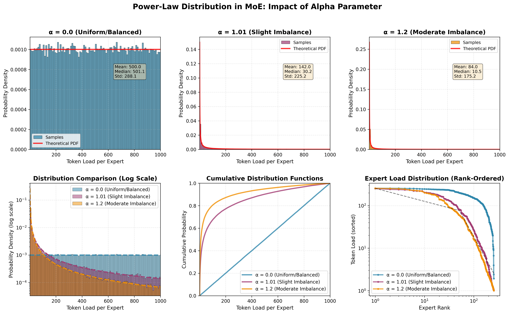
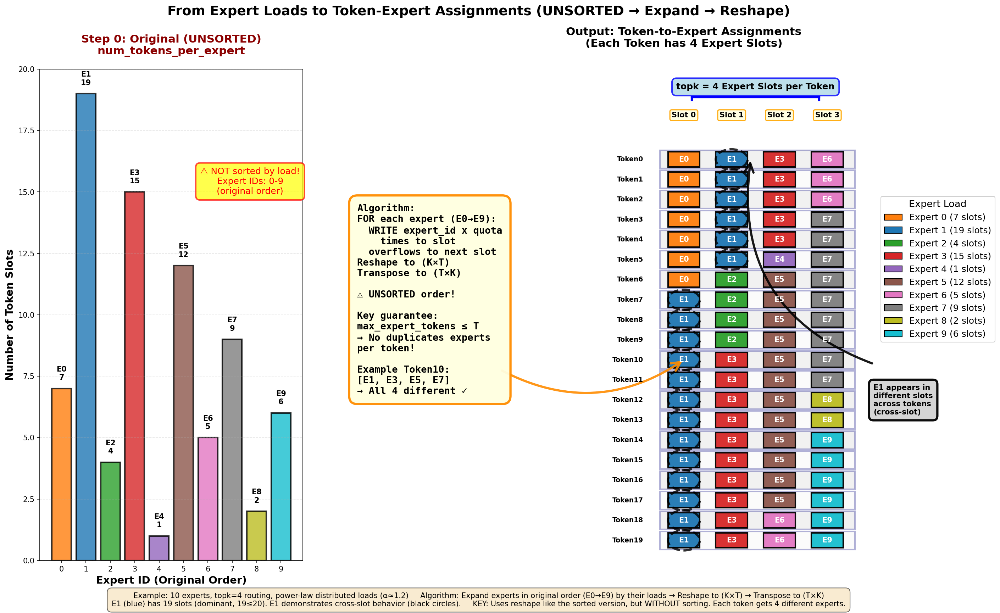
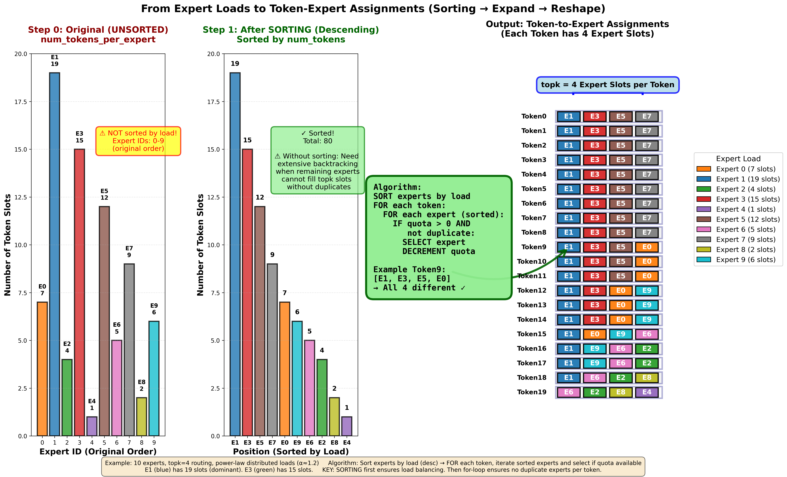

<!--
SPDX-FileCopyrightText: Copyright (c) 2026 NVIDIA CORPORATION & AFFILIATES. All rights reserved.
SPDX-License-Identifier: Apache-2.0
-->

# MoE workload sampling

The collector's [`helper.py`](../../../python/aisimulate/collector/helper.py)
builds expert-load quotas and token assignments for synthetic MoE measurements.
Persist the selected workload distribution with the table identity; it changes
kernel efficiency and must not be inferred from a precision label.

## Parameters and quota generation

Let `T` be source tokens, `E` experts, `K` selected experts per token, and `EP`
expert-parallel ranks. Valid routing assigns exactly `T*K` expert slots, with
no expert receiving more than `T` tokens and no token selecting an expert twice.
Experts are placed in contiguous groups of `E/EP`.

`sample_power_law` samples bounded positive weights using a uniform `u`:

```text
alpha != 1: x = ((xmax**(1-alpha) - xmin**(1-alpha))*u + xmin**(1-alpha))**(1/(1-alpha))
alpha == 1: x = xmin * exp(u * log(xmax/xmin))
```

The caller normalizes weights to `T*K`, rounds integer quotas, caps each at `T`,
and redistributes overflow and rounding residuals in rank-round-robin order.
The busiest contiguous rank is swapped with rank zero so single-rank compute
measurements exercise the bottleneck. `alpha=0` in the benchmark's distribution
selection uses balanced routing; it is distinct from sampling a bounded uniform
weight distribution. Positive alpha, including exactly 1, remains stochastic.
Model defaults such as `power_law_1.01` or `power_law_1.2` are synthetic workload
choices, not measured routing histograms or universal model properties.



## Token assignment

The current `_assign_experts_from_counts` sorts experts by descending quota,
expands each expert ID by its count, then reshapes the flat vector to `(K,T)`
and transposes it to `(T,K)`. The cap `quota <= T` keeps one expert's contiguous
run from appearing twice at the same token position. Quotas are preserved.
Sorting and output materialization cost work; this is not a constant-time or
`O(E)` total computation independent of token count.

These retained illustrations explain assignment order and layout; the helper
source above defines the current algorithm:




The [DeepEP-LL communication model](../methods/deepep-ll.md) shares quota
semantics but intentionally uses randomized exact-quota assignments to model
source/destination endpoint contention. Do not substitute the deterministic
compute assignment for that Monte Carlo routing or assume identical seeds
produce identical streams across Rust and PyTorch.

## Validation

Check the exact quota sum, nonnegative integer quotas bounded by `T`, `(T,K)`
assignment shape, unique experts within each token, and reconstructed expert
counts. Check busiest-rank placement separately from token assignment. Retain
the random seed and distribution in collection evidence. `AIC_DEBUG=1` prints
quota details from the common helper; other operation debug controls have their
own scope. EPLB changes placement/replication and needs its explicit collector
and consumer contract rather than relabeling ordinary power-law data.
