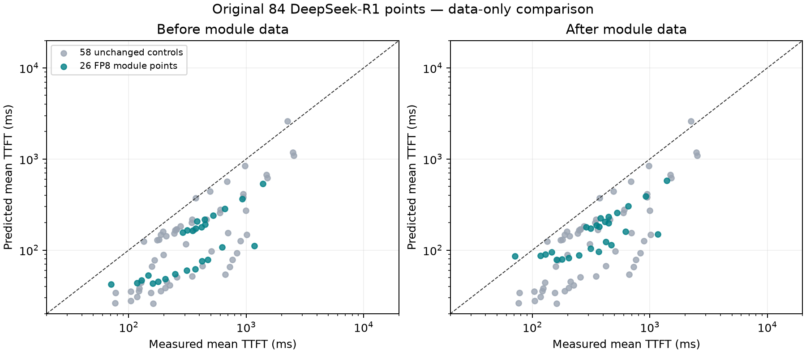

# SGLang MLA module data: original 84-point replay

Adding compatible module profiles improves overall TTFT MAPE from **58.83% to
55.35%**. The 26 FP8-weight points improve from **64.56% to 53.34%**. The 48
NVFP4 points retain their mixed BF16/NVFP4 granular path; mixed-projection
module identity remains deferred. H200's 10 predictions are also unchanged.

## Paired accuracy

| Scope | Points | TTFT MAPE before | TTFT MAPE after | TPOT MAPE before | TPOT MAPE after |
| --- | ---: | ---: | ---: | ---: | ---: |
| H200 | 10 | 33.92% | 33.92% | 10.29% | 10.29% |
| B200 | 29 | 65.15% | 61.77% | 5.61% | 5.20% |
| B300 | 45 | 60.29% | 55.98% | 5.86% | 5.67% |
| All | 84 | 58.83% | 55.35% | 6.30% | 6.06% |
| FP8 module points | 26 | 64.56% | 53.34% | 6.15% | 5.37% |
| NVFP4 controls | 48 | 60.91% | 60.91% | 5.55% | 5.55% |

MAPE is the equal-point mean of absolute percentage errors against silicon
mean latency. All 26 affected TTFT errors improve; TPOT improves for 20,
worsens for five, and is unchanged for one. No observations are dropped.
For B300 TP8, 1k input, CC1, predicted TTFT changes from 42.06 to 85.88 ms
against 70.93 ms measured: the absolute error improves but the sign reverses.
B200 TP8, 1k, CC1 changes from 43.22 to 78.25 ms against 160.36 ms measured.
The remaining error cannot be attributed solely to missing module data.

## Controlled replay

- All 84 original replay specs are byte-identical. All 21,430 requests complete,
  with zero truncation, failures, or unavailable metrics.
- Baseline is the verified `cd2f1e384db303920e151189e2bb9f3f7f79aded` wheel,
  including the separate static KV estimator correction in PR #263. This
  experiment changes only two module parquet files and their two provenance
  sidecars. The other 1,807 package files, including Python and both native
  runtimes, match. No capacity override or latency calibration is used.
- The 48 NVFP4 and 10 H200 controls have exactly identical TTFT, TPOT,
  request-latency, and throughput predictions in both arms.
- Silicon is SGLang 0.5.12-cu130 (65 points) or 0.5.12.post1 (19 points), while
  the preserved profile query is 0.5.14. This is a controlled data-refresh
  comparison, not version-matched validation or full-forward attribution.

## Collection and consumer checks

| GPU | Exclusive-node job | Node | Rows | Failed / unattempted | Elapsed |
| --- | --- | --- | ---: | ---: | --- |
| B200 | 1994663 | nsc-svg-slurm-1-gpu-177 | 218 | 0 / 0 | 1m26s |
| B300 | 467888 | pool0-0112 | 218 | 0 / 0 | 1m41s |

- Target: `mla_context_module_perf.parquet`, SGLang 0.5.14, native heads 128,
  local heads 16/32 (TP8/TP4), `fp8` attention, `fp8` KV, `fp8_block` projections.
  The model is loaded with dummy weights from the cached DeepSeek-R1 config.
- For each local-head count, 109 batch/sequence pairs come from the declared
  module grid within the original replay's 32,768 fresh-token chunk limit.
  Sixteen additional grid pairs exceed that experiment scope and are not
  scheduled. This is targeted coverage, not every precision or prefix bucket.
- Ordinary context timing includes real Q/KV down-projection, norms/rotary,
  remaining projections, and attention. SGLang's `AttentionInputs` caches its
  QKV latent; the collector resets it for every measured call. The original
  wide-EP harness supplied a dummy latent and wrote a different table.
- Separate smoke hooks verified exactly 18 calls to each of the four
  projections: eight warmups plus ten timed iterations. Hooks are removed
  before production. Prefill uses eager execution and back-to-back CUDA-event
  timing. Per-rank module shapes run on one GPU; TP communication, full-model
  scheduling, frontend cost, and cross-rank waiting are outside this boundary.
- Uniform projection precision is checked from loaded weights and quantization
  config before logging. Mixed BF16/NVFP4 modules are rejected. No existing
  wide-EP rows are renamed or reused as ordinary module measurements.
- All 436 physical keys are unique and have positive latency. The unchanged
  native SILICON loader/query reproduces every stored latency with sibling
  reuse disabled. Both tables are consumed without SDK/Rust changes.
- Exact amd64 image digest:
  `sha256:9611bd4c5624b0e9e17829506188a12f17205f2083de0dd44d6c521733553a50`.
  Runtime is SGLang 0.5.14 / Torch 2.11.0+cu130. Collector revision is
  `7b42363cf32eb2685dca50569dc00ef896397e35`; source and case-plan hashes are
  in the table sidecars. The framework source was inspected inside this image.
- Jobs reserve exclusive nodes and request `--gpu-freq=high`. Before/after
  GPU clock, driver and power snapshots are retained; a hard clock lock is
  not claimed. Preliminary single-GPU runs 1994653/467864 remain separate and
  are not published. Boundary probe 1994624 is also excluded.
- Checks: 64 focused MLA tests and nine data-schema/layout tests pass. Full
  collector suite: 1,837 passed, seven skipped, one existing DSV4-Pro FPM
  memory-admission failure. That failure reproduces on the unchanged baseline.
  Ruff and diff checks pass.

## Deferred modeling gap

The [Known gaps slide](https://docs.google.com/presentation/d/1gu1aBbQLp8nxhn93JPvUC_R3dY9UEj5pwiVTl5Ew0oM/edit#slide=id.known_gap_mixed_projections)
records the 48 NVFP4 points: BF16 Q/KV projections, NVFP4 output projection,
and FP8 attention/KV. A single `gemm_type` cannot describe that combination.
This data refresh does not change its identity or replace it with an
all-BF16/all-NVFP4 module. Decide any modeling extension separately.

## Reproduction evidence

[Paired rows and manifests](sglang-mla-module-20260917.json) include original
point IDs, silicon/predicted values, signed errors, APEs, job IDs, exact input
and output hashes, and all collector source/plan hashes.

Raw scripts, plans, smoke proofs, Slurm logs, CSV/parquet rows, replay specs,
per-request reports, and checks remain under:

`/Users/simonec/.cache/aisim-e2e-gym/mla-module-20260917/`

Remote data remains under
`/lustre/fsw/portfolios/coreai/projects/coreai_comparch_inferencex/users/simonec/results/mla-module-20260917/isolated/`
on each GPU's cluster. `collect_module.py` resolves the declared grid, runs the
smoke gate, writes per-case outcomes, and uses the canonical parquet finalizer.
`replay-84/overlay.py`, `check_queries.py`, `run.py`, and `score.py` reproduce the
data-only experiment and its original-spec/completed-request/control checks.
