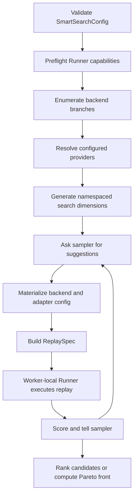

> [!WARNING]
> **Experimental.** Sweeper's API, configuration schema, search results, and deployment output may
> change without a standard deprecation period.

A `SmartSearchConfig` combines backend knobs, optional adapter search spaces, a workload, an
optimization goal, and sweep run control. A `Sweeper` composes that configuration with an injected
replay runtime.

## Ownership

| Layer | Owns | Does not own |
|---|---|---|
| Sweeper core | backend search, parallel enumeration, optimizer orchestration, scoring, cache, worker lifecycle | feature-specific policy semantics or a concrete replay runtime |
| `SweepConfigProvider` | feature-specific search-space generation and per-candidate replay materialization | optimizer execution, scoring, or process pools |
| Replay runner | execution of a complete `ReplaySpec` and declaration of supported backends and hooks | optimizer suggestions or provider search-space generation |

## Unified CLI integration

AISimulate owns `predict` and `recommend`, the shared traffic and engine schemas, and durable
output publication. Stack selection is a command-line option and is not embedded in a recommended
YAML. Prediction evaluates one concrete configuration; recommendation emits concrete prediction
inputs. Commands, configuration fields, and output files are covered in the
[AISimulate CLI User Guide](../cli/user-guide.md).

The `engine` runner factory ships with AISimulate. Optional stacks are discovered through the
`aisimulate.runner_factories` Python entry-point group; the `ai-dynamo` package registers `dynamo`.
Entry-point names are the accepted `--stack` values and must be unique.

Runner factories advertise their supported execution modes. The built-in `engine` stack supports
offline prediction. Optional stacks may additionally support `predict --online`. A stack that does
not advertise online execution fails before runner creation instead of silently falling back to
offline execution. The selected runner validates finer stack-specific combinations.

Optional component configuration is discovered separately through
`aisimulate.config_adapters`. Adapter names are `<stack>.<section>`, such as `dynamo.router` and
`dynamo.planner`. An adapter validates and materializes its section for `predict` and contributes
search dimensions plus per-candidate runtime hooks for `recommend`; it never starts replay itself.
The selected runner factory combines all hooks and invokes the underlying runtime exactly once.

Every section owner defines separate typed prediction and recommendation models. AISimulate owns
`TrafficPredictionConfig` / `TrafficRecommendationConfig` and `EnginePredictionConfig` /
`EngineRecommendationConfig`; optional packages own the corresponding models for their sections.
Internal runtime config is a third, fully resolved layer and is never used as the CLI search schema.
The config-adapter ABI has three operations: compile a concrete prediction section, compile a
recommendation section into a search plan, and materialize one candidate. The legacy Sweeper
provider ABI remains a separate SDK compatibility surface.

See [Sweep Configuration Providers](sweep-config-provider.md) for the SDK provider contract.

## Sweep Flow



Provider code runs in the main process. Worker tasks receive only a serializable `ReplaySpec`; they
do not import or pickle provider objects. Each worker creates one runner and reuses it for candidate
replays.

## Parallelism search projection

The built-in default follows the existing Sweeper projection algorithm below. It does not expose the
six YAML leaves as six independent optimizer parameters.

First, the Sweeper builds the legal configuration pool for each deployment-mode branch. It enumerates
worker sizes from the current `1, 2, 4, 8, 16` GPU ladder, with pipeline parallelism fixed at `1`, then
enumerates legal tensor, attention-data, MoE-tensor, and MoE-expert shapes. It applies model-width,
backend, real-silicon, KV-capacity, GPU-budget, and runner-capability filters. For every surviving
worker shape, it enumerates positive replica counts that fit the budget. A disaggregated pool contains
prefill/decode pairs whose combined GPU count fits the same budget. Aggregated and disaggregated modes
use separate optimizer studies; backend remains a categorical parameter within each study.

Second, each complete mapping is encoded into a smaller latent search space:

| Deployment | Latent Parameter | Optimizer Type | Encoding |
|---|---|---|---|
| Both | `used_gpu_ratio` | Continuous float | Total GPUs divided by the branch GPU budget; range is the minimum and maximum ratio in the legal pool, default clamped from `1.0`. |
| Aggregated | `agg_num_gpus_per_engine_target` | Log-scale discrete | GPUs per worker, `tensor * pipeline * attention_data`; feasible values come from the legal pool and the default is the pool value nearest its geometric midpoint. |
| Aggregated | `agg_attention_mode` | Categorical | `tp` when attention data parallelism is `1`, otherwise `dp`. |
| Aggregated MoE | `agg_ffn_mode` | Categorical | `ep` when MoE expert parallelism is greater than `1`, otherwise `tp`. |
| Disaggregated | `prefill_gpu_share` | Continuous float | Prefill-pool GPUs divided by total candidate GPUs; range comes from the legal pool, default clamped from `0.5`. |
| Disaggregated | `prefill_num_gpus_per_engine_target` | Log-scale discrete | Prefill GPUs per worker. |
| Disaggregated | `decode_num_gpus_per_engine_target` | Log-scale discrete | Decode GPUs per worker. |
| Disaggregated | `prefill_attention_mode`, `decode_attention_mode` | Categorical | Per-role `tp` or `dp`. |
| Disaggregated MoE | `prefill_ffn_mode`, `decode_ffn_mode` | Categorical | Per-role `ep` or `tp`. |

The latent parameter names retain the existing Sweeper's `engine` wording; in this public schema,
`num_gpus_per_engine_target` means GPUs per worker.

Only `used_gpu_ratio` and, for disaggregated mode, `prefill_gpu_share` are continuous parallelism
parameters. GPUs per worker are discrete values sampled on a log scale; attention and FFN modes are
categorical. Replica count is not sampled directly: together, total GPU ratio and GPUs-per-worker
targets express the desired replica footprint. Constant latent parameters are omitted from the study
and injected at their defaults.

Third, every optimizer suggestion is snapped back to one complete mapping from the legal pool:

1. Remove mappings that do not support the suggested backend.
2. Count categorical mismatches for attention and FFN modes, and retain only mappings with the minimum
   mismatch count. An exact mode match wins whenever one exists.
3. Compute normalized squared distance over the numeric latent parameters. Ratios use linear values;
   each GPUs-per-worker target uses `log2`. Each dimension is normalized by its backend-compatible
   minimum-to-maximum span, and a constant dimension contributes zero:

   ```text
   distance = sum(((transform(actual) - transform(requested)) / span) ^ 2)
   ```

4. Select the mapping with minimum distance. Ties are deterministic: compare
   `(tensor, pipeline, attention_data, moe_tensor, moe_expert, replicas)` for aggregated mode, or the
   concatenated prefill tuple followed by the decode tuple for disaggregated mode.

The selected mapping supplies the concrete six YAML fields. Trial metadata records requested latent
features, actual snapped features, projection distance, whether a categorical mode was projected, and
the final complete parallel configuration.

## Provider Preparation

A provider implements two operations:

1. `generate_search_space(search_spec, context)` validates the complete adapter-owned search space
   and returns branch-specific parameters plus reusable prepared state.
2. `materialize_replay(plan, selection, context)` turns one namespaced selection into an
   `AdapterReplaySpec` with concrete configuration and optional runtime hooks.

Sweeper namespaces provider parameters as `adapter::<adapter name>::<local parameter>`. This avoids
collisions without adding feature-specific fields to the core schema.

## Replay and Failure Semantics

Before execution, `RunnerCapabilities` verifies the replay-spec version, execution mode,
backend/topology pair, and every runtime hook. Unsupported coarse capabilities fail before the
optimizer spends trials on them. Runner implementations validate finer stack-specific combinations
when they execute a replay.

When all configured backend/topology pairs are rejected during this preflight,
`aisimulate.sweeper.RunnerIncompatibleError` is raised with the deployment modes and rejected
backends. It subclasses `NoViableParallelConfig`, so callers that already handle that base error
remain compatible. Mixed runner incompatibility and model, KV-capacity, or performance-data failure
continues to raise `NoViableParallelConfig`, with the known runner-incompatible backends appended to
the diagnostic. These preflight failures happen before candidate execution and therefore produce no
serialized `SweepResult`; the unified CLI reports them as configuration errors with exit status 2.

Optimizer ask/tell stays in the main process. Exact repeated suggestions use a run-local result
cache. Candidate build failures, replay failures, GPU-budget violations, and timeouts become
infeasible trials. Parallel evaluation uses spawned worker processes and worker-sized waves; a
timed-out pool is terminated and replaced.
