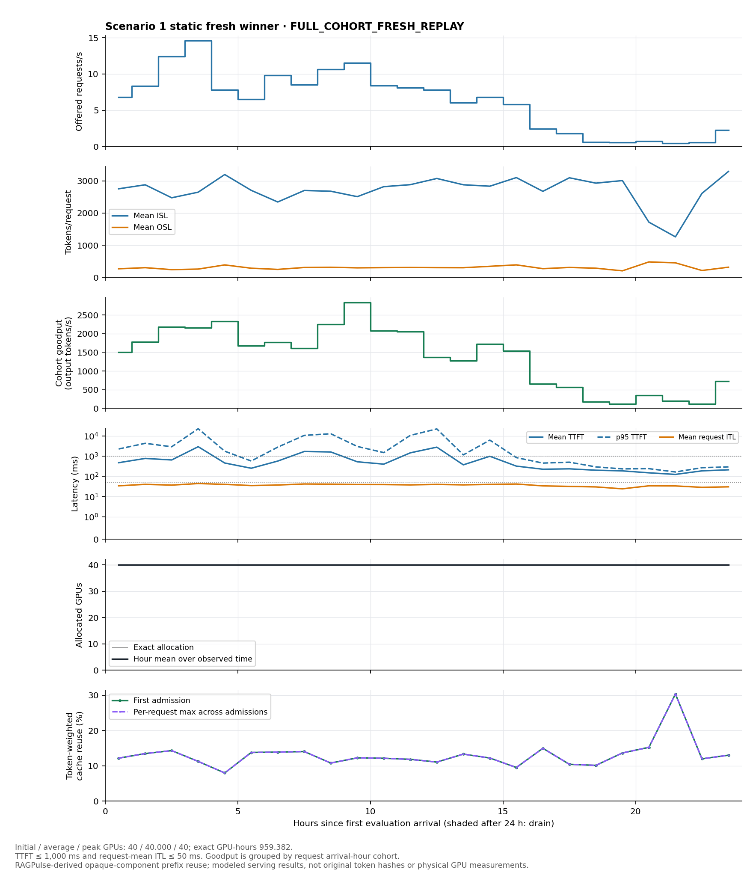
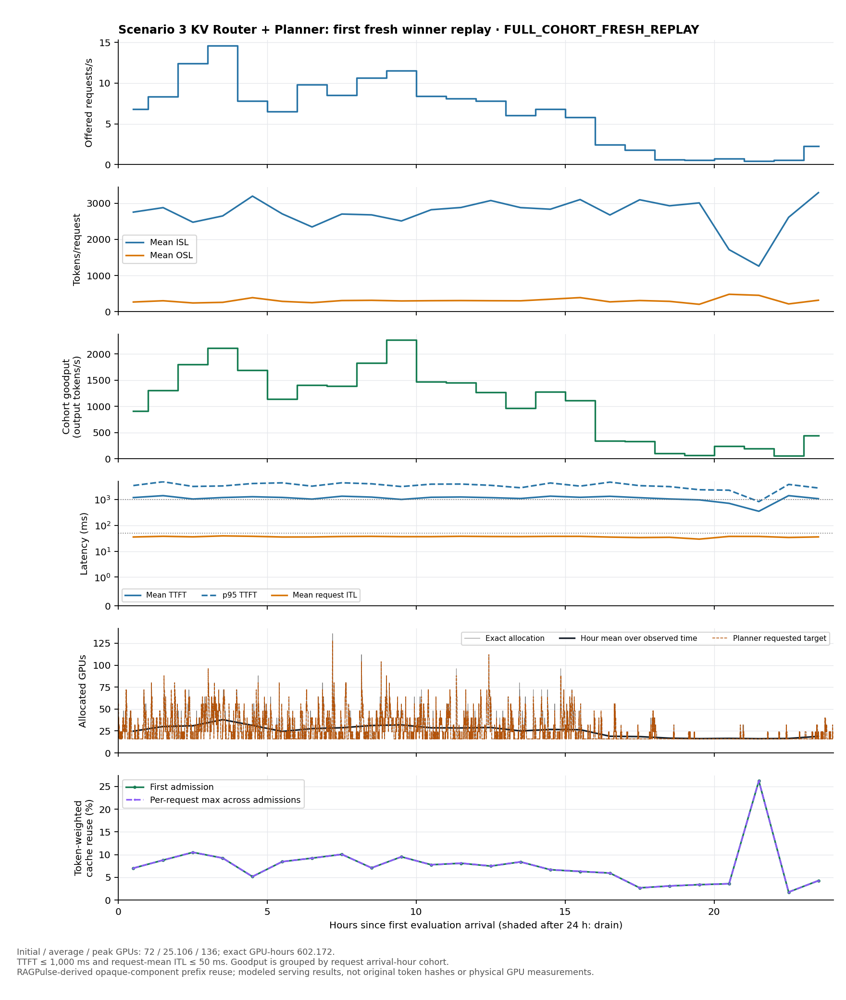
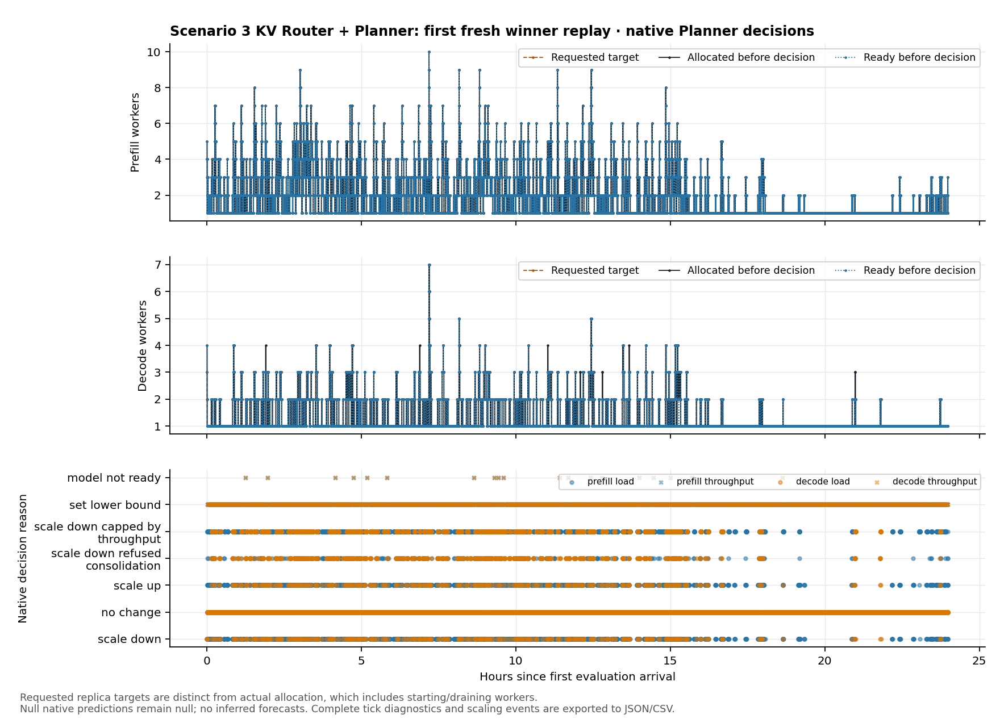

<!--
SPDX-FileCopyrightText: Copyright (c) 2026 NVIDIA CORPORATION & AFFILIATES. All rights reserved.
SPDX-License-Identifier: Apache-2.0
-->

# ComputeLab experiment results — 2026-10-01 snapshot

Snapshot UTC: **2026-10-01T16:49:18.026466+00:00**. Scenario 1 (Static) and scenario 3 (KV Router +
Planner) are complete, independently replayed, archived, and their allocations
released. Scenario 2 (KV Router) is still running. This is an interim result,
not a claim that all three searches have finished.

[Search spaces and execution contract](../../README.md) ·
[Machine-readable snapshot](snapshot.json) · [Per-replay timing ledger](attempt-timings.csv)

| Scenario | State | Suggestions | Search best tok/s/GPU | Fresh mean tok/s/GPU | Fresh mean GPUs | Fresh total goodput tok/s | Fresh request SLA pass |
|---|---|---:|---:|---:|---:|---:|---:|
| 1 | Complete, independently validated and released | 256/256 | 34.3868 | 34.3868 | 40.000 | 1375.471 | 78.51% |
| 2 | Search running; winner not yet validated | 236/256 | 19.3786 | Pending | Pending | Pending | Pending |
| 3 | Complete, independently validated and released | 256/256 | 41.9101 | 41.7679 | 25.123 | 1049.319 | 58.32% |

The goal is goodput/GPU, with **no minimum SLA coverage constraint**. Higher
GPU efficiency can accompany fewer requests meeting SLA. These are independent,
finite-budget joint searches; they are not a controlled causal ablation of
Router or Planner, and the winners are not proven global optima.

## Selected configurations and independent replays

- **Static:** SGLang 0.5.14 disaggregated, 40 GPUs. P: 3 × TP8/attention-DP1,
  MoE-TP8; D: 2 × TP1/attention-DP8, MoE-TP8. P tokens/sequences: 32768/256;
  D: 16384/512. One fresh full-day replay reproduced every modeled metric
  within the declared tolerance, taking 234.840 seconds. First-admission cache
  reuse was 12.1279%.
- **KV Router:** search still running. The displayed incumbent is provisional;
  no fresh winner replay or final winner comparison is claimed.
- **KV Router + Planner:** vLLM 0.24.0 disaggregated. Initial P: 5 × TP8 and
  D: 4 × TP8, attention-DP1 and MoE-TP8 on both; initial 72 GPUs. P
  tokens/sequences: 16384/2; D: 8192/1024. Router: KV policy, load model `none`,
  overlap credit 1, load scale 64, temperature 0. Planner: throughput + load
  scaling every 60 s / 5 s, load sensitivity 95 with 12 observations, FPM
  sampling 256 / bucket 16. Actual predictor: **constant_last**. Four-day
  predictor selection/bootstrap does not establish learned diurnal seasonality.
  Three unchanged fresh replays scored 41.845607, 41.605250, 41.852928, taking
  275.454, 192.277, 193.042 seconds. Native routing can be stochastic; differences
  were retained. The first detailed replay had average/peak allocation
  25.106 / 136 GPUs and 602.172 GPU-hours; the exact lifecycle integral matched.
  First-admission cache reuse was 7.9918%, with readmission/decode counters
  reconciled separately rather than added as prefill savings.

The figures below use the first agreed detailed replay, not the best fresh
repeat. Full cohort: 537,600 requests, 1,476,413,952 input tokens, 160,730,624
output tokens. TTFT ≤ 1000 ms and request-mean ITL ≤ 50 ms. Scores divide
compliant output tokens by 86,400 seconds and the native full-run average GPUs.
Day 5 is also optimizer feedback: fresh replay verifies same-day reproducibility,
not accuracy on a new held-out day or physical GPUs. Worker startup delay is zero.

## Time and incumbent findings

[PDF](search-comparison.pdf). The curves show the replacement studies, including
Planner preparation. Earlier failed studies are excluded from these curves and
retained separately in the cost ledger below. Summed optimizer calls include
AIS preparation/projection around Vizier and are not isolated GP CPU time;
parallel replay durations are not additive study wall time.

| Completed study | Supervisor wall time | Predictor preparation | Instrumented optimizer calls | Actual complete replays | Cache observations | Other outcomes |
|---|---:|---:|---:|---:|---:|---|
| Static | 14,543.015 s (4.04 h) | — | 2,100.803 s (14.45%) | 162 | 84 | 5 virtual-cap incomplete, 3 native invariant errors, 2 timeouts |
| + Planner | 20,759.812 s (5.77 h) | 1,767.553 s | 3,320.622 s (16.00%) | 242 | 13 | 1 timeout |

No OOM occurred. Each study uses a 256-suggestion native budget and 32 evaluation
workers, inside a 40-CPU / 384-GiB container with a 320-GiB tree-RSS guard.
Failed and cached feedback consumes the suggestion budget. Incomplete requests
or timed-out trials never receive fabricated zero-goodput scores.

## Why studies were restarted

The first three remote studies exited when their native executor could not
finish pool cleanup after a worker-wave timeout. The pinned nightly allowed two
2-second manager joins. A controlled 32-worker / 216.67-GiB fixture reproduced
that failure; larger join budgets completed cleanup in about 4.69 seconds.

The recovery only adds a **60-second executor join grace**, in wrapper commit
`38a89d02`. Original Static/Router bundle `71fbad95` and Planner bundle `9ebfc7de`
were copied and only `runtime/run_sweep.py` replaced. The numerical engine,
image, data, search domains, objective, seed, 256-suggestion budgets and
7200-second native wave deadline stayed fixed. All three replacement studies
subsequently crossed actual timeouts and continued after native pool replacement.

These were new studies, not optimizer resume: previous observations were not
silently reused. Failed-run wall time remains part of campaign cost: Static
8,416.411 s; Router 7,230.824 s; Planner 14,413.437 s. Studies overlap in time,
so these values must not be naively summed as total campaign elapsed time.
The later one/three/three fresh winner replays are a separate reproducibility
check; they do not search again or replace the selected native winner.

## Hourly serving and Planner behavior

[Static PDF](scenario-1-day.pdf)

[Planner PDF](scenario-3-day.pdf)

[Planner decisions PDF](planner-decisions.pdf). Requested replica targets are
shown separately from allocated/ready workers. Exact allocated GPU curves count
active, starting and draining workers; summary GPU-hours were independently
reconciled with that integral.

## Frozen inputs and artifact scope

Dynamo: `c7241c2f153efba10b57c38c2144b70d82194a4d`.
AISimulate: `0.13.0.dev202609300000000061`; release Rust bindings.
Image: `nvcr.io/nvidian/dynamo-dev/aisimulate@sha256:3d38aa7e325da409c3a7b1d33298fbce5843fbc1c2f93b0643a69d6e907be670`.
CPU JAX/JAXlib 0.4.38, x64 enabled; Vizier 0.1.21.

The input provenance and hash transform are documented in the
[experiment contract](../../experiment-contract.yaml). The source is
[RAGPulse revision 7da286be](https://github.com/flashserve/RAGPulse/tree/7da286becf0f049b2bcb1e5a11d9ba8eb638eff4).
The traffic is 512 disjoint copies with bounded session jitter, without time
compression; days 1–4 serve only predictor selection/bootstrap and day 5 is
replayed. Prefix hashes are derived from opaque component IDs, not original
token blocks. Results and figures here are original aggregate experiment
measurements; source traces and per-request reports are not redistributed.

The machine-readable snapshot includes the completed selections, all agreed fresh
scores, artifact hashes, exact configuration fields and read-only coverage-floor
references. The latter are original search observations, **not** newly optimized
or fresh-validated alternatives. Large raw reports, all trial receipts and
cross-node SHA manifests remain in the local campaign archive. Static verified
1,587 output files / 1,523,744,763 bytes; Planner verified 2,008 output files /
1,635,879,947 bytes before resource release. A final three-winner comparison
will be added after Router completes its search and independent validations.
