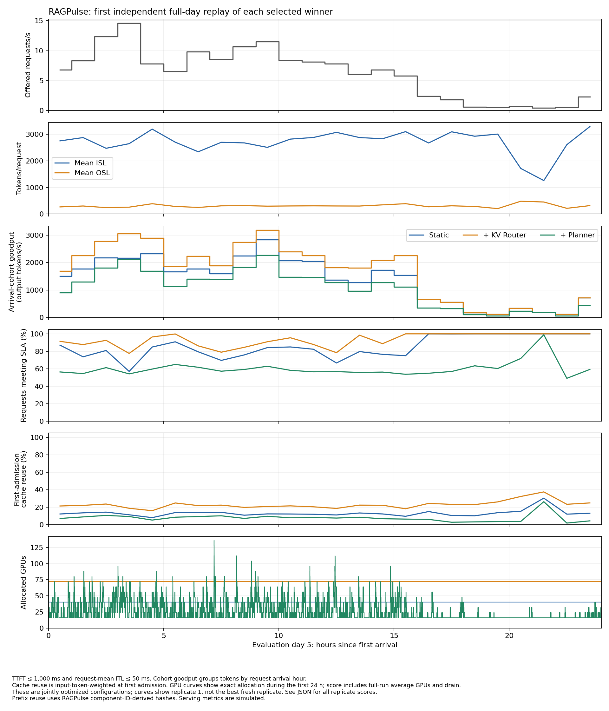
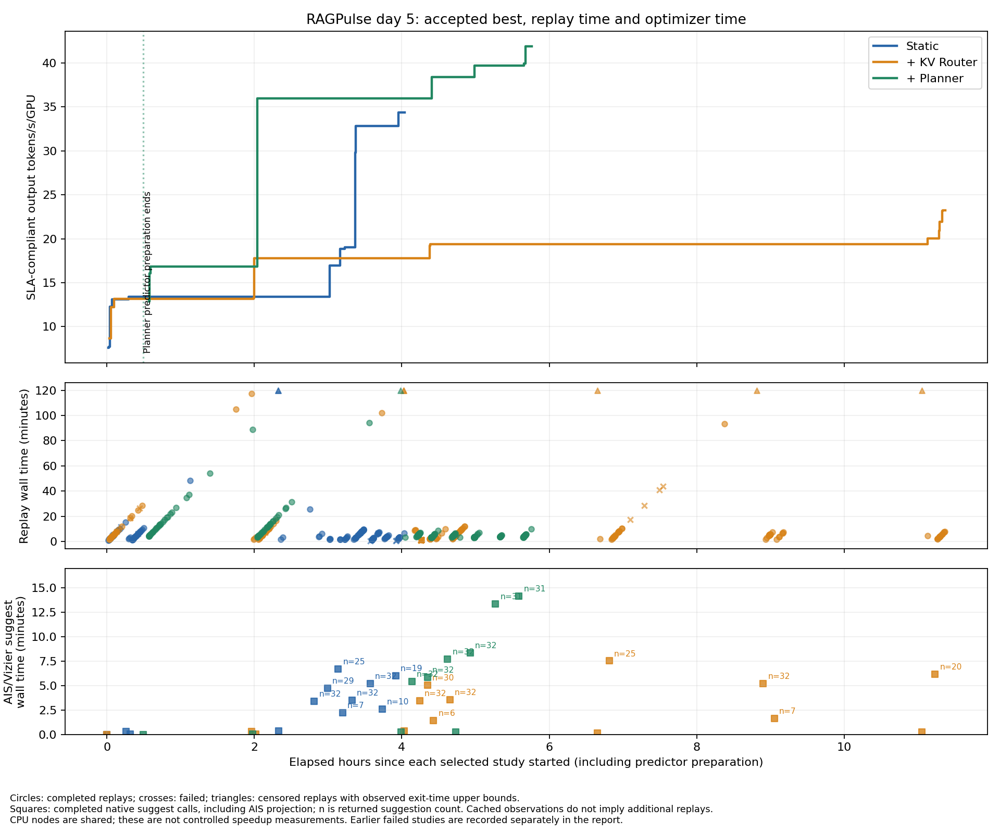

<!--
SPDX-FileCopyrightText: Copyright (c) 2026 NVIDIA CORPORATION & AFFILIATES. All rights reserved.
SPDX-License-Identifier: Apache-2.0
-->

# Results

Three independent 256-suggestion searches on DeepSeek-V3 / modeled H200 SXM,
followed by 1 / 3 / 3 full-day validation replays. The table reports validation
means; all runs and resource cleanup are complete.

| Scenario | Average GPUs | Goodput/GPU (tok/s) | Total goodput (tok/s) | Request SLA pass |
|---|---:|---:|---:|---:|
| Static | 40.00 | 34.3868 | 1375.471 | 78.51% |
| + KV Router | 72.00 | 23.2134 | 1671.362 | 89.38% |
| + Planner | 25.12 | 41.7679 | 1049.319 | 58.32% |

The objective is compliant output tokens / 86,400 seconds / average GPUs,
with TTFT ≤ 1000 ms and request-mean ITL ≤ 50 ms. **There is no minimum SLA
coverage constraint:** Planner's higher efficiency accompanies lower coverage.
These are jointly optimized configurations, not a causal feature ablation or
proven global optima.

Router also found an **80-GPU, 99.7809%-coverage** configuration at 23.1996
tok/s/GPU—only 0.0453% below the selected configuration's search score. It is
an **unvalidated search reference**, not a replacement winner; see [coverage.csv](coverage.csv).

## Selected configurations

All three use disaggregated serving. Worker counts below are initial counts;
Planner changes them during replay. Both pools use MoE TP8/EP1, except the
Router scenario's decode pool, which uses MoE TP1/EP8.

| Scenario | Backend | Prefill workers | Decode workers | P max tokens / sequences | D max tokens / sequences |
|---|---|---|---|---|---|
| Static | SGLang 0.5.14 | 3 × TP8 / attention-DP1 | 2 × TP1 / attention-DP8 | 32768 / 256 | 16384 / 512 |
| + KV Router | SGLang 0.5.14 | 4 × TP8 / attention-DP1 | 5 × TP1 / attention-DP8 | 32768 / 1 | 16384 / 1024 |
| + Planner | vLLM 0.24.0 | 5 × TP8 / attention-DP1 | 4 × TP8 / attention-DP1 | 16384 / 2 | 8192 / 1024 |

Static uses round-robin placement. The other scenarios use KV routing with
load model `none`, load scale 64 and temperature 0; overlap credit is 1.5 for
Router and 1 for Planner. Planner uses throughput/load scaling every 60 s / 5 s
and the selected **constant_last** predictor. Four-day predictor preparation
does not establish learned diurnal seasonality or warm the engine KV cache.
Exact controls, individual validation scores and frozen versions are in [results.json](results.json).

## Serving behavior

Curves use the first detailed validation replay, not the best repeat. GPU-hours
and cache reuse were reconstructed and checked against native summaries.
Planner reaches 136 GPUs and falls to about 16 during low load;
[decision details](planner-decisions.png) distinguish requested targets from allocation.
[hourly.csv](hourly.csv) includes all three scenarios, including latency metrics.

## Search time

| Scenario | Search wall time | AIS optimizer call time |
|---|---:|---:|
| Static | 4.04 h | 35.01 min (14.45%) |
| + KV Router | 11.38 h | 35.09 min (5.14%) |
| + Planner | 5.77 h | 55.34 min (16.00%) |

Planner's search includes 29.46 minutes of predictor preparation. Optimizer time
includes AIS projection and is not isolated Vizier CPU time. The plotted studies
exclude the earlier pool-cleanup failures; [timings.csv](timings.csv) retains all
816 formal/validation replay records, including those failed studies, plus the
selected studies' per-replay scores. Censored durations remain labeled bounds.

## Data and scope

[Search spaces and protocol](../README.md) · [Experiment contract](../experiment-contract.yaml)

RAGPulse is scaled 512×: days 1–4 supply predictor history, and day 5 supplies
537,600 evaluation requests. Validation repeats that same evaluation day;
it is not a held-out-day or physical-GPU test. Worker startup is modeled as zero,
and prefix hashes derive from opaque component IDs rather than original tokens.
Raw reports and cleanup evidence remain in the experiment archive; this directory
contains aggregate measurements and figures.
