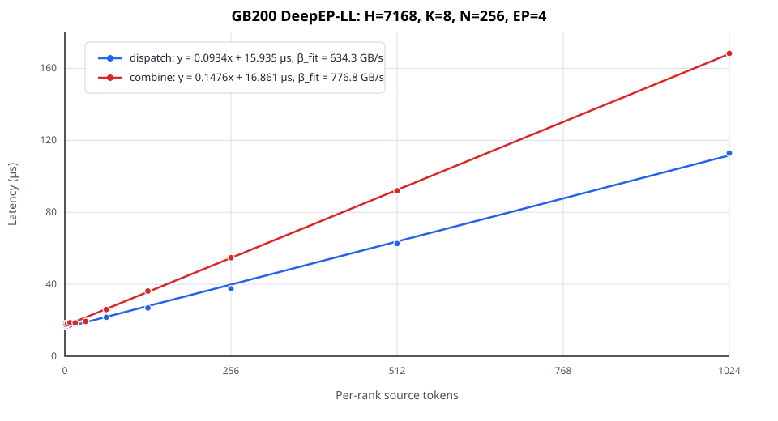

<!--
SPDX-FileCopyrightText: Copyright (c) 2025 NVIDIA CORPORATION & AFFILIATES. All rights reserved.
SPDX-License-Identifier: Apache-2.0
-->

# AISimulate application (AIConfigurator compatibility source)

> This directory contains the complete AIConfigurator application migrated to
> the standalone AISimulate repository. It builds the `aisimulate` 0.12.0
> wheel, not a separate `aiconfigurator` wheel. The legacy import namespace and
> `aiconfigurator` executable remain compatibility surfaces alongside the public
> `aisimulate` prediction CLI. The original AIC
> documentation below is retained so existing workflows remain discoverable
> during the CLI parity and deprecation window.

[](https://deepwiki.com/ai-dynamo/aisimulate)
[](https://discord.gg/mRJ2KNzwYE)

In disaggregated serving, configuring an effective deployment is challenging: you need to decide how many prefill and decode
workers to run, and the parallelism for each worker. Combined with SLA targets for TTFT (Time to First Token) and
TPOT (Time per Output Token), optimizing throughput at a given latency becomes even more complex.

`aiconfigurator` helps you find a strong starting configuration for disaggregated serving. Given your model, GPU
count, and GPU type, it searches the configuration space and generates configuration files you can use for deployment with Dynamo or llm-d.

For a technical deep dive into the design and methodology of AIConfigurator, please refer to our paper:
[**AIConfigurator: Lightning-Fast Configuration Optimization for Multi-Framework LLM Serving**](https://arxiv.org/abs/2601.06288).

The tool models LLM inference using collected data for a target machine and framework. It evaluates thousands of
configurations and runs anywhere via the CLI.

## DeepEP-LL decode modeling

Stage 1 models each DeepEP low-latency decode dispatch/combine from a measured
same-shape curve, OLS or system-startup one-shot calibration, and deterministic
Monte Carlo routing skew. Runtime uses the P50 of complete trials. Typed rows
are tried per shape before the phase-compatible legacy `default` row;
`default` is FP8 dispatch or BF16 combine, not a general dtype wildcard.
Exact-topology curves are not rescaled by advertised bandwidth;
NVLink/MNVL/IB endpoint limits guard only single-domain donor extrapolation.
DeepEP-HT, DeepEP V2, and TensorRT-LLM communication paths are unchanged. See the detailed
[DeepEP-LL modeling document](docs/DEEPEP_LL_MODELING.md) for token conventions,
payload dtypes, formulas, topology rules, fixed assumptions, and Stage 2/3/4
TODOs.

Expert compute remains on the measured `MoeExpertCompute` path, including the
existing SGLang `DeepEPMoE.run_moe_core`-derived WideEP data. The Monte Carlo
routing/load adjustment is applied only to LL dispatch and combine, so this
stage changes communication modeling without replacing the measured compute
kernel with the ordinary fused-MoE predictor.

Across the 192 checked-in LL curves, every OLS slope and raw intercept is
positive; the smallest raw intercept is approximately 6.02 us, median
\(R^2\) is approximately 0.99909, and the minimum is approximately 0.9522. A
future finite negative intercept caused by measurement noise is clamped to
zero instead of making the configuration unavailable. For
GB200 \(H=7168,K=8,N=256\), the dispatch and combine fitted bandwidths are
634.3 and 776.8 GB/s, respectively. These slopes are fitted from parquet data;
the separate 900 GB/s NVLink value comes from `SystemSpec`.



Let's get started.

## Build and Install

### Install from PyPI

```bash
pip3 install aisimulate
```

One `aisimulate` wheel contains the compatibility CLI and application, the
estimator SDK, model/system data, Replay, Sweeper, and the native extension.
It installs no separate `aiconfigurator`, `aiconfigurator-core`, or Python
`aisimulate-core` distribution. The `aiconfigurator`, `aiconfigurator_core`,
and `aisimulate_core` import namespaces remain available from this wheel.

`Task` and the orchestration APIs remain available:

```python
from aiconfigurator.sdk.task_v2 import Task
```

When upgrading from standalone AIConfigurator, remove the old distributions so
only the new owner provides the compatibility paths:

```bash
python3 -m pip uninstall -y aiconfigurator aiconfigurator-core
python3 -m pip install aisimulate
```

### Build and Install from Source

```bash
git clone https://github.com/ai-dynamo/aisimulate.git
cd aisimulate
python3 -m venv myenv
source myenv/bin/activate
pip3 install ./python/aisimulate
```

Current performance profiles are checked-in Parquet files, so normal builds
and usage do not require Git LFS. Install Git LFS and run `git lfs pull` only
when working with retained legacy `*.txt` perf assets or their compatibility
tests.

## Run

### AISimulate prediction and recommendation

AISimulate uses one strict YAML surface for a concrete prediction and a configuration search:

```bash
aisimulate predict --config prediction.yaml
aisimulate recommend --config recommendation.yaml
```

The built-in `engine` stack is the default. Optional packages can register another runner, such as
Dynamo, without creating another CLI:

```bash
aisimulate predict --stack dynamo --config prediction.yaml
```

See [the unified CLI design](../../docs/cli/design.md) for the complete field, domain, preset, and
traffic contract. The `aiconfigurator` command below remains available for its existing AIC
estimation and deployment-generation workflows.

### CLI

```bash
aiconfigurator cli default --model Qwen/Qwen3-32B-FP8 --total-gpus 32 --system h200_sxm
aiconfigurator cli recommend --model Qwen/Qwen3-32B-FP8 --system h200_sxm --target-request-rate 50 --ttft 2000 --tpot 30
aiconfigurator cli exp --yaml-path exp.yaml
aiconfigurator cli generate --model-path Qwen/Qwen3-32B-FP8 --total-gpus 8 --system h200_sxm
aiconfigurator cli support --model-path Qwen/Qwen3-32B-FP8 --system h200_sxm
```
- We have six modes: `default`, `estimate`, `recommend`, `exp`, `generate`, and `support`.
- Use `default` to find the estimated best deployment by searching the configuration space.
- The former standalone Replay and Sweeper module CLIs are replaced by `aisimulate predict` and
  `aisimulate recommend`; their Python SDKs remain available for embedded callers.
- Use `exp` to run customized experiments defined in a YAML file.
- Use `generate` to quickly create a naive configuration without a parameter sweep.
- Use `recommend` to find the minimum GPU count and optimal deployment configuration needed to meet a performance target. This mode is designed as a procurement sizing tool -- specify exactly one load target (`--target-request-rate` or `--target-concurrency` — mutually exclusive) along with SLA constraints, and the system calculates the minimum GPUs required. You can also omit `--total-gpus` in default mode with a load target for the same behavior.
- Use `support` to verify if AIC supports a model/hardware combination for agg and disagg modes.
- `--model` is an alias for `--model-path` in the CLI.
- Use `--backend` to specify the inference backend: `trtllm` (default), `vllm`, or `sglang`.
- Use `--deployment-target` to specify the artifact platform: `dynamo-j2` (default, typed Dynamo manifests), `dynamo-python`, `llm-d-helm`, `llm-d-kustomize`, or `fpm`. FPM V1 supports one aggregated vLLM worker group and emits exactly three artifacts: a reusable keepalive Pod, LeaderWorkerSet, or Grove PodCliqueSet in `k8s_deploy.yaml`, `fpm_env.sh` (the collection-facts contract file), and a launch-only `run.sh`; see the [Generator overview](docs/generator_overview.md#fpm-v1-target).
- Use `exp`, pass in exp.yaml by `--yaml-path` to customize your experiments and even a heterogenous one.
- Use `--save-dir DIR` to generate deployment artifacts for the selected target (Dynamo manifests, llm-d values/overlays, or an FPM resource workload + script).
- Use `--database-mode` to control performance estimation mode: `SILICON` (default, uses collected silicon data), `HYBRID` (uses silicon data when available, otherwise SOL+empirical), `EMPIRICAL` (SOL+empirical for all), or `SOL` (speed-of-light only). Please be careful, only `SILICON` mode's result is reproducible. Other modes are for research purpose
- Use `--systems-paths` to override where system YAMLs and data are loaded from (comma-separated; `default` maps to the built-in systems path). First match wins for identical system/backend/version.
- Use `-h` for more options and customization.
- SLA constraints:
  - `--ttft` and `--tpot` filter configurations that exceed either bound; omit a flag to leave that constraint unset.
  - `--request-latency` applies an end-to-end per-request limit. The CLI searches for all configurations whose estimated
  latency stays within that budget, optionally honoring a provided `--ttft`.
  When this flag is set, `--tpot` becomes implicit and is ignored.

Quantization defaults are inferred from the Hugging Face model config (`config.json` plus optional `hf_quant_config.json`).
For low-precision models, use a quantized HF ID (for example, `Qwen/Qwen3-32B-FP8`) or a local model directory containing those files.
Any quantization set via `profiles` or YAML `config` overrides the HF defaults.

For a full end-to-end walkthrough (support check, sweep, deploy, benchmark), see the [CLI User Guide -- End-to-End Workflow](docs/cli_user_guide.md#end-to-end-workflow).

Refer to [CLI User Guide](docs/cli_user_guide.md)

KV-cache estimation and AISimulate engine replay accept an optional
`cuda_graph_reserved_bytes` rank-local reservation. For SGLang, the value is
additional to headroom already encoded by `mem_fraction_static`. The default is zero. See
the [core API contract](../../docs/core-api.md#kv-cache-capacity-reservation)
for the Python and Rust fields and budget semantics.

The standard prediction CLI accepts the same value at
`engine.workers.<role>.kv_cache.capacity.cuda_graph_reserved_bytes` when
`capacity.type` is `default`.

### Python API

You can also use `aiconfigurator` programmatically in Python:

```python
from aiconfigurator.cli import cli_default, cli_exp, cli_generate, cli_recommend, cli_support

# 1. Run default agg vs disagg comparison
result = cli_default(model_path="Qwen/Qwen3-32B-FP8", total_gpus=32, system="h200_sxm")
print(result.best_configs["disagg"].head())

# 2. Run experiments from a YAML file or a dictionary config
result = cli_exp(yaml_path="my_experiments.yaml")
# Or use a dictionary config directly
result = cli_exp(config={
    "my_exp": {
        "serving_mode": "disagg",
        "model_path": "Qwen/Qwen3-32B-FP8",
        "total_gpus": 32,
        "system_name": "h200_sxm",
        "isl": 4000,
        "osl": 1000,
    }
})

# 3. Find minimum GPUs for a performance target (procurement sizing)
result = cli_recommend(model_path="Qwen/Qwen3-32B-FP8", system="h200_sxm", target_request_rate=50.0, ttft=2000, tpot=30)
for mode, df in result.best_configs.items():
    print(f"{mode}: {df[['total_gpus_needed', 'replicas_needed', 'tp', 'tpot']].head()}")

# 4. Generate a naive configuration
result = cli_generate(model_path="Qwen/Qwen3-32B-FP8", total_gpus=8, system="h200_sxm")
print(result["parallelism"]) # {'tp': 1, 'pp': 1, 'replicas': 8, 'gpus_used': 8}

# 5. Check support for a model/system combination
agg, disagg = cli_support(model_path="Qwen/Qwen3-32B-FP8", system="h200_sxm")
print(f"Agg supported: {agg}, Disagg supported: {disagg}")
```

Serving configs can be adapted into validated estimate requests without running
an estimate. InferenceX DB records, DynamoGraphDeployments, and concrete
`dynamo-ci` SGLang benchmark recipes are supported:

```python
from pathlib import Path

from aiconfigurator.sdk.config_adapter import (
    AdapterOverrides,
    DynamoRecipeSource,
    adapt_config,
    to_cli_estimate_kwargs,
)

report = adapt_config(
    DynamoRecipeSource(Path("deploy.yaml"), Path("perf.yaml")),
    AdapterOverrides(system_name="h200_sxm"),
)
for request in report.requests:
    kwargs = to_cli_estimate_kwargs(request)
```

See the [Config Adapter Guide](docs/config_adapter.md) for schema, precedence,
supported recipe shapes, diagnostics, and explicit estimate execution.

An example here,
```bash
aiconfigurator cli default --model-path Qwen/Qwen3-32B-FP8 --total-gpus 32 --system h200_sxm --isl 4000 --osl 500 --prefix 500 --ttft 300 --tpot 10
```

```text
********************************************************************************
*                         AIConfigurator Final Results                         *
********************************************************************************
  ----------------------------------------------------------------------------
  Input Configuration & SLA Target:
    Model: Qwen/Qwen3-32B-FP8 (is_moe: False)
    Total GPUs: 32
    Best Experiment Chosen: disagg at 684.79 tokens/s/gpu (disagg 1.67x better)
  ----------------------------------------------------------------------------
  Overall Best Configuration:
    - Best Throughput: 21,913.22 tokens/s
    - Per-GPU Throughput: 684.79 tokens/s/gpu
    - Per-User Throughput: 100.31 tokens/s/user
    - TTFT: 295.71ms
    - TPOT: 9.97ms
    - Request Latency: 5270.24ms
  ----------------------------------------------------------------------------
  Pareto Frontier:
       Qwen/Qwen3-32B-FP8 Pareto Frontier: tokens/s/gpu_cluster vs tokens/s/user
      ┌────────────────────────────────────────────────────────────────────────┐
1250.0┤ •• agg                                                                 │
      │ ff disagg                                                              │
      │ xx disagg best                                                         │
      │                                                                        │
1041.7┤                                                                        │
      │          f                                                             │
      │          fffffffff                                                     │
      │                   fff                                                  │
 833.3┤                      ffff                                              │
      │                          f                                             │
      │       •                   ff                                           │
      │       ••                    fxfff                                      │
 625.0┤         •••••                   f                                      │
      │              •                  f                                      │
      │               ••••••••••••      f                                      │
      │                           •••   f                                      │
 416.7┤                              ••••ff                                    │
      │                                  ••ff                                  │
      │                                     •fffffffffffff                     │
      │                                           ••••••••ff•                  │
 208.3┤                                                     ff•••              │
      │                                                       ff ••••          │
      │                                                         fff •••        │
      │                                                                •       │
   0.0┤                                                                        │
      └┬─────────────────┬─────────────────┬────────────────┬─────────────────┬┘
       0                60                120              180              240
tokens/s/gpu_cluster                 tokens/s/user

  ----------------------------------------------------------------------------
  Deployment Details:
    (p) stands for prefill, (d) stands for decode, bs stands for batch size, a replica stands for the smallest scalable unit xPyD of the disagg system
    Some math: total gpus used = replicas * gpus/replica
               gpus/replica = (p)gpus/worker * (p)workers + (d)gpus/worker * (d)workers; for Agg, gpus/replica = gpus/worker
               gpus/worker = tp * pp * dp = etp * ep * pp for MoE models; tp * pp for dense models (underlined numbers are the actual values in math)

agg Top Configurations: (Sorted by tokens/s/gpu)
+------+---------+--------------+---------------+--------+-----------------+-------------+-------------------+----------+--------------+-------------+----------+----+
| Rank | backend | tokens/s/gpu | tokens/s/user |  TTFT  | request_latency | concurrency | total_gpus (used) | replicas | gpus/replica | gpus/worker | parallel | bs |
+------+---------+--------------+---------------+--------+-----------------+-------------+-------------------+----------+--------------+-------------+----------+----+
|  1   |  trtllm |    410.22    |     108.48    | 251.10 |     4850.91     | 128 (=16x8) |    32 (32=8x4)    |    8     |      4       |  4 (=4x1x1) |  tp4pp1  | 16 |
|  2   |  trtllm |    361.33    |     107.43    | 224.48 |     4869.40     | 112 (=28x4) |    32 (32=4x8)    |    4     |      8       |  8 (=8x1x1) |  tp8pp1  | 28 |
|  3   |  trtllm |    117.92    |     122.25    | 292.72 |     4374.38     |  32 (=2x16) |    32 (32=16x2)   |    16    |      2       |  2 (=2x1x1) |  tp2pp1  | 2  |
+------+---------+--------------+---------------+--------+-----------------+-------------+-------------------+----------+--------------+-------------+----------+----+

disagg Top Configurations: (Sorted by tokens/s/gpu)
+------+---------+--------------+---------------+--------+-----------------+--------------+-------------------+----------+---------------+------------+----------------+-------------+-------+------------+----------------+-------------+-------+
| Rank | backend | tokens/s/gpu | tokens/s/user |  TTFT  | request_latency | concurrency  | total_gpus (used) | replicas |  gpus/replica | (p)workers | (p)gpus/worker | (p)parallel | (p)bs | (d)workers | (d)gpus/worker | (d)parallel | (d)bs |
+------+---------+--------------+---------------+--------+-----------------+--------------+-------------------+----------+---------------+------------+----------------+-------------+-------+------------+----------------+-------------+-------+
|  1   |  trtllm |    684.79    |     100.31    | 295.71 |     5270.24     | 272 (=68x4)  |    32 (32=4x8)    |    4     |  8 (=2x2+1x4) |     2      |    2 (=2x1)    |    tp2pp1   |   1   |     1      |    4 (=4x1)    |    tp4pp1   |   68  |
|  2   |  trtllm |    684.79    |     100.16    | 295.71 |     5277.73     | 240 (=120x2) |    32 (32=2x16)   |    2     | 16 (=4x2+1x8) |     4      |    2 (=2x1)    |    tp2pp1   |   1   |     1      |    8 (=8x1)    |    tp8pp1   |  120  |
|  3   |  trtllm |    404.71    |     100.35    | 295.71 |     5268.25     | 140 (=140x1) |    32 (24=1x24)   |    1     | 24 (=5x2+7x2) |     5      |    2 (=2x1)    |    tp2pp1   |   1   |     7      |    2 (=2x1)    |    tp2pp1   |   20  |
+------+---------+--------------+---------------+--------+-----------------+--------------+-------------------+----------+---------------+------------+----------------+-------------+-------+------------+----------------+-------------+-------+
********************************************************************************
2026-02-08 23:10:21,413 - aiconfigurator.cli.main - INFO - All experiments completed in 6.50 seconds
```

These results indicate that deploying Qwen3-32B-FP8 on h200_sxm in FP8 can achieve **1.67x** higher tokens/s/gpu for disaggregated versus aggregated deployment **under the SLA targets TTFT ≤ 300 ms and TPOT ≤ 10 ms**, with ISL:OSL of 4000:500 (with prefix len: 500).
Try different ISL:OSL values and SLA limits to fit your use case, for example:

```bash
aiconfigurator cli default --model-path Qwen/Qwen3-32B-FP8 --total-gpus 32 --system h200_sxm --ttft 200 --tpot 10 --isl 8000 --osl 200 --prefix 500
```

You will get different results.

### Customized Configuration for aiconfigurator

The `default` mode will create two experiments, one is `agg` and another one is `disagg` and then compare the results.
To further customize (including the search space and per-component quantization), parameters are defined in a YAML file.
Built-in YAML files are under `src/aiconfigurator/cli/example.yaml` and `src/aiconfigurator/cli/exps/*.yaml`
Refer to the YAML file and modify as needed. Pass your customized YAML file to `exp` mode:

```bash
aiconfigurator cli exp --yaml-path customized_config.yaml
```
We can use `exp` mode to compare multiple results, including disagg vs. agg, homogeneous vs. heterogeneous, and more than 2 experiments.
We've crafted several examples in `src/aiconfigurator/cli/exps/*.yaml`
For the full guide, refer to [CLI User Guide](docs/cli_user_guide.md).

### Deploying to llm-d Platform

AIConfigurator supports deploying to the llm-d platform using Helm values. Use `--deployment-target llm-d-helm` with vLLM or SGLang backends:

```bash
# vLLM on llm-d
aiconfigurator cli default \
  --model-path Qwen/Qwen3-32B \
  --total-gpus 32 \
  --system h200_sxm \
  --backend vllm \
  --deployment-target llm-d-helm \
  --save-dir ./output

# SGLang on llm-d
aiconfigurator cli default \
  --model-path Qwen/Qwen3-32B \
  --total-gpus 32 \
  --system h200_sxm \
  --backend sglang \
  --deployment-target llm-d-helm \
  --save-dir ./output
```

This generates `llm-d-values.yaml` files compatible with the llm-d-modelservice Helm chart. The generated Helm values include model artifacts, parallelism settings, and container configurations optimized for your workload.

You can customize llm-d-specific settings using generator overrides:
```bash
--generator-set LlmdConfig.vllm_image=vllm/vllm-openai:v0.6.0 \
--generator-set LlmdConfig.model_cache_size=200Gi \
--generator-set LlmdConfig.routing_proxy_enabled=true
```

### Generate Configurations for Dynamo and Reproduce the results

Please refer to the [Deployment Guide](docs/dynamo_deployment_guide.md) for details about deployment and reproduction especially about the benchmark methodology.

To simplify the deployment and reproduction, in the `aiconfigurator` CLI, if you specify `--save-dir`, the tool generates configuration files for your chosen deployment target.
The folder structure varies based on `--deployment-target`:

**For Dynamo deployments** (`--deployment-target dynamo-j2` or `dynamo-python`):

```text
results/QWEN3_32B_FP8_h200_sxm_trtllm_isl4000_osl1000_ttft1000_tpot20_904495
├── agg
│   ├── best_config_topn.csv
│   ├── config.yaml
│   ├── pareto.csv
│   ├── top1
│   │   ├── agg
│   │   │   ├── agg_config.yaml
│   │   │   ├── bench_run.sh          # aiperf benchmark sweep script (bare-metal)
│   │   │   ├── k8s_bench.yaml        # aiperf benchmark sweep Job (Kubernetes)
│   │   │   ├── k8s_deploy.yaml
│   │   │   └── node_0_run.sh
│   │   └── generator_config.yaml
│   ...
├── disagg
│   ├── best_config_topn.csv
│   ├── config.yaml
│   ├── pareto.csv
│   ├── top1
│   │   ├── disagg
│   │   │   ├── bench_run.sh          # aiperf benchmark sweep script (bare-metal)
│   │   │   ├── decode_config.yaml
│   │   │   ├── k8s_bench.yaml        # aiperf benchmark sweep Job (Kubernetes)
│   │   │   ├── k8s_deploy.yaml
│   │   │   ├── node_0_run.sh
│   │   │   └── prefill_config.yaml
│   │   └── generator_config.yaml
│   ...
└── pareto_frontier.png
```

**For llm-d Helm deployments** (`--deployment-target llm-d-helm`):

```text
results/QWEN3_32B_h200_sxm_vllm_isl4000_osl1000_ttft1000_tpot20_904495
├── disagg
│   ├── best_config_topn.csv
│   ├── config.yaml
│   ├── pareto.csv
│   ├── top1
│   │   ├── disagg
│   │   │   ├── decode_config.yaml
│   │   │   ├── llm-d-values.yaml    # Helm values for llm-d-modelservice chart
│   │   │   ├── node_0_run.sh
│   │   │   └── prefill_config.yaml
│   │   └── generator_config.yaml
│   ...
└── pareto_frontier.png
```

Note: llm-d deployments generate `llm-d-values.yaml` instead of `k8s_deploy.yaml` and `k8s_bench.yaml`.

Use `--generator-config path/to/file.yaml` to load a YAML payload with `ServiceConfig`, `K8sConfig`, `DynConfig`, `WorkerConfig`, and `Workers.<role>` sections, or specify inline overrides with `--generator-set KEY=VALUE` (repeatable). Examples:

- `--generator-set ServiceConfig.model_path=Qwen/Qwen3-32B-FP8`
- `--generator-set K8sConfig.k8s_namespace=dynamo \`

Run `aiconfigurator cli default --generator-help` to print information that is sourced directly from `src/aiconfigurator/generator/config/deployment_config.yaml` and `backend_config_mapping.yaml`.

## Tuning with Advanced Features

There are many features, such as different quantizations and parallelism strategies, to tune performance beyond the default configurations.
These apply to the CLI. Refer to [Advanced Tuning](docs/advanced_tuning.md) for details.

## How It Works

### Modeling and Mechanism

LLM inference performance is dominated by:

1. Compute cost (such as GEMM and attention).
2. Communication cost (such as all-reduce for tensor parallel and P2P for pipeline parallel).

To estimate performance, we take the following steps:

1. Break down LLM inference into operations: GEMM, attention, communication, embedding, element-wise operations, and others.
2. Collect operation execution times on the target hardware.
3. Estimate end-to-end execution time for a configuration by composing operation times using interpolation and extrapolation.
4. Model in-flight batching (aggregated) and disaggregated serving on top of that.
5. Search thousands of combinations to find strong configurations and generate Dynamo or llm-d configuration files based on the results.

### Supported Features

- **Models**:
  - GPT
  - LLAMA (2, 3)
  - MOE
  - QWEN
  - DEEPSEEK_V3
  - Support using huggingface model id if falls into these model family and not MoE models.

- **Operations**:
  - Attention
    - MHA/GQA (FP8, BF16)
    - MLA (FP8, BF16)
  - KV Cache (BF16, FP8, INT8)
  - GEMM (BF16, FP8, FP8-Block, FP8-OOTB, SQ, INT8 WO, INT4 WO, NVFP4)
  - CustomAllReduce (BF16)
  - Embedding
  - P2P
  - ElementWise
  - NCCL (all_reduce, all_gather, all-to-all, reduce_scatter)
  - MoE (BF16, FP8, FP8-Block, W4A-FP8, INT4 WO, NVFP4)
  - MLA BMM (BF16, FP8)

- **Parallel modes**:
  - Tensor-parallel
  - Pipeline-parallel
  - Expert Tensor-parallel/Expert-parallel
  - Attention DP (for DEEPSEEK and MoE)

- **Scheduling**:
  - Static
  - Aggregated serving (continuous batching)
  - Disaggregated serving
  - MTP (for DEEPSEEK)

- **Inference Backends**:
  - TensorRT-LLM (trtllm)
  - vLLM
  - SGLang

### Data Collection

Data collection is a standalone process for building the database used by aiconfigurator. By default, you do not need to collect data yourself.
Small changes to the database may not materially change performance estimates. For example, you can use 1.0.0rc3 data of `trtllm` on `h200_sxm` and deploy the generated configuration with Dynamo and a `trtllm` 1.0.0rc4 worker.

To go through the process, refer to the [guidance](collector/README.md) under the `collector` folder.

**New:** The collector now supports optional GPU power monitoring during kernel execution. Use the `--measure_power` flag to collect power consumption data alongside performance metrics. See the [collector README](collector/README.md#power-monitoring-optional) for details.

### System Data Support Matrix

| System | Framework(Version) | Status |
|--------|-------------------|--------|
| h100_sxm | TRTLLM(1.0.0rc3, 1.2.0rc5), SGLang(0.5.6.post2), vLLM(0.12.0) | ✅ |
| h200_sxm | TRTLLM(1.0.0rc3, 1.2.0rc5), SGLang(0.5.6.post2), vLLM(0.12.0) | ✅ |
| b200_sxm | TRTLLM(1.0.0rc3, 1.2.0rc5), SGLang(0.5.6.post2) | ✅ |
| gb200 | TRTLLM(1.0.0rc3, 1.2.0rc5) | ✅ |
| a100_sxm | TRTLLM(1.0.0), vLLM(0.12.0) | ✅ |
| h100_pcie, a100_pcie, l4, a30 | Estimate-only system specs for `generate` and non-SILICON database modes (`SOL`, `EMPIRICAL`, `HYBRID`) | ⚠️ |

(last updated: 2026/02/02)

> **Note**: b200 and gb200 are under dev. Results are to be aligned. For preview now.
> `h100_pcie`, `a100_pcie`, `l4`, and `a30` do not include built-in silicon performance databases yet. Use them for naive sizing or rough SOL/EMPIRICAL estimates, and use `--systems-paths` to provide measured data for production-quality predictions.

#### Legacy AIC Support Matrix

The interactive [Legacy AIC Support Matrix](docs/support-matrix/) preserves
historical AIConfigurator CLI compatibility coverage. It uses the current
`main` snapshot and supports filtering by system, mode, and model.

For current strict-native forward-pass estimator coverage, use the
[FPE Support Matrix](docs/fpe-support-matrix/). FPE coverage is estimator
evidence, not deployment certification.

The raw data is also available as
[per-system CSV files](src/aiconfigurator_core/systems/support_matrix).

You can also check support via the CLI:
```bash
aiconfigurator cli support --model-path Qwen/Qwen3-32B-FP8 --system h100_sxm --backend-version 1.2.0rc5
```

## Contributing and Development

We welcome contributions from the community! Check out the below resources to get started:

- [DEVELOPMENT.md](https://github.com/ai-dynamo/aisimulate/blob/main/DEVELOPMENT.md) - Set up your development environment, run tests, and follow our coding standards
- [CONTRIBUTING.md](https://github.com/ai-dynamo/aisimulate/blob/main/CONTRIBUTING.md) - Contribution guidelines and requirements
- [CODE_OF_CONDUCT.md](https://github.com/ai-dynamo/aisimulate/blob/main/CODE_OF_CONDUCT.md) - Community standards
- [Discord](https://discord.gg/mRJ2KNzwYE) - Chat with team and community

### How To Add A New Model
Adding a new model will require modifying the source code and perhaps collecting new data for the model. Please refer to [How to Add a New Model](docs/add_a_new_model.md).

## Citation

If you use AIConfigurator for your research, please cite our paper:

```bibtex
@article{xu2026aiconfigurator,
  title={AIConfigurator: Lightning-Fast Configuration Optimization for Multi-Framework LLM Serving},
  author={Tianhao Xu and Yiming Liu and Xianglong Lu and Yijia Zhao and Xuting Zhou and Aichen Feng and Yiyi Chen and Yi Shen and Qin Zhou and Xumeng Chen and Ilya Sherstyuk and Haorui Li and Rishi Thakkar and Ben Hamm and Yuanzhe Li and Xue Huang and Wenpeng Wu and Anish Shanbhag and Harry Kim and Chuan Chen and Junjie Lai},
  journal={arXiv preprint arXiv:2601.06288},
  year={2026}
}
```

## Known Issues

1. Memory estimation for the backends needs to be studied more.
2. Results can be overly optimistic in the low-speed, high-throughput region.
3. **vLLM and SGLang support is currently being evaluated**. While both backends are functional and available for use, we are still completing comprehensive performance evaluations and alignment testing. We recommend validating results with real benchmarks for production use.

> **Note**: The results are not final or absolute. They can be inaccurate due to modeling gaps or indicate performance improvement opportunities. The tool aims to align with the framework's current implementation and to provide configuration suggestions. Verify results in real benchmarks with the generated configurations and perform follow-up tuning.
