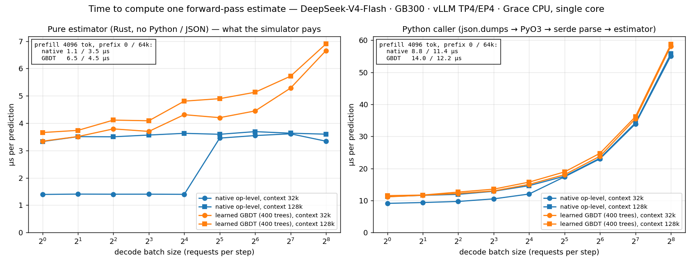
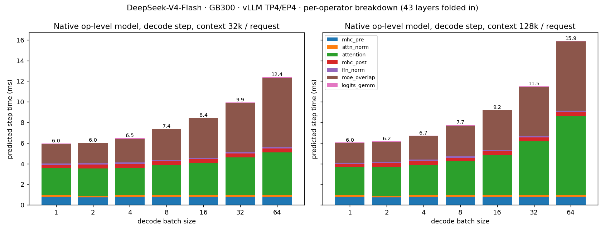
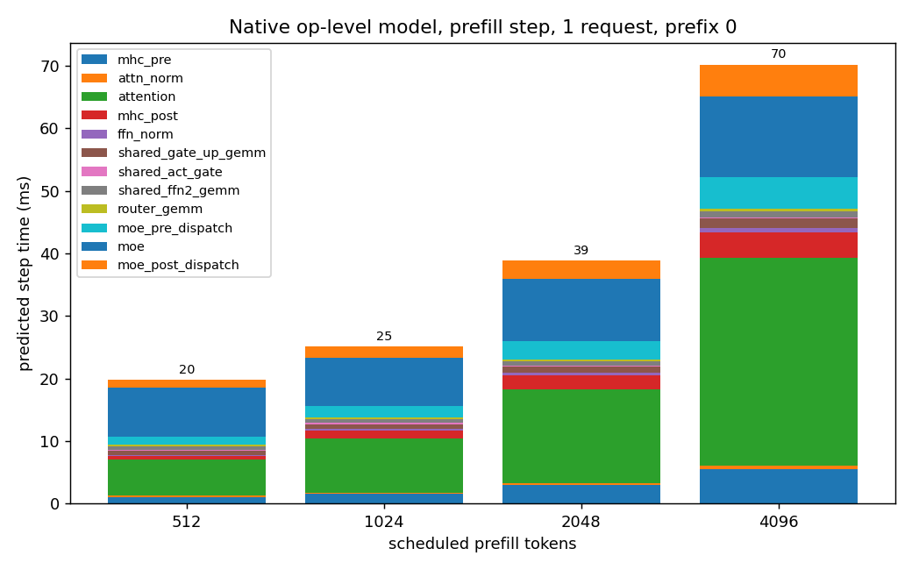
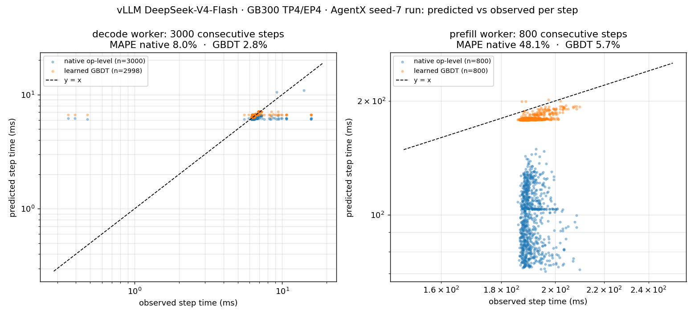

# Learned forward-pass model: design

A gradient-boosted tree model that predicts the wall time of one engine forward pass
(one scheduler step of a prefill or decode worker) from the composition of the batch,
trained on `ForwardPassMetrics` (FPM) recorded from real traffic. It is a third variant
of `ForwardPassPerfModel` next to the native analytic model and the regression store,
and is exposed today through the SDK (`aisimulate_core.sdk.fpm_learned` for training,
`RustForwardPassPerfModel.from_learned` for inference).

Companion document in this directory: [`learned-forward-pass-model.md`](learned-forward-pass-model.md)
(how to collect, train and use).
The existing FPM documentation under `../fpm/` is unchanged; everything about the learned model lives here.

## 1. Problem and design goals

The simulator needs, per scheduler step, the time the GPU forward will take for the
batch the scheduler just formed. The native model derives it from kernel-level
analytic formulas; the regression store interpolates a grid of measured operating
points. Both need per-model calibration effort and neither sees the batch at the
granularity the engine does.

Real deployments already emit exactly the needed observation: Dynamo's FPM stream
reports, for every step, the scheduled batch and the step's wall time. The learned
model turns that stream into a predictor with these goals:

1. **Per-request resolution.** The prediction must condition on each request's
   `(extend, past)` pair, not only on batch aggregates: two decode batches with the
   same total KV but different per-request context distributions do not take the
   same time, and a prefill chunk with 16k new tokens on 200k past is not a 16k chunk
   on 0 past.
2. **No engine source changes.** Stock Dynamo FPM v1 carries aggregates only. The
   per-request lists are added at runtime by import hooks that live in this repo
   (`aisimulate_core.fpm_hooks`), so any stock Dynamo image produces trainable data.
3. **Inference in Rust, microseconds per call.** The simulator calls the perf model
   once per simulated step; the model must be a pure function over a fixed feature
   vector, evaluated without Python.
4. **Refuse rather than degrade.** If an artifact needs per-request features and the
   input has none, the model errors with a pointer to the fix instead of returning a
   constant.
5. **Honest evaluation.** Accuracy is quoted per raw step on data the model never
   saw, with the split scheme stated, never on a random shuffle of correlated steps.

## 2. Data: what a training record is

One record = one FPM event from one engine worker:

| Field | Meaning |
| --- | --- |
| `worker_id`, `dp_rank`, `counter_id` | identity and step counter of the emitting worker |
| `wall_time` | seconds the step took (semantics below) |
| `scheduled_requests.num_prefill_requests`, `sum_prefill_tokens`, `sum_prefill_kv_tokens`, `var_prefill_length` | prefill aggregates |
| `scheduled_requests.num_decode_requests`, `sum_decode_kv_tokens`, `var_decode_kv_tokens` | decode aggregates |
| `scheduled_requests.extend_lengths[i]`, `past_kv_lengths[i]` | **per request**: new tokens this step, KV already present (added by the hooks) |

`wall_time` semantics differ by backend and matter for what is being learned:

- **vLLM** (`InstrumentedScheduler`): host clock between two `schedule()` calls, i.e.
  the engine step including scheduler overhead. Overlap is not an issue.
- **SGLang** (`SchedulerMetricsReporter` + `DeviceTimer`): CUDA events around the
  forward, accumulated and flushed when the batch result is processed. With the
  overlap scheduler on, the disaggregated prefill loop does KV hand-off work before
  the flush, so the next forward completes first and is merged into the current record
  (2× bimodal step times for identical batch shapes, 18% of records dropped, 22%
  prefill error). **All SGLang collection is done with `--disable-overlap-schedule`**,
  which makes each record exactly one forward. A model trained overlap-off still
  predicts overlap-on decode steps to within a near-constant 5.5% offset; overlap-on
  prefill records are not usable as truth.

A **capture run** is one fresh deployment on its own nodes, one aiperf seed, every
concurrency tier run once (20 min each). Runs are the unit of independence: steps
inside a run share machine state, warm-up and request sequence.

## 2a. Per-request fields and the runtime hooks that add them

### What stock FPM carries and what is missing

Stock Dynamo `ForwardPassMetrics` v1 describes a step by seven aggregates (counts,
token sums and variances for the prefill and decode sides). Two batches with identical
aggregates can differ a lot in cost: a decode batch of 8 requests all at 100k context
and one with seven at 10k plus one at 730k have the same `sum_decode_kv_tokens`; a
prefill step with one 16k chunk on 200k past and one with two 8k chunks on 0 past have
the same `sum_prefill_tokens`. The attention work Σ eᵢ·pᵢ, the extremes and the spread
are not recoverable from sums and variances. The learned model therefore needs, per
scheduled request, the pair

- `extend_lengths[i]`: tokens computed for request *i* in this step (chunk size for a
  prefill request, 1 for a plain decode request, `1 + k` with speculative drafts);
- `past_kv_lengths[i]`: KV tokens already present for request *i* before this step
  (prefix-cache hit plus earlier chunks for prefill; the context so far for decode).

Neither field exists in Dynamo main or SGLang main. Instead of patching either code
base, the two lists are added at runtime inside the engine process by
`aisimulate_core.fpm_hooks`; no engine source is changed.

### How the hooks work

1. **Post-import patching.** `fpm_hooks.install()` registers a `sys.meta_path` finder
   for two module names, `sglang.srt.managers.scheduler_components.metrics_reporter`
   and `dynamo.vllm.instrumented_scheduler`. When the engine imports one of them the
   finder delegates to the real loader and runs the corresponding patch function right
   after `exec_module`. Modules that never get imported are never touched; nothing is
   imported eagerly.
2. **Extended `ScheduledRequestMetrics`.** FPM is a `msgspec` struct serialized to
   msgpack. The hook creates a frozen subclass of the producer's
   `ScheduledRequestMetrics` with two extra `list[int]` fields (`_struct.extend_struct`),
   keeps the class name and module, and copies the original instance into it
   (`_struct.with_pairs`). The msgpack payload keeps FPM `version` 1; aggregate-only
   consumers ignore the two extra keys, the Dynamo runtime decodes the event
   unchanged and the Rust trace sink writes them out. If the producer's struct already
   has both fields (a patched image), the hook is a no-op.
3. **SGLang** (`fpm_hooks/_sglang.py`; the leading underscore keeps the hook directory, which precedes site-packages on `PYTHONPATH`, from shadowing the real `sglang` package). The class that defines
   `_build_scheduled_request_metrics` is found by method name (it is
   `SchedulerMetricsReporter` in the V4.1 runtime, a mixin in other versions). Its
   method is wrapped: the wrapper calls the original, then derives one `(extend, past)`
   pair per request of the `ScheduleBatch` it received:
   - prefill (extend) batches: `batch.extend_lens[i]` and `batch.prefix_lens[i]`, the
     schedule-time values aligned with `batch.reqs` (the per-request attributes are
     reset after the step, so they cannot be used);
   - decode batches: `(1, batch.seq_lens_cpu[i])`. On the runtime used for the captures
     this equals the per-request term of the aggregate `sum_decode_kv_tokens`; depending
     on the SGLang version it may include the token being decoded, i.e. be one above
     "KV before the step". The learned model tolerates exactly that (one token of slack
     per decode request in its consistency bound), and the trees see the same
     convention at training and inference time.
4. **Dynamo vLLM** (`fpm_hooks/_dynamo_vllm.py`). `InstrumentedScheduler._extract_scheduled`
   is wrapped; the pairs come from the `SchedulerOutput` the scheduler just produced:
   `num_scheduled_tokens[req_id]` is the extend, the request's `num_computed_tokens`
   the past (for newly scheduled requests from the request object, for cached
   requests from `scheduled_cached_reqs.num_computed_tokens`).
5. **Reaching every process.** Engines fork scheduler subprocesses that do not run the
   parent's Python code. `fpm_hooks/sitecustomize.py` calls `install()` at interpreter
   start, so putting the package directory on `PYTHONPATH`
   (`export PYTHONPATH=$(python -c 'import aisimulate_core.fpm_hooks as h; print(h.hook_path())'):$PYTHONPATH`)
   installs the hooks in the launcher and in every spawned interpreter. Alternatively
   `python -m aisimulate_core.fpm_hooks dynamo.sglang -- <args>` sets this up and
   execs the module.
6. **Consumers must not re-type the payload.** The relay sink writes the raw msgpack
   as JSON and keeps the two keys. Any consumer that decodes with the stock typed
   `ForwardPassMetrics` struct drops them (msgspec ignores unknown keys), which looks
   like a capture without hooks. A ZMQ subscriber of ours did exactly that during the
   vLLM captures; the relay files recorded in parallel were complete.
7. **Failure mode.** The hooks depend on private engine internals (the two method
   names and the batch attributes). If a target does not look as expected the installer
   logs and skips, and the engine keeps emitting aggregate-only FPM; the learned model
   then refuses `sglang18` inference with a message pointing here rather than
   predicting from NaN features. During the V4.1 captures a class-name change (mixin →
   `SchedulerMetricsReporter`) was caught exactly this way and fixed by the
   method-name lookup.

### Validation of the recorded lists

On load, both lists must be absent or both of length
`num_prefill_requests + num_decode_requests` (a spec-decode extend of `1 + k` is
allowed). In the learned feature path, `sum(past)` must not exceed
`sum_prefill_kv + sum_decode_kv + sum_prefill_tokens + num_decode`; lists that do are
treated as absent for that step. On the V4.1 captures the per-request sums matched the
aggregates on 100% of decode steps and on all but a handful of prefill steps (page
padding makes `sum_prefill_tokens` slightly larger than Σ extend).

## 3. Features

The feature space is a fixed 135-name ABI; an artifact lists the names it reads
(a preset), and only those are computed into the vector it consumes. The `req_*` and
`slot*` names are NaN when a step has no usable per-request lists. Three presets exist:

| Preset | Slots | Source |
| --- | --- | --- |
| `v1` | 21 aggregates + their `log1p` and derived ratios | stock FPM v1, no lists needed |
| `sglang18` (default) | the 18 per-request features below | per-request lists |
| `hisim` | `req_batch_size` + 32 request slots × (present, past, extend), requests sorted by past descending | per-request lists |

The `sglang18` set is the feature definition of the SGLang simulator's
`MLTimePredictor`; the `hisim` slots follow HiSim's `_build_xgb_feature_maxbs_2`.
Both are feature definitions adapted from those projects (see
`THIRD_PARTY_NOTICES.md`), not code copies. Over the per-request pairs
`(e_i, p_i)` of a step:

| Feature | Definition |
| --- | --- |
| `req_batch_size` | number of requests |
| `req_sum_extend`, `req_max_extend`, `req_min_extend` | Σ e_i, max, min |
| `req_sum_past`, `req_max_past`, `req_min_past` | Σ p_i, max, min |
| `req_sum_extend_x_past` | Σ e_i·p_i |
| `req_sum_extend_squared` | Σ e_i² |
| `req_sum_past_squared` | Σ p_i² |
| `req_sum_attn_flops` | Σ e_i·(p_i + e_i/2), the attention work proxy |
| `req_sum_extend_x_max_past` | Σ e_i · max_j p_j |
| `req_log1p_sum_past`, `req_log1p_sum_attn_flops` | log1p of the two sums |
| `req_batch_size_x_sum_extend` | n · Σ e_i |
| `req_max_past_minus_min_past` | context spread inside the batch |
| `req_is_decode`, `req_is_prefill` | worker role flags |

Why these and not raw lists: trees need a fixed-width input; sums, extremes and the
attention proxy capture the two cost drivers (GEMM work ∝ Σ e_i, attention work
∝ Σ e_i·p_i) plus the batch shape (n, spread) that decides kernel selection and
padding. `v1` and `hisim` land within 0.3–0.6 pp of `sglang18` on every deployment
tested; `sglang18` is the default. §3.1 works out how many of the 18 are actually needed:
five suffice for decode without any measured loss, prefill needs all 18. The shipped code
has no reduced preset; a reduced set is trained by passing the feature names to
`--features` as a comma-separated list.

### 3.1 How many of the 18 features are needed

**Conclusion.** The atomic feature set, i.e. the smallest set from which all 18 can be
computed back, is 5 features for decode and 10 for prefill. Decode: the reduction is exact
(the other 13 are identities of the 5 on a decode step) and measured lossless on every
train/test pair, so decode uses the 5. Prefill: the 10 atomic features are equally good
in-distribution, but a GBDT cannot form products, and on cross-workload pairs the missing
derived axis n · Σe costs 2–35 pp (§8.8 b). Since extra features cost nothing at inference
(§8.7), prefill keeps all 18. The shipped default stays at 18 for both roles; the decode 5
are selected with `--features`.

| role | atomic features | count | vs 18 features |
| --- | --- | --- | --- |
| decode | n, Σp, max p, min p, Σp² | 5 | identical to the second decimal on all 13 train/test cells; **used** |
| prefill | n, Σe, max e, min e, Σp, max p, min p, Σe·p, Σe², Σp² | 10 | same in-distribution; LongBench → ShareGPT 29 % → 69 % under extrapolation; **prefill keeps 18** |

Evidence follows.

**By construction.** Eight of the 18 are exact functions of the others, or constants:
`req_sum_attn_flops` = Σe·p + ½Σe², `req_sum_extend_x_max_past` = Σe · max p,
`req_batch_size_x_sum_extend` = n · Σe, `req_max_past_minus_min_past` = max p − min p, the
two `log1p` features are monotone transforms of `req_sum_past` and `req_sum_attn_flops`,
and `req_is_decode` / `req_is_prefill` are constant inside a store. Ten remain: n, Σe,
max e, min e, Σp, max p, min p, Σe·p, Σe², Σp². On a decode step every request extends by
exactly one token, so Σe = n, max e = min e = 1, Σe² = n and Σe·p = Σp, and five remain:

| role | reduced set | features |
| --- | --- | --- |
| decode | 5 | n, Σp, max p, min p, Σp² |
| prefill | 10 | n, Σe, max e, min e, Σp, max p, min p, Σe·p, Σe², Σp² |

**By measurement.** Same data and method as §7.1 (GB300, SGLang V4.1-Flash, ten capture
runs). Each cell is the MAPE of the model trained on the row's data and tested on the
column's data, written as **18 features / reduced set**. Diagonal and last row: the test
set is the last 40 % of each concurrency tier of that workload, training uses the rest
(no overlap). Off-diagonal: every run of the row workload trains, every run of the column
workload tests.

Decode, 18 / 5:

| train \ test | AgentX | ShareGPT | LongBench |
| --- | --- | --- | --- |
| AgentX only | 2.34 / 2.33 | 14.14 / 13.79 | 3.03 / 2.77 |
| ShareGPT only | 3.88 / 5.00 | 2.26 / 2.12 | 3.43 / 6.03 |
| LongBench only | 2.91 / 2.97 | 22.45 / 22.46 | 1.84 / 1.84 |
| all three | 2.21 / 2.21 | 2.10 / 2.08 | 1.84 / 1.84 |

Prefill, 18 / 10:

| train \ test | AgentX | ShareGPT | LongBench |
| --- | --- | --- | --- |
| AgentX only | 2.24 / 2.24 | 3.49 / 3.47 | 0.88 / 0.87 |
| ShareGPT only | 26.23 / 28.04 | 2.55 / 2.54 | 43.17 / 43.92 |
| LongBench only | 6.52 / 10.84 | 29.42 / 73.43 | 0.62 / 0.62 |
| all three | 2.28 / 2.28 | 2.56 / 2.56 | 0.57 / 0.57 |

Reading the tables:

- **Decode.** Five features reproduce the 18 on the diagonal and on the pooled model to
  the second decimal. Across workloads the two move by −0.3 to +2.6 pp either way, within
  the run-to-run spread of those cells. The 13 dropped features are exact copies of the
  five on a decode step; this holds only without speculative decoding (extends of 1 + k
  make the extend features informative again).
- **Prefill.** Ten features tie the 18 on the diagonal and on the pooled model, but not
  across workloads: LongBench → ShareGPT 29 % → 73 %, LongBench → AgentX 6.5 % → 10.8 %. A
  tree cannot form a product or a log, so the derived axes (attention work Σe·(p + e/2),
  Σe · max p, the `log1p` transforms) let it split directly on quantities that carry over
  to unseen chunk-size / prefix mixes. Information-preserving is not the same as
  GBDT-preserving; prefill keeps all 18. §8.8(b) traces the loss to one derived feature,
  n · Σe, which is what the trees cannot reconstruct from the atomic set.
- **Time per estimate is unchanged by the feature count.** Two decode artifacts trained on
  the same vLLM AgentX run (§7.2 data, 400 trees each), timed as in §8.1 on one Grace core:
  18 features 3.7–5.8 µs over the decode grid, 4 features 4.3–6.4 µs; prefill 4.5–6.3 µs
  versus 4.6–5.3 µs. The feature build is a few hundred nanoseconds; the time is the
  400-tree walk, and trees fitted on fewer axes are not shallower.

The shipped default is `sglang18` for both roles. A reduced model is trained by listing the
names: `--features req_batch_size,req_sum_past,req_max_past,req_min_past,req_sum_past_squared`
for decode. Raw output (including the other subsets tried, `core4` and `indep12`):
`feature_ablation_*.txt` and `estimator_latency_by_feature_set.csv` in the playground
`reports/`.

## 4. Model

### 4.1 Estimator

One `HistGradientBoostingRegressor` (scikit-learn GBDT, histogram-binned, 255 bins)
per **store**, where a store is one workload kind of the worker role: `pure_prefill`,
`pure_decode`, `contains_locally_mixed` (some rank ran prefill and decode in the same
step) and `cross_rank_aggregated` (prefill on some ranks, decode on others). A
prefill or decode worker has the pure kind only; an aggregated worker can have all four. Target is
`log(wall_ms)`; the prediction is `exp(raw)`. The log target makes the loss relative
(a 10% miss on a 4 ms decode step and on a 400 ms prefill step weigh the same) and
keeps predictions positive.

Hyperparameters used for every number in this document (`HistGradientBoostingRegressor`, `random_state=0`):

| | value |
| --- | --- |
| trees (`max_iter`) | 400 (CLI default is 600) |
| learning rate | 0.05 |
| max leaf nodes | 31 |
| min samples per leaf | 5 |
| L2 | 0 |
| early stopping | trainer CLI: **off**. The evaluation scripts behind §7 used sklearn's default `'auto'`, which above 10k rows holds out 10% of the *training* portion and stops when validation loss plateaus: decode fits ran all 400 trees, prefill fits stopped at ~116. The held-out 10% is taken from the training side only, so test sets are unaffected. |
| loss | squared error on log target |

`trees_fitted` is recorded in the artifact so the tree count is never assumed.

Why GBDT and not a random forest or a neural net: the mapping is a smooth-ish,
monotone-by-region function of a dozen numeric features with sharp regime changes
(kernel switches at batch-size and chunk-size thresholds). Boosted trees fit such
piecewise structure with a few hundred shallow trees, train in minutes on a million
rows on CPU, need no feature scaling, handle NaN natively, and evaluate as a
sum of leaf values, which is what makes the Rust inference trivial and fast.
Random forests need far more, deeper trees for the same accuracy; neural nets need
scaling, GPU-free training is slower and the artifact is not a portable JSON.

### 4.2 Artifact

A single JSON per worker role, schema version 1:

```
schema, schema_version, worker_type, target ("log_ms" | "ms"), features (ordered names),
stores: {kind: {baseline, trees: [{left, right, feature, threshold, value, missing_left}]}},
metadata: {trainer, model, hyperparameters, trees_fitted, train_rows, sources, features_preset, ...}
```

`validate_artifact` checks the schema version is an `int` equal to 1, every tree is
well formed (array lengths match, leaves have no children, features are within the
ABI), and `missing_left` is optional per tree. Typical size 100–450 KB.

### 4.3 Inference (Rust)

`crates/core/src/perfmodel/fpm/learned.rs`:

1. `IterationFeatureVector::from_metrics_with(&[ForwardPassMetrics], fill_slots)` builds
   the 135-slot vector from all ranks of one step. All `req_*` sums, extremes and cross
   terms come out of one pass over the `(extend, past)` pairs; the requests are sorted by
   past and copied into the 32 HiSim slots only when `fill_slots` is set, which
   `learned_base_ms` derives from the artifact (`needs_slot_features()`), so a `sglang18`
   artifact never pays for the sort. It also records whether request lists were present
   and consistent.
2. `predict_ms` gathers the artifact's features into a fixed-size stack array (no
   per-call allocation), selects the store by workload kind, walks each tree (NaN follows
   `missing_left`, `<=` threshold goes left), sums leaf values onto `baseline`, and
   applies `exp` for the `log_ms` target. A kind without a store returns `None`; a
   non-finite result is an error.
3. `learned_base_ms` (in `model.rs`) refuses with `InvalidForwardPassMetrics` when the
   artifact uses any `req_*` / `slot*` feature and the step has no usable lists on an
   active rank; idle steps return `Some(0.0)`. Regression-store weights never affect the
   learned path (`classify_regression_workload` is weight-independent).

The online correction grid (`tune_with_fpms`) sits on top of the learned base exactly
as on top of the native model, so a constant run-to-run offset is absorbed at run
time.

## 5. Evaluation method

- **Unit:** one raw scheduler step. `APE = |predicted − observed| / observed`.
  Reported: step-weighted MAPE, median APE, p95 APE. No aggregation into tiers before
  scoring, so a model that is right on average but wrong per step is not rewarded.
- **No random split in reported numbers.** Consecutive steps of one run are strongly
  correlated (same requests, same KV state); a random shuffle puts near-duplicates of
  test steps into training and hides run-to-run variation. The trainer CLI's
  `--holdout-frac` is such a random split and is labelled as a smoke check in its
  report; none of the figures below come from it.
- **Two split schemes are used:**
  1. *Independent runs*: train on one capture run, test on another with a different
     seed and different concurrency tiers. The strictest test; used for the
     per-deployment headline numbers.
  2. *60/40 time blocks over all runs*: every (run, tier) window is cut into five
     consecutive blocks; blocks 1, 2, 4 train, 3, 5 test. No shared step; both sides
     see every run and tier. Used when several runs of several workloads are pooled,
     so the comparison between single-workload and pooled models is on the same test
     set.
- **Cross-workload:** train on all runs of workload A, test on all runs of workload B.
  Measures extrapolation, i.e. what happens when a release model meets traffic it was
  not trained on.

### 5.1 Script path vs. the shipped CLI

The tables in §7 were produced by the campaign's evaluation scripts (scikit-learn fit and
predict on tier-windowed records). To check that the shipped path gives the same answer,
the `fpm_learned train` → `evaluate` CLI (Rust inference, 400 trees, early stopping off,
all records of the run including warm-up and inter-tier gaps) was run on one pair of
capture runs per backend, training on the seed-42 run and evaluating on the seed-7 run:

| Pair | decode, script | decode, CLI | prefill, script | prefill, CLI |
| --- | --- | --- | --- | --- |
| SGLang V4.1-Flash AgentX 42 → 7 | 1.91% | 1.92% | 2.23% | 2.73% |
| vLLM V4-Flash AgentX 42 → 7 | 3.66% | 4.02% | 4.39% | 5.09% |

Decode agrees; the CLI prefill numbers are 0.5–0.7 pp higher because the CLI scores every
recorded step, including the ~3% of prefill steps that fall outside the concurrency
windows (warm-up sweep, tier boundaries), which are the unusual-shape steps the tiered
tables exclude. Both paths use the same feature definitions.

## 6. The three workloads

All on one deployment: DeepSeek-V4.1-Flash, Dynamo SGLang runtime
`1.6.0-deepseek-v4.1-flash-dev.1`, 1P1D, one 4×GB300 node per role, TP4/EP4, page
size 256, 262k context, mooncake KV transfer, `--disable-overlap-schedule`,
`mem-fraction-static 0.8`, `max-prefill-tokens 16384`, hooks on. Load generator is
the SemiAnalysis aiperf fork at the InferenceX pin. GB300 only; no other GPU type is
mixed in.

| Workload | Source | Why it is in the set |
| --- | --- | --- |
| **AgentX** | aiperf `--scenario inferencex-agentx-mvp`, SemiAnalysis Claude-Code traces, 393 sessions, trajectory start 0.25–0.75 | agentic long-context traffic with heavy prefix reuse; the target workload |
| **ShareGPT** | aiperf `--public-dataset sharegpt` | chatbot traffic: short prompts, no prefix reuse, decode batch pinned at the concurrency |
| **LongBench** | LongBench-v2 (503 real documents, 8k–2M words). Each prompt = unique preamble line + a document window on a fixed 8k…200k-token grid + question and choices, `max_tokens` 1024; 4000 prompts in 8 files, one file per concurrency tier | long single-turn prefill with **no** cross-request prefix hit (the preamble makes every prompt's first token unique) and no prompt ever replayed |

Only workloads with real text tokens are used. Trace-replay datasets that carry
lengths and hash IDs only (Mooncake, Bailian, BurstGPT, the aiperf agentic-code
synthesizer) fill prompts with corpus slices; the MoE routing of such text is not the
routing of real requests, so they are excluded as truth.

Input distributions as the engine saw them, from the FPM per-request lists of one
capture run each (p5 / p50 / p95 / max):

**Prefill**

| Quantity | AgentX | ShareGPT | LongBench |
| --- | --- | --- | --- |
| requests per step | 1 / 1 / 2 / 11 | 1 / 3 / 9 / 63 | 1 / 1 / 2 / 3 |
| new tokens per request this step (extend, 16k chunking) | 333 / 3,743 / 16,384 / 16,384 | 40 / 326 / 796 / 1,934 | 1,719 / 16,384 / 16,384 / 16,384 |
| KV already present per request (past) | 0 / 70,144 / 194,816 / 252,672 | 0 / 0 / 1,280 / 1,792 | 0 / 19,200 / 125,952 / 200,192 |
| request ISL | 6,656 / 82,949 / 213,369 / 254,199 | 40 / 531 / 1,642 / 2,134 | 1,536 / 14,336 / 128,151 / 200,624 |
| cross-request prefix-cache hit | 54% of requests; hit size p50 31k, p95 176k | ~none | none (by construction) |

**Decode**

| Quantity | AgentX | ShareGPT | LongBench |
| --- | --- | --- | --- |
| requests per step (batch) | 1 / 7 / 30 / 43 | 26 / 58 / 243 / 256 | 2 / 5 / 10 / 26 |
| context per request | 36,268 / 115,407 / 233,765 / 254,469 | 122 / 779 / 1,879 / 2,886 | 8,682 / 32,496 / 160,469 / 201,648 |
| KV tokens per step | 129k / 909k / 3.8M / 4.9M | 17k / 49k / 215k / 270k | 128k / 288k / 400k / 511k |
| output length | model-terminated (hundreds to thousands) | model-terminated (tens to hundreds) | capped at 1024 |

**Data volume**

| Workload | capture runs (seeds) | concurrency tiers | prefill steps | decode steps |
| --- | --- | --- | --- | --- |
| AgentX | 4 (42 / 7 / 11 / 23) | c16/32/64/128, c24/48/96 | 20.9k | 1,150k |
| ShareGPT | 4 (42 / 7 / 11 / 23) | c32/64/128/256, c48/96/192 | 38.2k | 520k |
| LongBench | 2 (42 / 7) | c16/32/64/128, c24/48/96 | 20.2k | 1,062k |

LongBench did not produce large decode batches even at concurrency 128: with
50k-token average prompts the prefill node is the bottleneck (three to four 16k
steps per request), so few requests are decoding at any moment. The region
"decode batch ≥ 64 at context ≥ 30k" is covered by none of the three workloads.

## 7. Results

The results are organised around the two deployments that carry the full three-workload
study: DeepSeek-V4.1-Flash on the Dynamo SGLang runtime (§7.1) and DeepSeek-V4-Flash on the
Dynamo vLLM runtime (§7.2), both on GB300. Earlier single-pair runs on other models are in
Appendix A.

### 7.1 DeepSeek-V4.1-Flash on the Dynamo SGLang runtime, three workloads

Rows = training data, columns = test set. Same-workload cells (diagonal and the
pooled row): 60/40 time-block split of that workload's runs, test set = 40% of the
workload. Cross-workload cells: all runs of the row workload train, all runs of the
column workload test.

**Decode, step-weighted MAPE**

| Training data \ test set | AgentX | ShareGPT | LongBench |
| --- | --- | --- | --- |
| AgentX only | 2.34% | 14.14% | 3.03% |
| ShareGPT only | 3.88% | 2.26% | 3.43% |
| LongBench only | 2.91% | 22.45% | 1.84% |
| all three pooled | 2.21% | 2.10% | 1.84% |

**Prefill, step-weighted MAPE**

| Training data \ test set | AgentX | ShareGPT | LongBench |
| --- | --- | --- | --- |
| AgentX only | 2.24% | 3.49% | 0.88% |
| ShareGPT only | 26.23% | 2.55% | 43.17% |
| LongBench only | 6.52% | 29.42% | 0.62% |
| all three pooled | 2.28% | 2.56% | 0.57% |

Reading the off-diagonal cells:

- AgentX → ShareGPT decode 14%: error grows monotonically with concurrency (c32 2%,
  c64 5–7%, c128 24–26%, c256 41–43%); AgentX never has more than ~43 requests in a
  decode batch, so the model extrapolates.
- ShareGPT → AgentX prefill 26% and → LongBench prefill 43%: ShareGPT never has a 16k
  chunk or a past above 2k.
- LongBench → ShareGPT decode 22% (c32 2% … c256 50%) and prefill 29%: no short
  requests, no batch above 26.
- LongBench → AgentX prefill 6.5%: the full-chunk tiers are at 0.8%; the small-extend
  prefix-hit chunks that only AgentX has are at 7–8%.
- AgentX → LongBench 3.0% / 0.9%: LongBench's shapes lie inside AgentX's range, so no
  extrapolation is needed.

The pooled model matches or beats every single-workload model on that model's own
workload, so a release artifact should be trained on the union of the workloads it is
meant to simulate. Step balancing between workloads changes the pooled numbers by at
most 0.1 pp.

### 7.2 DeepSeek-V4-Flash on the Dynamo vLLM runtime, same three workloads

Same GB300 nodes and load generator, Dynamo vLLM runtime `vllm-runtime:1.4.0`,
DeepSeek-V4-Flash (V4.1 is not in a vLLM release yet), TP4/EP4, 262k context, FP8 KV,
`max-num-batched-tokens` 4096 on the prefill worker, full CUDA graphs on decode
(`VLLM_USE_BREAKABLE_CUDAGRAPH` disables the torch.compile pipeline), NIXL KV transfer,
prefix caching on; per-request lists from the `_dynamo_vllm` hook. Two capture runs per
workload (seeds 42 and 7; the ShareGPT seed-42 c256 tier was re-captured on another
GB300 node after an NVLink hardware fault). vLLM `wall_time` is the host clock between
two `schedule()` calls, so scheduler overhead is part of what is learned.

Input distributions differ from the SGLang runs mainly in chunking (4k instead of 16k
prefill chunks, so 2–4× more prefill steps per request) and in vLLM keeping more
requests in decode at once on ShareGPT (batch p50 56 / p95 161 vs. 58 / 243) and fewer on
AgentX (p50 3 / max 23 vs. 7 / 43):

| Quantity (p5 / p50 / p95 / max) | AgentX | ShareGPT | LongBench |
| --- | --- | --- | --- |
| prefill requests per step | 1 / 1 / 2 / 7 | 1 / 4 / 12 / 83 | 1 / 1 / 2 / 2 |
| prefill extend per request (4k chunking) | 872 / 4,096 / 4,096 / 4,096 | 14 / 309 / 764 / 1,908 | 1,376 / 4,096 / 4,096 / 4,096 |
| prefill past per request | 2,210 / 61,288 / 180,377 / 253,731 | 0 / 0 / 1,280 / 1,959 | 0 / 29,173 / 132,060 / 200,150 |
| decode batch | 1 / 3 / 14 / 23 | 25 / 56 / 161 / 253 | 1 / 3 / 5 / 14 |
| decode context per request | 34k / 115k / 230k / 254k | 96 / 759 / 1,861 / 2,860 | 8.6k / 32k / 160k / 201k |
| prefill / decode steps (both runs) | 61.6k / 1,089k | 45.1k / 697k | 56.9k / 1,341k |

Decode, step-weighted MAPE (same layout as §7.1):

| Training data \ test set | AgentX | ShareGPT | LongBench |
| --- | --- | --- | --- |
| AgentX only | 3.78% | 19.05% | 1.85% |
| ShareGPT only | 4.20% | 1.52% | 2.44% |
| LongBench only | 3.95% | 28.86% | 1.71% |
| all three pooled | 3.40% | 1.54% | 1.70% |

Prefill:

| Training data \ test set | AgentX | ShareGPT | LongBench |
| --- | --- | --- | --- |
| AgentX only | 3.11% | 7.99% | 5.85% |
| ShareGPT only | 19.22% | 2.99% | 24.03% |
| LongBench only | 5.06% | 7.46% | 2.43% |
| all three pooled | 3.34% | 3.01% | 3.31% |

Same structure as SGLang: pooling costs nothing, and the same off-diagonal cells fail
for the same reasons (decode batch sizes only ShareGPT reaches; prefix/extend lengths
only AgentX and LongBench have). Two backend differences: AgentX decode is 3.8% on vLLM
against 2.3% on SGLang (median 1.0%, p95 7%: the host-clock `wall_time` adds a
scheduler-side tail that the CUDA-event timing of SGLang does not have), and LongBench
prefill is 2.4% against 0.6% (4k chunks are shorter steps, so the same absolute jitter
is a larger share).

One capture-side lesson from this set: the vLLM capture script also ran an extra ZMQ
subscriber that re-decoded the FPM payload with the stock typed struct; its files lacked
the per-request lists and a model trained on them landed at 12–19% decode error. The
Dynamo relay files recorded in parallel were complete and are the only source used. See
§2a item 6.

## 8. Speed

**Setup.** One machine for every latency number in this chapter: an AI Hub
(aws-cmh-slurm-1) login node, NVIDIA Grace CPU (Arm Neoverse V2), 96 cores at one thread
per core, 2 MiB L2 per core, 36 MiB L3, 370 GB RAM, aarch64. Release build, the benchmark
pinned to one core with `taskset`. Both estimators are the same deployment
(DeepSeek-V4-Flash, GB300, vLLM 0.24.0 tables, TP4/EP4); the GBDT is a `sglang18`
artifact with 400 trees. Two call paths were timed: the Rust call
`ForwardPassPerfModel::estimate_forward_pass_time_ms` on a prebuilt struct, which is what
the simulator pays, and the Python wrapper, which serialises the FPM dict to JSON and
parses it in Rust on every call. Op-level and GBDT columns come from the same run.

### 8.1 Time per estimate

| step | op-level, Rust | GBDT, Rust | op-level, Python | GBDT, Python |
| --- | --- | --- | --- | --- |
| decode, batch 1, context 32k | 1.4 µs | 3.4 µs | 9.1 µs | 11.1 µs |
| decode, batch 16, context 32k | 1.4 µs | 4.2 µs | 12.0 µs | 15.0 µs |
| decode, batch 64, context 128k | 3.7 µs | 4.9 µs | 23.2 µs | 24.7 µs |
| decode, batch 256, context 128k | 3.6 µs | 5.6 µs | 55.8 µs | 58.7 µs |
| prefill, 1 × 512 tokens, no prefix | 1.05 µs | 4.7 µs | 8.8 µs | 12.4 µs |
| prefill, 1 × 4096 tokens, no prefix | 1.04 µs | 6.3 µs | 8.8 µs | 14.2 µs |
| prefill, 1 × 4096 tokens, 64k prefix | 3.5 µs | 4.5 µs | 11.5 µs | 12.3 µs |
| prefill, 4 × 4096 tokens, 16k prefix each | 1.6 µs | 4.8 µs | 10.1 µs | 13.1 µs |
| model construction | 2.1 s (decode), 0.9 s (prefill) | 5–8 ms | | |



The op-level model is flat in batch size with two plateaus (1.4 µs and 3.5 µs) that
correspond to exact-hit versus interpolated lookups in the attention table. The GBDT is a
400-tree walk of about 3.3 µs plus the 18-feature build, one pass over the per-request
lists at about 8 ns per request, hence 3.4 → 5.6 µs from decode batch 1 to 256 and flat
4.5–6.3 µs on prefill. **In pure compute the op-level model is 1.1–3× faster on decode and
1.3–6× on prefill.** At the Python boundary the JSON marshalling (6–39 µs, linear in the
list lengths) dominates both, so a Python caller sees them within 0.3–5 µs of each other.
A million-step simulation spends 1–6 s in either estimator.

### 8.2 Prefill grid

Prefill worker, one request unless stated, Rust call (µs per estimate):

| extend (tokens) | past (KV) | op-level | GBDT |
| --- | --- | --- | --- |
| 512 | 0 | 1.05 | 4.70 |
| 4096 | 0 | 1.04 | 6.33 |
| 16384 | 0 | 1.04 | 6.07 |
| 512 | 16,384 | 1.61 | 4.70 |
| 4096 | 16,384 | 1.60 | 4.75 |
| 4096 | 65,536 | 3.47 | 4.47 |
| 16384 | 65,536 | 3.66 | 4.62 |
| 2 requests × 4096 | 16,384 each | 1.61 | 4.62 |
| 4 requests × 4096 | 16,384 each | 1.62 | 4.77 |

The op-level cost depends only on the prefix length (1.0 µs at 0, 1.6 µs at 16k,
3.5–3.7 µs at 64k: different interpolation regions of the attention table), not on the
chunk size or the number of requests. The GBDT is flat at 4.5–6.3 µs.

### 8.3 Operations per estimate

| step | op-level model¹ | learned GBDT² |
| --- | --- | --- |
| decode, batch 1 | ~0.5–1.5 k | 1,682 (1,239 comparisons + 400 adds + ~42 feature ops) |
| decode, batch 16 | ~0.5–1.5 k | 2,072 (1,449 + 400 + ~222) |
| decode, batch 64 | ~1.5–4 k | 2,736 (1,537 + 400 + ~798) |
| decode, batch 256 | ~1.5–4 k | 5,040 (1,537 + 400 + ~3,102) |
| prefill, 4096 tokens, no prefix | ~0.5–1.5 k | 2,772 (2,329 + 400 + ~42) |
| prefill, 4096 tokens, 64k prefix | ~1.5–4 k | 1,948 (1,505 + 400 + ~42) |

¹ Estimated from the interpolation code, not instrumented: 16 operator evaluations (10
top-level ops with the 43-layer count folded in as a scale factor: embedding, mHC pre/post,
norms, two compressed-attention variants, MoE + shared-expert overlap, logits), each 1–2
perf-table lookups; an exact-key hit is a map lookup (~10 operations), a miss recurses over
the 2–3 table axes (binary search of ~6 comparisons per visited node, 2 neighbours per
axis, 4–8 leaves, one linear blend of ~4 operations per internal node), i.e. roughly
30–120 operations per lookup, plus the attention/MoE closed-form SOL terms.
² Exact, counted by walking the trained artifact on the same inputs: internal nodes visited
across the 400 trees (mean leaf depth 3.1–5.8), 400 leaf additions, plus the 18-feature
build (~12 operations per request + ~30).

### 8.4 The two models on real steps

Accuracy on the real steps of the same deployment: op-level decode 6.7 % / prefill 46 %,
GBDT 4.0 % / 5.1 % (§7.2).







The op-level prefill error on this deployment is a systematic under-estimate, not noise:
the vLLM prefill worker's `wall_time` sits on a 180–250 ms floor regardless of scheduled
tokens (a 5-token chunk takes 200–650 ms, a 4096-token chunk ~190 ms), while the analytic
compute estimate is 24–110 ms. The floor is disaggregation overhead (KV hand-off) inside
the measured step, which the GBDT learns from the data and the op-level model does not
represent. It also means the vLLM prefill numbers in §7.2 are step times including that
overhead, not pure forward time.

### 8.5 Training time

scikit-learn `HistGradientBoostingRegressor`, log target, 400 trees, 16 OpenMP threads.

| data | machine | rows | load + featurize | fit |
| --- | --- | --- | --- | --- |
| one SGLang AgentX capture run, decode | Grace node above | 302,603 | 4.4 s | 54 s |
| same run, prefill | Grace node above | 5,245 | | 20 s |
| ten GB300 SGLang runs of §7.1 pooled, decode | dlcluster login-03, AMD EPYC 7313P (16 cores / 32 threads, x86_64) | 2,732,395 | 204 s | 25 s |
| same pooled set, prefill | same | 79,261 | | 1 s (116 trees, early-stopped) |

Loading the gzip JSON-lines stream dominates; both are one-off offline costs. Artifacts
are 100–450 KB of JSON.

### 8.6 More cores, and a second CPU

Everything above is one thread on one core, because one estimate is a 1–6 µs call and
the simulator asks for one step at a time. This section answers two follow-up questions:
what more cores buy, and how a different CPU compares. Two machines, same binary source
(branch at c4e101e), same artifacts:

| | NVIDIA Grace | AMD EPYC 7313P |
| --- | --- | --- |
| machine | AI Hub `cpu` partition compute node cpu-0088: NVIDIA Grace CPU, 96 Arm Neoverse V2 cores at one thread per core, 2 MiB L2 per core, 36 MiB L3, 240 GB RAM, aarch64, exclusive allocation, load 0.6 | dlcluster login-03: AMD EPYC 7313P (Zen 3, Milan), 16 cores / 32 threads with SMT, 512 KiB L2 per core, 128 MiB L3, 125 GB RAM, x86_64, shared login node, load 30–70 during the run, boost on (3.6–3.7 GHz), no pinning, no root to fix the clock |
| conditions | clean | noisy; numbers are upper bounds |

**One thread, one estimate (µs):**

| step | op-level, Grace | GBDT, Grace | op-level, EPYC 7313P | GBDT, EPYC 7313P |
| --- | --- | --- | --- | --- |
| decode, batch 16, context 32k | 1.40 | 4.32 | 1.52 | 5.22 |
| decode, batch 256, context 128k | 3.58 | 5.71 | 4.35 | 7.80 |
| prefill, 1 × 4096 tokens, no prefix | 1.05 | 6.29 | 1.21 | 9.08 |

The quiet Grace node reproduces the login-node numbers of §8.1 within 0.1 µs. The loaded
EPYC 7313P node is 1.1–1.5× slower on both models; with the load it carried, that is not a
statement about the CPU.

**Many independent estimates in parallel** (N threads, each looping on its own step with
the same read-only model; the case of many simulations or a batched caller). Aggregate
throughput in million estimates per second, and per-call latency seen by each thread:

| threads | GBDT decode bs 16 | GBDT decode bs 256 | GBDT prefill | op-level decode bs 16 | op-level decode bs 256 | op-level prefill |
| --- | --- | --- | --- | --- | --- | --- |
| Grace 1 | 0.23 (4.3 µs) | 0.18 (5.7 µs) | 0.16 (6.3 µs) | 0.71 (1.4 µs) | 0.28 (3.6 µs) | 0.95 (1.1 µs) |
| Grace 8 | 1.85 (4.3 µs) | 1.40 (5.7 µs) | 1.27 (6.3 µs) | 4.67 (1.7 µs) | 2.04 (3.9 µs) | 3.64 (2.2 µs) |
| Grace 16 | 3.68 (4.4 µs) | 2.81 (5.7 µs) | 2.53 (6.3 µs) | 4.01 (4.0 µs) | 4.06 (3.9 µs) | 3.54 (4.6 µs) |
| Grace 32 | 7.35 (4.4 µs) | 5.61 (5.7 µs) | 5.06 (6.3 µs) | 3.38 (9.5 µs) | 3.56 (9.1 µs) | 3.50 (9.3 µs) |
| Grace 96 | 21.9 (4.4 µs) | 16.7 (5.8 µs) | 15.2 (6.3 µs) | 2.58 (42 µs) | 2.81 (47 µs) | 3.32 (31 µs) |
| EPYC 7313P 16 | 2.68 (6.1 µs) | 1.65 (10.1 µs) | 1.39 (11.9 µs) | 5.05 (3.2 µs) | 2.43 (6.9 µs) | 5.33 (3.1 µs) |
| EPYC 7313P 32 | 3.25 (10.0 µs) | 1.96 (16.5 µs) | 1.91 (17.2 µs) | 5.12 (6.4 µs) | 3.17 (10.3 µs) | 8.41 (3.9 µs) |

The GBDT is read-only after loading and scales linearly to all 96 Grace cores with the
per-call latency unchanged (22 M decode estimates per second at batch 16). The op-level
model stops scaling at 8–16 threads and its per-call latency then grows with the thread
count (1.4 → 42 µs at 96), which is the signature of contended shared state; the
op-level path keeps mutex-guarded lookup caches in the perf-database and operator layers
(`perf_database/source_resolution.rs`, `perf_database/dsa.rs`,
`operators/util_empirical.rs`), not instrumented here. On the EPYC 7313P node the GBDT stops
scaling at 16 threads because the machine has 16 cores and was already loaded; the same
op-level plateau is visible.

**Splitting one estimate across cores.** To see whether a single prediction could be made
faster with threads, K pinned workers each walk a 400/K-tree artifact for the same step
behind a spin barrier and the caller's wall time per estimate is measured (the workers
spin while idle, so this buys latency with K busy cores):

| K workers | Grace, decode bs 16 | Grace, decode bs 256 | EPYC 7313P, decode bs 16 | EPYC 7313P, decode bs 256 |
| --- | --- | --- | --- | --- |
| 1 (400 trees, no barrier) | 4.31 µs | 5.71 µs | 4.98 µs | 10.3 µs |
| 2 × 200 trees | 2.50 µs | 3.60 µs | 3.12 µs | 4.93 µs |
| 4 × 100 trees | 1.67 µs | 2.50 µs | 2.39 µs | 3.97 µs |
| 8 × 50 trees | 1.38 µs | 2.06 µs | 2.04 µs | 5.78 µs |

On the quiet Grace node the split reaches 3.1× at 8 workers (4.3 → 1.4 µs), i.e. one
cross-core barrier costs about 0.7 µs and the rest divides. It is not implemented in the
estimator: it needs K cores spinning per simulation to save 3 µs per step, and the
simulator's steps are sequential, so the same cores are better spent running more
simulations in parallel (previous table). The measurement is here so the option is
quantified, not guessed. Raw data: `estimator_threads_grace_node.csv`,
`estimator_threads_amd_login.csv` in the playground `reports/`.

### 8.7 Simplifying the model: fewer features, fewer and shallower trees

**Conclusion.** The default model (18 features, 400 trees × 31 leaves) can be replaced by
one 4–5× faster with no measurable loss where the model is meant to be used, i.e. on the
workload it was trained on:

| role | features | trees × leaves (learning rate) | time per estimate, one Grace core | accuracy on held-out data |
| --- | --- | --- | --- | --- |
| decode, default | 18 | 400 × 31 (0.05) | 3.4–5.5 µs | pooled 2.06 %, vLLM pair 4.02 % |
| **decode, recommended** | **5** | **100 × 7 (0.2)** | **0.8–1.6 µs** | **pooled 2.02 %, vLLM pair 3.29 %** |
| prefill, default | 18 | 400 × 31 (0.05) | 4.5–6.3 µs | pooled 2.05 %, vLLM pair 5.09 % |
| **prefill, recommended** | **18** | **100 × 15 (0.2)** | **0.8–1.1 µs** | **pooled 2.03 %, vLLM pair 5.04 %** |

Four findings support this:

1. **Time per estimate depends on trees × leaves, not on the feature count.** 100 × 7 is
   4–5× faster than 400 × 31 at every batch size; 18 vs 5 features at equal tree size
   differ by less than 0.2 µs.
2. **Same-workload accuracy is flat across the whole grid.** From 400 × 31 down to 50 × 7,
   pooled MAPE stays at 2.0–2.1 % for both roles; per batch-size and per context bucket
   the small models are within 0.1 pp of the default (§8.8 c). On the vLLM pair the
   7-leaf models are better (decode p95 3.3 % vs 9.4 %): 31-leaf trees overfit the
   training run's step-time noise.
3. **Cross-workload accuracy moves by a few points in both directions.** Those cells are
   25–70 % for every configuration including the default; the 2–3 pp differences between
   model sizes are real (seed noise ≤ 0.9 pp, §8.8 a) but do not change which cells are
   usable. Extrapolation across workloads is fixed by training data, not by model size.
4. **Feature reduction is a separate, free choice.** Decode 18 → 5 is exact and lossless;
   prefill's atomic set is 10 but loses extrapolation, so prefill keeps 18 (§3.1, §8.8 b).

Training the recommended models needs no code change:

```
# decode
--features req_batch_size,req_sum_past,req_max_past,req_min_past,req_sum_past_squared --max-iter 100 --learning-rate 0.2 --max-leaf-nodes 7
# prefill
--max-iter 100 --learning-rate 0.2 --max-leaf-nodes 15
```

The shipped defaults are unchanged. What follows is the evidence.

**Method.** Smaller models are trained with the existing CLI options (`--max-iter`,
`--learning-rate`, `--max-leaf-nodes`, `--features`). The learning rate is raised as the
tree count drops so the ensembles fit to the same depth. Grid: features {18; decode 5;
prefill 10} × trees {400, 200, 100, 50} × leaves {31, 15, 7}.

**Accuracy on the GB300 SGLang data** (ten runs; same 4 × 3 layout as §3.1: rows = training
data, columns = test data; diagonal and last row use the 60/40 time split, other cells
train on every run of the row workload and test on every run of the column workload;
MAPE %). One table per configuration; the first in each group is the shipped default.

Decode:

18 features, 400 trees × 31 leaves, lr 0.05 (default)

| train \\ test | AgentX | ShareGPT | LongBench |
| --- | --- | --- | --- |
| AgentX only | 2.34 | 13.5 | 3.04 |
| ShareGPT only | 4.63 | 2.27 | 5.52 |
| LongBench only | 2.80 | 22.5 | 1.86 |
| all three | 2.23 | 2.10 | 1.84 |

5 features, 400 × 31, lr 0.05

| train \\ test | AgentX | ShareGPT | LongBench |
| --- | --- | --- | --- |
| AgentX only | 2.33 | 14.1 | 2.68 |
| ShareGPT only | 3.83 | 2.21 | 3.95 |
| LongBench only | 3.01 | 22.4 | 1.85 |
| all three | 2.23 | 2.09 | 1.84 |

5 features, 200 × 7, lr 0.10

| train \\ test | AgentX | ShareGPT | LongBench |
| --- | --- | --- | --- |
| AgentX only | 2.21 | 14.8 | 2.33 |
| ShareGPT only | 4.50 | 2.19 | 3.03 |
| LongBench only | 3.01 | 24.8 | 1.83 |
| all three | 2.14 | 2.10 | 1.84 |

5 features, 100 × 7, lr 0.20 (recommended)

| train \\ test | AgentX | ShareGPT | LongBench |
| --- | --- | --- | --- |
| AgentX only | 2.20 | 15.4 | 2.34 |
| ShareGPT only | 4.03 | 2.19 | 3.08 |
| LongBench only | 3.02 | 24.1 | 1.83 |
| all three | 2.15 | 2.09 | 1.84 |

5 features, 50 × 7, lr 0.30

| train \\ test | AgentX | ShareGPT | LongBench |
| --- | --- | --- | --- |
| AgentX only | 2.19 | 16.0 | 2.36 |
| ShareGPT only | 6.72 | 2.20 | 5.14 |
| LongBench only | 2.91 | 23.9 | 1.82 |
| all three | 2.14 | 2.13 | 1.85 |

Prefill:

18 features, 400 trees × 31 leaves, lr 0.05 (default)

| train \\ test | AgentX | ShareGPT | LongBench |
| --- | --- | --- | --- |
| AgentX only | 2.35 | 4.64 | 0.91 |
| ShareGPT only | 28.8 | 2.74 | 43.3 |
| LongBench only | 5.22 | 34.7 | 0.63 |
| all three | 2.29 | 2.68 | 0.60 |

18 features, 200 × 7, lr 0.10

| train \\ test | AgentX | ShareGPT | LongBench |
| --- | --- | --- | --- |
| AgentX only | 2.21 | 3.58 | 0.95 |
| ShareGPT only | 30.9 | 2.57 | 36.9 |
| LongBench only | 5.31 | 42.2 | 0.62 |
| all three | 2.30 | 2.51 | 0.65 |

18 features, 100 × 15, lr 0.20 (recommended)

| train \\ test | AgentX | ShareGPT | LongBench |
| --- | --- | --- | --- |
| AgentX only | 2.29 | 5.48 | 0.96 |
| ShareGPT only | 29.5 | 2.70 | 39.6 |
| LongBench only | 6.82 | 36.1 | 0.65 |
| all three | 2.32 | 2.61 | 0.64 |

18 features, 50 × 7, lr 0.30

| train \\ test | AgentX | ShareGPT | LongBench |
| --- | --- | --- | --- |
| AgentX only | 2.34 | 3.39 | 1.06 |
| ShareGPT only | 26.9 | 2.59 | 40.3 |
| LongBench only | 6.44 | 67.4 | 0.66 |
| all three | 2.36 | 2.53 | 0.78 |

10 atomic features, 400 × 31, lr 0.05

| train \\ test | AgentX | ShareGPT | LongBench |
| --- | --- | --- | --- |
| AgentX only | 2.38 | 3.28 | 0.92 |
| ShareGPT only | 28.3 | 2.72 | 48.0 |
| LongBench only | 7.17 | 69.1 | 0.64 |
| all three | 2.27 | 2.66 | 0.60 |

10 atomic features, 100 × 15, lr 0.20

| train \\ test | AgentX | ShareGPT | LongBench |
| --- | --- | --- | --- |
| AgentX only | 2.35 | 3.15 | 0.95 |
| ShareGPT only | 25.6 | 2.70 | 40.0 |
| LongBench only | 5.16 | 71.8 | 0.64 |
| all three | 2.30 | 2.60 | 0.64 |

Same-workload cells (diagonal and last row) are equal to within 0.1 pp across every
configuration. Cross-workload cells move by up to 2–3 pp in both directions and stay at
the 25–70 % level for every configuration; the exceptions are the 10-feature prefill
tables, where LongBench → ShareGPT rises to 69–72 % (§3.1, §8.8 b). Full grid: playground
`reports/simplify_matrix_sglang_gb300.txt`.

**Accuracy and time per estimate on the vLLM V4-Flash AgentX pair** (§7.2 data: one run
trains, the other is scored; latency = Rust call on one Grace core, method of §8.1; every
artifact trained and timed on the same AI Hub `cpu`-partition node):

Decode, five features:

| trees × leaves (lr) | test MAPE | median | p95 | bs 1 / 32k | bs 16 / 32k | bs 64 / 128k | bs 256 / 128k |
| --- | --- | --- | --- | --- | --- | --- | --- |
| 400 × 31 (0.05), 18 features | 4.02 % | 1.48 % | 9.4 % | 3.35 µs | 4.12 µs | 4.82 µs | 5.48 µs |
| 400 × 31 (0.05) | 3.94 % | 1.45 % | 8.5 % | 3.21 µs | 4.07 µs | 4.62 µs | 5.28 µs |
| 200 × 7 (0.10) | 3.28 % | 1.30 % | 3.3 % | 1.30 µs | 1.40 µs | 1.55 µs | 2.19 µs |
| 100 × 15 (0.20) | 3.57 % | 1.36 % | 5.6 % | 0.74 µs | 0.87 µs | 1.11 µs | 1.74 µs |
| 100 × 7 (0.20) | 3.29 % | 1.30 % | 3.3 % | 0.77 µs | 0.76 µs | 0.89 µs | 1.55 µs |
| 50 × 15 (0.30) | 3.55 % | 1.32 % | 4.2 % | 0.45 µs | 0.54 µs | 0.68 µs | 1.33 µs |
| 50 × 7 (0.30) | 3.30 % | 1.28 % | 3.3 % | 0.45 µs | 0.50 µs | 0.63 µs | 1.28 µs |

Prefill, 18 features:

| trees × leaves (lr) | test MAPE | median | p95 | 1 × 512, no prefix | 1 × 4096, no prefix | 1 × 4096, 64k prefix | 4 × 4096, 16k each |
| --- | --- | --- | --- | --- | --- | --- | --- |
| 400 × 31 (0.05) | 5.09 % | 4.03 % | 9.1 % | 4.68 µs | 6.29 µs | 4.46 µs | 4.67 µs |
| 200 × 7 (0.10) | 4.98 % | 3.97 % | 9.1 % | 1.72 µs | 1.53 µs | 1.27 µs | 1.30 µs |
| 100 × 15 (0.20) | 5.04 % | 4.00 % | 9.1 % | 1.06 µs | 1.10 µs | 0.78 µs | 0.84 µs |
| 100 × 7 (0.20) | 4.99 % | 3.98 % | 9.1 % | 0.82 µs | 0.81 µs | 0.68 µs | 0.70 µs |
| 50 × 15 (0.30) | 5.04 % | 3.99 % | 9.1 % | 0.63 µs | 0.63 µs | 0.50 µs | 0.53 µs |
| 50 × 7 (0.30) | 4.97 % | 3.97 % | 9.1 % | 0.58 µs | 0.49 µs | 0.46 µs | 0.47 µs |

The full 48-configuration grid (12 model sizes × two feature sets × two roles) is in the
playground `reports/simplify_grid_vllm_acc_latency_grace.txt`; the rows above are the
shortlist. Time per estimate scales with trees × depth, as §8.1 predicts: 100 trees of 7
leaves is 4–5× faster than 400 × 31 at every batch size, 50 × 7 is 7×. Accuracy on the
held-out run does not drop; on this pair the 7-leaf models are better (decode 3.3 % vs
4.0 %, p95 3.3 % vs 9.4 %) because the 31-leaf trees overfit the training run's
step-time noise.

Machines: accuracy grid on dlcluster login-03 (AMD
EPYC 7313P, 16 threads); vLLM training and latency on AI Hub aws-cmh `cpu` partition node
cpu-0007 (NVIDIA Grace, 96 cores, exclusive; 48 trainings in parallel at 8 threads each,
then the bench pinned to one core).

### 8.8 Three checks on the simplified models

**Conclusion.** (a) Training is deterministic for prefill and within ±0.9 pp for decode,
so the differences reported in §8.7 are real. (b) Of the eight derived prefill features,
only n · Σe matters for extrapolation; the others add nothing measurable. (c) The small
models lose nowhere in-distribution (every batch-size, context and token bucket within
0.1 pp of the default); under extrapolation their losses sit on multi-request batches (10
features) or short chunks (15 leaves), inside the range the default itself spans.
n · Σe is a diagnosis of *why* the atomic set falls short, not a recommended eleventh
feature: it is derived, and the reduced sets in this document are atomic sets only.

All on the ten GB300 SGLang runs (dlcluster login-03, AMD EPYC 7313P), same method as §3.1
and §8.7. Raw output in the playground `reports/`: `simplify_seed_variance.txt`,
`prefill_feature_addone_leaveoneout.txt`, `simplify_error_by_bucket.txt`.

**(a) Is the difference between configurations larger than training noise?** Five
training seeds per configuration, full 4 × 3 matrix, mean ± standard deviation:

| role, model | pooled | same workload (AgentX / ShareGPT / LongBench) | cross cells |
| --- | --- | --- | --- |
| decode 18 features 400 × 31 | 2.06 ± 0.00 | 2.34 / 2.29 / 1.86, ± ≤ 0.02 | ± 0.08 – 0.43 |
| decode 5 features 400 × 31 | 2.05 ± 0.00 | 2.33 / 2.22 / 1.85, ± ≤ 0.02 | ± 0.05 – 0.91 |
| decode 5 features 100 × 7 | 2.02 ± 0.00 | 2.21 / 2.20 / 1.83, ± ≤ 0.01 | ± 0.02 – 0.70 |
| decode 5 features 50 × 7 | 2.03 ± 0.00 | 2.20 / 2.20 / 1.82, ± ≤ 0.01 | ± 0.03 – 0.93 |
| prefill, every configuration | ± 0.00 | ± 0.00 | ± 0.00 |

Without early stopping or subsampling the fit is deterministic; the only randomness is the
200,000-row histogram-binning sample, which exists only for the decode stores (more than
200,000 rows). So same-workload numbers are exact to the second decimal, and cross cells
carry at most ±0.9 pp of seed noise. The 2–3 pp differences between model sizes on cross
cells in §8.7 are real; they are also small next to the 25–70 % level of those cells.

**(b) Which of the eight derived prefill features carry the extrapolation?** Add each one
to the ten atomic features, and remove each one from the eighteen (400 × 31 and 100 × 15;
deterministic, so single runs). One feature matters: `req_batch_size_x_sum_extend` (n · Σe).

| prefill feature set | n | pooled | LongBench → AgentX | LongBench → ShareGPT | ShareGPT → LongBench | AgentX → ShareGPT |
| --- | --- | --- | --- | --- | --- | --- |
| 18 (400 × 31) | 18 | 2.05 | 5.22 | 34.7 | 43.3 | 4.64 |
| 10 atomic | 10 | 2.03 | 7.17 | 69.1 | 48.1 | 3.28 |
| 10 + n · Σe | 11 | 2.04 | 5.91 | 37.5 | 48.0 | 5.24 |
| 10 + any other single derived feature | 11 | 2.03–2.05 | 6.8–7.4 | 65–71 | 46–48 | 3.1–3.6 |
| 18 − n · Σe | 17 | 2.04 | 6.65 | 64.3 | 44.9 | 3.12 |
| 18 − any other single derived feature | 17 | 2.04–2.05 | 5.2–6.0 | 30–35 | 43–48 | 4.0–5.2 |
| 18 (100 × 15) | 18 | 2.03 | 6.82 | 36.1 | 39.6 | 5.48 |
| 10 + n · Σe (100 × 15) | 11 | 2.02 | 6.20 | 35.1 | 46.9 | 4.90 |
| 18 − n · Σe (100 × 15) | 17 | 2.02 | 8.40 | 70.0 | 38.9 | 3.25 |

The attention proxy, Σe · max p, the `log1p` transforms and max p − min p each move cells
by at most ±3 pp when added or removed; the role flags do nothing (constant in a store).
n · Σe is a product of two features the trees already have, but as its own axis one split
separates "one long chunk" from "many short requests with the same token total", which is
what LongBench-trained models otherwise get wrong on ShareGPT. This explains the gap
between the atomic 10 and the 18; the practical choice for prefill stays at 18.

**(c) Does the small model lose anywhere in particular?** Error by batch size, by mean
context per request and (prefill) by scheduled tokens; default versus small model;
predictions averaged over 3 seeds. Pooled 60/40 test set of all three workloads (MAPE %):

| decode, pooled | 18 features 400 × 31 | 5 features 100 × 7 |
| --- | --- | --- |
| all steps | 2.06 (p95 6.4) | 2.02 (p95 6.4) |
| batch 1 / 2 / 3–4 / 5–8 | 1.68 / 1.67 / 1.81 / 1.92 | 1.59 / 1.58 / 1.74 / 1.89 |
| batch 9–16 / 17–32 / 33–64 | 2.22 / 2.42 / 2.33 | 2.19 / 2.35 / 2.33 |
| batch 65–128 / 129–256 | 1.98 / 1.96 | 2.01 / 2.00 |
| context per request ≤ 1k / 1–4k / 4–16k / 16–64k / > 64k | 2.02 / 2.64 / 2.66 / 1.83 / 2.17 | 2.04 / 2.48 / 2.39 / 1.83 / 2.10 |

| prefill, pooled | 18 features 400 × 31 | 18 features 100 × 15 | 10 features 100 × 15 |
| --- | --- | --- | --- |
| all steps | 2.05 (p95 6.2) | 2.03 (p95 6.1) | 2.02 (p95 6.0) |
| batch 1 / 2 / 3–4 / 5–8 / 9–16 | 1.61 / 1.61 / 2.60 / 3.23 / 3.93 | 1.62 / 1.59 / 2.57 / 3.11 / 3.76 | 1.62 / 1.59 / 2.56 / 3.10 / 3.77 |
| tokens ≤ 512 / 0.5–2k / 2–8k / 8–16k | 2.33 / 2.68 / 3.19 / 0.82 | 2.26 / 2.62 / 3.10 / 0.89 | 2.28 / 2.61 / 3.07 / 0.88 |
| context per request ≤ 1k / 1–4k / 4–16k / 16–64k / > 64k | 2.77 / 0.97 / 0.58 / 1.28 / 2.01 | 2.70 / 0.99 / 0.61 / 1.32 / 2.03 | 2.69 / 0.98 / 0.60 / 1.30 / 2.04 |

In-distribution no bucket moves by more than 0.1 pp in either direction: the small models
do not trade accuracy at the extremes for the average. On the hardest cross pair per role:

| cross pair | 18 features 400 × 31 | small model |
| --- | --- | --- |
| decode ShareGPT → LongBench | 5.15 | 5 features 100 × 7: 2.85, better in every batch and context bucket except batch 17–32 (5.0 vs 2.0) |
| prefill LongBench → AgentX | 5.22 | 18 features 100 × 15: 6.82, worse on chunks ≤ 8k tokens (10–13 vs 8), equal on 8–16k |
| prefill LongBench → AgentX | 5.22 | 10 features 100 × 15: 5.16, better at batch 1 (3.7 vs 4.8), worse at batch 2–8 (11–24 vs 6–15) |

The 10-feature model loses on multi-request batches, where the extremes and n · Σe do
their work; the 18-feature 15-leaf model loses on short chunks, which a 15-leaf ensemble
resolves less finely than a 31-leaf one. Both stay inside the range the default itself
spans on that pair.

## 9. Limitations and follow-ups

- **Coverage.** No workload in the set has decode batches above ~43 at contexts above
  30k. A prefix-reuse long-context workload with many concurrent sessions (AgentX at
  higher concurrency with more prefill capacity, or a synthetic shape sweep, flagged as
  such) is needed before the model is trusted there.
- **Per-request fields upstream.** The lists come from runtime hooks that wrap private
  engine internals; a native upstream field in Dynamo / SGLang FPM would remove that
  dependency.
- **Simulator wiring.** `best_available(config)` and `EstimationMode` have no learned
  option yet; the model is reachable through the SDK only.
- **Shared prefixes are invisible.** `past_kv_lengths` says how much KV a request reads,
  not whether several requests in the batch read the same physical blocks. Kernels that
  exploit that (vLLM cascade attention on FlashInfer backends) make a shared-prefix batch
  cheaper than its `past` values suggest; a batch-level "shared prefix tokens" field would
  be needed to learn it. None of the captured configurations is known to have triggered
  such a kernel, and the KV-capacity side of prefix sharing is the scheduler model's job,
  not this model's.
- **Speculative decoding.** Extends of `1 + k` are accepted, but no training data with
  MTP/EAGLE on exists yet. The five-feature decode set of §3.1 assumes one token per
  request per step and does not apply with MTP/EAGLE on.
- **GPU type.** All numbers are GB300. A model is per deployment (GPU, engine, model,
  parallelism); nothing here claims transfer across GPU types.

## Appendix A. Earlier single-pair runs on other deployments

Before the three-workload study, the method was checked on one pair of AgentX capture
runs per deployment: train on one run, test on another run with a different seed and
different concurrency tiers. Step-weighted MAPE (median in parentheses):

| Deployment | train → test tiers | decode | prefill |
| --- | --- | --- | --- |
| Qwen3-32B-FP8, vLLM 1.4.0, 262k YaRN context, TP4 | c16/32/64 → c24/48/96 | 2.41% (0.97%), 122k steps | 1.64% (0.55%), 13k steps |
| DeepSeek-V4-Flash, vLLM 1.4.0, 262k, TP4/EP4 (2026-09-18 capture, per-request fields from a patched Dynamo image rather than the hooks) | c16/32/64/128 → c24/48/96/64 | 3.14% (0.97%), 457k steps | 4.46% (4.48%), 32k steps¹ |
| DeepSeek-V4.1-Flash, SGLang 1.6.0-dev, TP4/EP4, overlap off (the first two runs of §7.1) | c16/32/64/128 → c24/48/96 | 1.92% (1.47%), 197k steps | 2.23% (1.00%), 3.7k steps |

¹ a constant run-to-run offset (predicted/observed median 1.044, p10–p90 1.002–1.058),
which the online correction grid absorbs.

On aggregates-only features (`v1`) the same experiments land within about half a
percentage point of `sglang18`; the per-request features matter most where batches are
large and heterogeneous.
